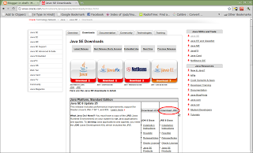
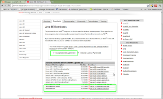
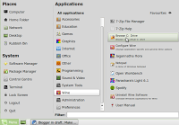
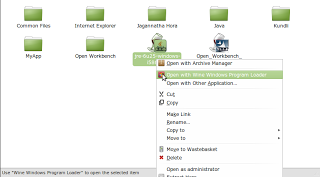
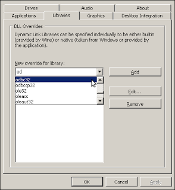
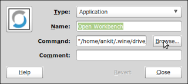

<h2 id="whatisopenworkbench">What is Open Workbench?</h2>
Open Workbench is a Project Planning Software comparable to Microsoft Project. There are mixed views on whether it is truly open source or not but as it is considered a very good alternative for Microsoft Project and it is free to download, it is something I as a Project Manager would want to know about. After all some of my clients are going to be using this. :)
Now then, as of writing this article Open Workbench is not available from the well publicised site www.openworkbench.org which seems to be down. Instead it is available for download fromhttp://www.itdesign.de/en/products-solutions/open-workbench.html
As you will find that the installer is an exe and the product is made for Windows platform and requires Java Runtime Environment, we will need to either use Windows in virtualbox or Wine. I am going to cover below the steps for installing the software on Linux using Wine.
Steps to install Open Workbench and JRE on Wine V1.2.2 in Linux Mint:
<ol>
<li>Install JRE in wine</li>
<li>Install Open Workbench in wine</li>
<li>Configure wine to play well with Open Workbench</li>
<li>Configure icon to launch Open Workbench</li>
</ol>
<h2 id="whatdoweneed">What do we need?</h2>
<ol>
<li>We will need to download the installer exe file from <a href="http://www.itdesign.de/en/products-solutions/open-workbench.html">http://www.itdesign.de/en/products-solutions/open-workbench.html</a></li>
<li>As the product requires Java Runtime Environment, we will need to download the JRE for windows.</li>
<li>We will need access to system32 folder of a WindowsXP machine or in Virtualbox.</li>
</ol>
<h3 id="step1installjreinwine">Step 1: Install JRE in wine</h3>
You can download the JRE file from <a href="http://www.oracle.com/technetwork/java/javase/downloads/index.html">http://www.oracle.com/technetwork/java/javase/downloads/index.html</a> . Remember, we only need JRE not JDK so click the download button in second column.
This will open another page for you to select which JRE package you want to download. 

Click on the radio-button to accept license agreement and then select Windows x86 Offline for download.

I am assuming that your hardware is 32 bit, if not please select Windows x64 but it will not have the offline version and I have no way of checking if it will work or not; so please leave a comment either way as it will help others.

a)      Copy the downloaded (jre-6u25-windows-i586.exe) file into .wine/drive_C/Program Files. You can do this using GUI on Linux Mint using steps below:
<ul>
<li>Goto MENU-ALL APPLICATIONS-WINE and click on BROWSE C: DRIVE</li>
<li>Click on Program Files folder.</li>
<li>Paste the copied exe file here.</li>
</ul>

b)      Right click on the exe file and select &quot;open with wine windows program loader&quot;. 
c)      Follow the installation wizard. 
 
Once completed move on to next step.
<h3 id="step2installopenworkbenchinwine">Step 2: Install Open Workbench in wine</h3>
a)      Download the “Open Workbench” installer file(Open_Workbench_Setup_1.1.6.exe) and copy it into .wine/drive_C/Program Files.

TIP: You can use Step 1 bullet "a" to reach drive_c and then click on windows folder and then on system32 folder.

b)      Right click on the exe file and select &quot;open with wine windows program loader&quot;.

TIP: You can use Step 1 bullet "b" to reach drive_c and then click on windows folder and then on system32 folder.

c)      Follow the installation wizard.
Step 3: Configure wine to play well with Open Workbench
Due to some bug identified in Wine V1.2 the odbc32.dll file does not work and gives the error “err:module:attach_process_dlls “odbc32.dll” failed to initialize, aborting” if you try to run file from Terminal.
The following workaround is one suggested on Launchpad (<a href="https://bugs.launchpad.net/ubuntu/+source/wine1.2/+bug/572393">https://bugs.launchpad.net/ubuntu/+source/wine1.2/+bug/572393</a>) and does solve the problem.
I have just tried to make it easier to follow the instructions by providing screenshots and explaining each step.
<ol>
<li>
On the WindowsXP machine / virtualbox goto following location – C:\WINDOWS\system32 

</li>
<li>
Now copy odbc32.dll and odbcint.dll files onto the Linux machine at this location - .wine/drive_c/windows/system32 .
</li>
</ol>
 
TIP: You can use Step 1 bullet "a" to reach drive_c and then click on windows folder and then on system32 folder.

<ol start="3">
<li>
Now goto wine configuration (On Linux Mint: MENU-ALL APPLICATIONS-WINE-CONFIGURE WINE)
</li>
<li>
Click on Libraries tab.
</li>
<li>
From the dropdown select odbc32 and click add.
</li>
<li>
Click OK
</li>
</ol>
<h3 id="step4configureopenworkbenchicontolaunchtheapplication">Step 4: Configure Open Workbench icon to launch the application</h3>
<ol>
<li>
Open terminal (MENU - TERMINAL)
</li>
<li>
Type: <code>wine ~/.wine/drive_c/Program\ Files/Open\ Workbench/bin/npWBench.exe</code>
</li>
<li>
Once Open Workbench is opened we are sure the command works. Select this command and right click and select copy.
</li>
</ol>

TIP: You can also press Ctrl+Shift+C to copy the selected text from terminal

<ol start="4">
<li>
Close &quot;Open Workbench&quot; and goto icon in  MENU-ALL APPLICATIONS-WINE.
</li>
<li>
Right click the &quot;Open Workbench&quot; icon and click on &quot;Edit Properties&quot;.
</li>
<li>
In Command click on browse and navigate to following location: <code>.wine/drive_c/Program Files/Open Workbench/bin/ and select the file npWBench.exe</code>.
</li>
</ol>
 
<ol start="7">
<li>Now click &quot;OK&quot;</li>
</ol>
This is it. You are ready to use Open workbench on Linux using wine.
