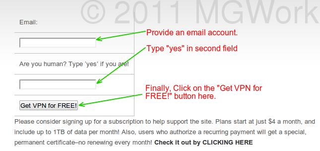

<em><strong>UPDATE: LOOKS LIKE HOSTIZZLE IS NOT WORKING ANYMORE. THE STEPS IN THIS GUIDE WILL STILL BE RELEVANT FOR SETTING UP OPEN VPN, JUST THAT YOU WILL NEED TO FIND SOME OTHER PROVIDER.</strong></em>

I received a Google Music invite and as it is only available in US, I used OpenVPN on linux. Now this is a handy little trick to bypass the geographical constraints that are placed to block services on net. All this without opening the windows box to install dodgy looking services of Hotspot Shield which anyway does not work on Linux.
Ever come across &quot;This video is not available in your country.&quot; on you tube or ever wanted to access Hulu only to be greeted by a similar message. Well then, if yes is your answer, openVPN is the solution to such sorrows.
It also comes with some other benefits such as anonymous browsing but then highlighting benefits of VPN is not exactly the aim of this post. The aim of this post is:
To configure a free VPN service that allows you to bypass country restrictions for US based sites. Keyword - US. As the site I am going to use only gives a US IP. Ofcourse if we remove the word free it opens up a range of possibilities which I will leave the readers to explore. :)
Alright, let's get on with the business:
<h3 id="step1installopenvpn">Step 1: Install OpenVPN</h3>
Open Synaptics and type OpenVPN in &quot;Quick Search&quot;. Then select all the packages marked green in screenshot below but not in your synaptic window and click on &quot;Apply&quot;.

Then type &quot;pptp&quot; in &quot;Quick Search&quot; and select all the packages marked green in the screenshot below but not in your synaptic window and click on &quot;Apply&quot;.

<h3 id="step2registerwiththefreeopenvpnproviderhostizzle">Step 2: Register with the free OpenVPN provider &quot;Hostizzle&quot;</h3>
a) Open the website <a href="http://hostizzle.com/">http://hostizzle.com/</a> and follow the screenshots below:
 
 

<h3 id="step3setupopenvpnonlinuxmint">Step 3: Set-up OpenVPN on Linux Mint</h3>
a) Open Terminal and type the following command:
<code>gksudo nautilus /etc/openvpn/</code>
You will be asked for root password and the File Explorer will be opened with root access. This is necessary as /opt directory only gives write access to root and as you wil see next step requires some files to be extracted in this directory. This extracted directory will be some long number.

Please be extremely careful now, as you are accessing your file system as root.

b) Now copy the zip file downloaded from Hostizzle in Step 2 to this directory and extract it here.
<h3 id="step4configurenetworkmanager">Step 4: Configure network manager</h3>
Open the Network Manager as shown in following screenshot:
Menu &gt; All Applications &gt; Preferences &gt; Network Connections 

This will open the following window: 

Now click on VPN tab and then on Import button as shown in next screenshot.
It will open the file selection box. Navigate to File System/etc/openvpn/ and now open the long numbered directory that was extracted in Step 3(a) as shown in next figure.

Here select the .ovpn file and click Open. Following dialogue box will open. 

Just accept defaults and click &quot;Apply&quot;. 
Then Click on &quot;Close&quot; on Network Connections window.

<h3 id="step5connecttotheopenvpn">Step 5: Connect to the OpenVPN</h3>
Restart your system and once it is connected to your home WiFi, click on Network Indicator in the panel and select &quot;VPN Connections&quot;.

This will list all available VPN connections as can be seen in the screenshot. Select the VPN name with big number which is what we have just configured.

Once done if everything was done correctly, it should connect to VPN and you should be able to browse with an american IP address.
Some key points to remember:
Free service of Hostizzle is quite generous compared to so many other options I explored, yet it is worth knowing the restrictions: 
a) 100GB of bandwidth each month. 
b) US IP 
c) Limited to one month. You need to download new Keys and configure VPN using steps below each month.
Now considering that it takes less than 5 minutes to complete these steps and that it is a free alternative with a generous bandwidth, I would say it is all worth it.
Ofcourse, if you are not happy with the restrictions, there are some paid alternatives that can be implemented for as low as $4 per month from various providers, Hostizzle included. Go shopping !!!
