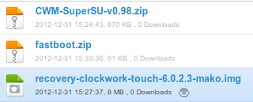
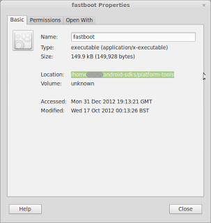
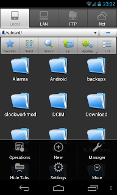

Having a rooted phone and then going to one that does not have root access is like getting used to driving a luxury car but then being forced to drive a tractor. So with arrival of my shining new nexus 4 once the novelty worn of in 8 hours or so, I sat down and rooted the device. Now there are plenty of guides out there but not many specific to Linux just yet. One reason might just be the fact the Linux Users are really smart and know how to figure it out but what about users who are new ...well at least for them I am sure this post will be useful and while we are at it, I felt I will install the touch version of CWM...
<strong>Pre-requisite:</strong>
<ol>
<li>For purpose of this tutorial, I will assume that adb set-up is in place using steps explained in my last post specifically up to Step 5. It is totally worth doing it before you proceed but if you would prefer a shorter route, please refer some guide on how to install just adb. Though I would not recommend any other approach. (Not because they will not work but because this approach will ensure clean system and something I have tested 4 times already to work and if you will follow this post, it makes sense to do it the way I did)</li>
<li>Clockwork Recovery Mod (Touch Version)</li>
<li>Super User App</li>
<li>Fastboot</li>
<li>This process will wipe out all user data and apps. Appropriate back-ups should be taken and restoring those is beyond the scope of this post.</li>
</ol>
Bullets 2 and 3 can be downloaded directly from <a href="http://www.clockworkmod.com/rommanager">http://www.clockworkmod.com/rommanager</a> and <a href="http://download.chainfire.eu/282/SuperSU/">http://download.chainfire.eu/282/SuperSU/</a> or as before I have uploaded them in mediafire and can be downloaded from this <a href="http://www.mediafire.com/?ylp382ompa4jr">link</a>.
I downloaded fastboot few months back from xda using this link and am not sure if it is still there or not so I have uploaded it to mediafire as well.

<pre><code>Step 1: Prepare Nexus 4 and Linux Mint 13
Step 2: Unblock bootloader for Nexus 4
Step 3: Root Nexus 4
Step 4: Make Clockwork Mod Permanent
Step 5: Mount and Un-Mount Nexus 4 to access files from Linux Mint
</code></pre>
<h3 id="step1preparenexus4andlinuxmint13">Step 1: Prepare Nexus 4 and Linux Mint 13</h3>
1.1. Check if fastboot is already there in the the /android-sdks/platform-tools directory. If yes skip the next step.
1.2. Extract the fastboot from downloaded zip file and place it in the /android-sdks/platform-tools directory if it is not already there and make it executable (Right Click, Select properties, Go To permissions tab and select the checkbox in front of &quot;Execute&quot;)
1.3. Copy the downloaded Clock Work Mod file (recovery-clockwork-touch-6.0.2.3-mako.img) in the /android-sdks/platform-tools directory.
1.4.Activate debug mode in nexus 4 - to do this go to settings &gt; About Phone and then click 7 to 8 times on &quot;Build Number&quot;. This will activate developer mode.
1.5. Now click back and got to {} Developer Options and Click the checkbox against USB debugging.
1.6. Set up udev on linux mint: 
a. Assuming that you have followed last post you would already have a &quot;51-android.rules&quot; file created.
b. Open the file with Gedit using following command
<pre><code> sudo gedit /etc/udev/rules.d/51-android.rules 
</code></pre>
c. Add following lines:
<pre><code>#LG - Nexus 4
SUBSYSTEM==&quot;usb&quot;, ATTR{idVendor}==&quot;1004&quot;, MODE=&quot;0666&quot;

SUBSYSTEMS==&quot;usb&quot;, ATTRS{idVendor}==&quot;18d1&quot;, ATTRS{idProduct}==&quot;4ee1&quot;, MODE=&quot;0660&quot;, OWNER=&quot;ankit&quot; #Normal nexus 4
SUBSYSTEMS==&quot;usb&quot;, ATTRS{idVendor}==&quot;18d1&quot;, ATTRS{idProduct}==&quot;4ee2&quot;, MODE=&quot;0660&quot;, OWNER=&quot;ankit&quot; #Debug &amp; Recovery nexus 4
SUBSYSTEMS==&quot;usb&quot;, ATTRS{idVendor}==&quot;18d1&quot;, ATTRS{idProduct}==&quot;4ee0&quot;, MODE=&quot;0660&quot;, OWNER=&quot;ankit&quot; #Fastboot nexus 4
</code></pre>
I got the Vendor ID and Product ID by connecting the phone in different states (USB debug checked, unchecked and also after the phone was connected and rebooted into bootloader using command &quot;adb reboot bootloader&quot;) as per the guidance given here.
d. Now Save the file, then chmod to all read using following command:
<pre><code>sudo chmod +x /etc/udev/rules.d/51-android.rules 
</code></pre>
<h3 id="step2unblockbootloaderfornexus4">Step 2: Unblock bootloader for Nexus 4</h3>
2.1. Plug your phone into the computer and type the following command in terminal:
<pre><code>adb reboot bootloader
</code></pre>
2.2. Once Nexus 4 has rebooted in recovery mode, type the following command in terminal:
<pre><code>fastboot oem unlock
</code></pre>
If terminal displays the message &quot;waiting for device&quot; 51-android.rules file is not set correctly and you might need to check vendor ID and product id using <code>lsusb</code> command in different modes and update it with appropriate data.
2.3. Phone will display a long message and ask for confirmation to unlock bootloader. Select &quot;Yes&quot; by using the volume keys and use power to select it.
2.4. Now, using volume keys navigate to &quot;Recovery Mode&quot; and select it using &quot;Power&quot; key.
2.5. After a while Android with blue progress bar should appear and phone should reboot but if it does not and instead shows a screen with &quot;Android&quot; on it's back with an exclamation mark on it's tummy, don't panic. Just press &quot;Power&quot; and &quot;Volume Up&quot; till it shows recovery menu and then select &quot;reboot&quot;.
The phone is now bootloader unlocked.
<h3 id="step3rootnexus4">Step 3: Root Nexus 4</h3>
OK now when the phone boots, it will be fresh with factory reset, no data or apps whatsoever other than those that are there by default and when the phone boots, it will ask all details like selecting country etc. Just enter quickly without bothering to enter gmail, wifi etc. Once done:
3.1. Install mtpfs from synaptics.
3.2. Plug the phone to computer.
3.3. Type the following commands:
<pre><code>sudo mkdir /media/nexus4 
</code></pre>
followed by
<pre><code>sudo chmod 755 /media/nexus4 
</code></pre>
3.4. Now mount the nexus 4 using following command so we can transfer files:
<pre><code>sudo mtpfs -o allow_other /media/nexus4 
</code></pre>
3.5. Copy the downloaded file &quot;CWM-SuperSU-v0.98.zip&quot; on Nexus 4.
3.6. Type the following command to unmount nexus 4:
<pre><code>sudo umount /media/nexus4
</code></pre>
3.7. Reactivate the debug mode using Step 1.4 and Step 1.5 above.
3.8.  On terminal type the command:
<pre><code>adb reboot bootloader 
</code></pre>
followed by:
<pre><code>fastboot flash recovery /android-sdks/platform-tools/recovery-clockwork-touch-6.0.2.3-mako.img
</code></pre>

Make sure in above command you replace PATH_TO with the actual path to the file. An easy way can be to right click on "recovery-clockwork-touch-6.0.2.3-mako.img" file and click on properties thene select the path and paste in this command.

3.9. Once completed, on the phone navigate to &quot;Recover Mode&quot; using volume keys and select using power key.
3.10 The new recovery menu will be presented. Select &quot;install zip from sd card&quot; and &quot;choose zip from sd card.&quot; and select the file we had put in step 3.5 - &quot;CWM-SuperSU-v0.98.zip&quot;.
3.11 Once done, go back to reboot and &quot;Reboot&quot; the phone.
At this point your phone is rooted,however, you will get a message suggesting the recovery will not be permanent or something to that effect which is fine if you aren't bothered about it but if you would rather want to keep this CWM we need to move to next step.
<h3 id="step4makeclockworkmodpermanent">Step 4: Make Clockwork Mod Permanent</h3>
4.1. On your phone install ES File Explorer.
4.2. Select Settings. 

4.3. Select &quot;Root Settings&quot;. 

4.4. Select all checkboxes. You will be asked for superuser access, say Yes. 

4.5. Now go back to main screen of ES File Explorer and select the third tab with an icon of Folder with up arrow and text Up. This should bring you to root.
4.6 Now using ES File Explorer navigate on your phone to /system/etc, find the file named &quot;install-recovery.sh&quot; and rename it to &quot;install-recovery.bak&quot;
4.7 Repeat Steps 3.7 to 3.11.
Now your clockwork mod is permanent.
<h3 id="step5mountandunmountnexus4toaccessfilesfromlinuxmint">Step 5: Mount and Un-Mount Nexus 4 to access files from Linux Mint</h3>
Now, with the steps 3.1 to 3.6 we have laid the foundation for being able to connect Nexus 4 and transfer files using USB. Something earlier was possible using USB Mass storage mode but is not present jelly bean onwards.
The commands in 3.4 and 3.6 are key to achieve this but rather than remembering these and typing each time, I have made a menu entries for each of these (Mount Nexus 4, Unmount Nexus 4) and after connecting phone via USB, I simply click on these, system asks root password and then connects nexus 4 as mass storage (see screenshot below):

In order to get these you will follow the steps below:
5.1 Right Click on Menu and select &quot;edit Menu&quot;. 
5.2 Now click on &quot;New Menu&quot; and Enter a menu entry &quot;Phone&quot;. 
5.3. Select the checkbox next to the new menu entry &quot;Phone&quot; in middle pane. 
5.4. Select new menu entry &quot;Phone&quot; in left pane. 
5.5. Click on &quot;New Item&quot; in right Pane and in the dialogue box fill the fields as below and save:
<pre>Type:       Application in terminal
Name:       Mount Nexus 4
Command:    sudo mtpfs -o allow_other /media/nexus4</pre>
5.6 Again click on &quot;New Item&quot; in right Pane and in the dialogue box fill the fields as below and save:
<pre>Type:            Application in terminal
Name:            Unmount Nexus 4
Command:         sudo umount /media/nexus4</pre>
5.7 Make sure checkbox next to these new items is ticked. Save and Close.
That's it !!! All Done.
Hope some will find this post useful.
