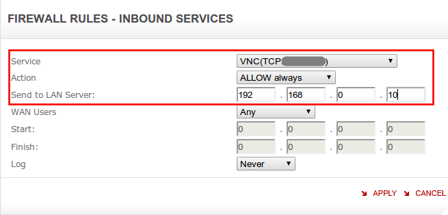
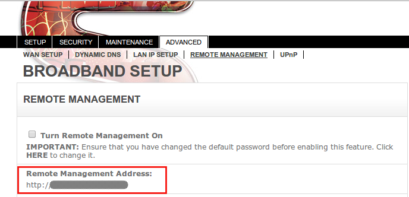
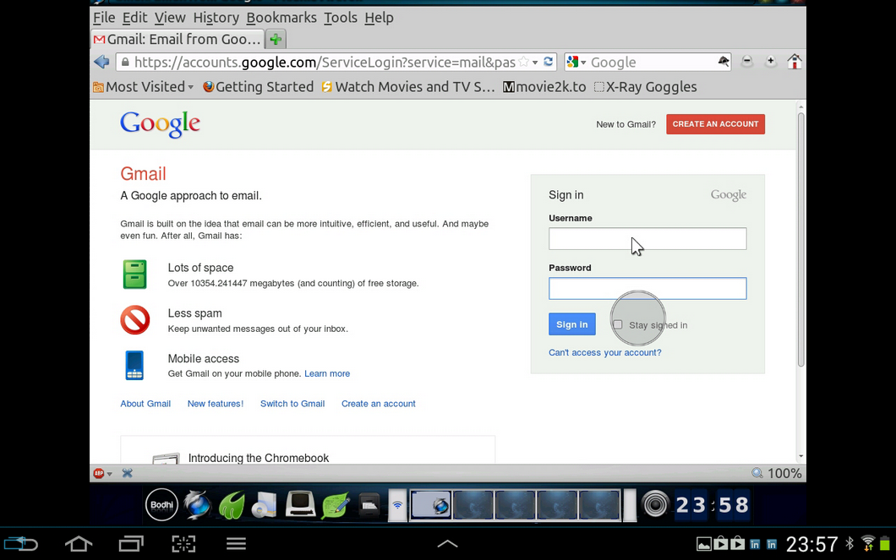

Today "Jump" was available for free on Amazon as the app of the day and since it's nearly 7 quids on google play store, I downloaded. For windows and Mac users they have a pretty straight forward set-up but as usual for Linux it means some work but in the end it leaves you with a set-up you can trust and feel secure about. 


There are three things that need to be set-up for this to work:

* TOC
{:toc}

# 1. Linux Mint machine should be set-up for x11vnc and ssh servers

1.1: Install X11VNC by typing following command in terminal:
<code>sudo apt-get install x11vnc</code>

1.2: Create a password for VNC using following command in terminal and providing a password and answering yes for the prompt to store password in a file:
<code>x11vnc -storepasswd</code>

1.3: Now to ensure that X11VNC starts at boot go to menu and type start, click on startup application as shown in the screenshot below:<br>
<br>
Then in the window that this will open click on "Add" and enter a "Name" and in "Command" field enter <code>x11vnc -forever -xkb -usepw -display :0</code> as shown below.<br>
<br>
VNC set-up on machine is complete.

1.4 Now install openssh-server using following command on terminal:
<code>sudo apt-get install openssh-server</code>

1.5 We will need to change some parameters in ssh configuration for making it secure as by default it allows root login but I dont want that for remote access and would advice most regular users to do so as well. So we will first make a backup of existing configuration file using the command below:
<code>sudo cp /etc/ssh/sshd_config ~</code>

1.6 Now, we will edit the actual config file using following command:
<code>gksudo gedit /etc/ssh/sshd_config</code>

1.7 Once the file is open <mark>change the parameter "PermitRootLogin" to "no".</mark> It's on line 27 for me.

1.8 Now the default port for ssh is 22 but I recommend changing it to something else such as 5432. To do so change the parameter "Port" from 22 to whatever port you want to put. In this example it will be 5432. For me "Port" parameter is on line 5.

1.9 Save the changes and close gedit.

1.10 Now we will restart the ssh server using following command in terminal
<code>sudo restart ssh</code>
For Arch, you can use the command:
<code>sudo systemctl start sshd</code>
followed by
<code>sudo systemctl enable sshd.service</code>
to ensure ssh daemon is enabled at startup.

1.11 Restart the machine and machine set-up is done.

# 2. Router firewall should be configured to allow inbound traffic on specific ports.

This may involve different step from those given below depending on the router in use. Following steps are meant for configuring the sky router. However principle is same. We will be creating specific service definition and port on router and then create a firewall rule that allows inbound traffic and directs it to Linux machine we configured above.

2.1  Type following command on terminal:
<code>ifconfig</code>

2.2 this will list lot of numbers, what we are interested in is the number just after "inet addr:" under wlan0. It will be something like 192.168.0.10.

2.3 Open sky router config through browser using 192.168.0.1 and click on "Security". You will need to enter router username and password.<br>
<br>

2.4 Then click on "Services" and then click on "Add Custom Services".

2.5 Enter as shown in Figure 4 and Start Port as 5900, Finish Port as 5900 and click on "Apply".<br>
<br>

5900 is default port for display 0 in VNC. If you have changed it like me you will need to enter that port. To change port you will need to use "x11vnc -forever -xkb -usepw -autoport nnnn -display :0" option in step 1.3. This is not required for security but in case you have two different machines then this approach will come handy.
{: .notice--tip}

2.6 Now click on "Add Custom Services" again and this time enter as shown in next screenshot. Start Port and End Port should be same as entered in step 1.8, so for this example it will be 5432. Then click on "Apply".<br>
<br>

2.7 Now we need to set the firewall for these services. To do so, click on "Firewall Rules" then click on "Add" under inbound services.
2.8 Configure fields as shown in next screen-shot below and click on "Apply":<br>
<br>

2.9 Now we will do same for SSH, so again click on "Add" under inbound services and configure fields as shown in screen-shot below and click on "Apply":<br>
<br>

2.10 Click on "Apply" under "Inbound Services".

2.11 In browser on the router management page, click on "Advanced" &gt; "Remote Management" and on this screen make note of the IP address (number after http:// in red box in next screen-grab) shown under "Remote Management Address".<br>
<br>

2.12 Go to <a href="https://www.dlinkddns.com/signin">https://www.dlinkddns.com/signin</a> and create an account. Refer this page for the how-to (<a href="http://www.dlinkddns.com/howto">http://www.dlinkddns.com/howto</a>) and you will need to use the IP from step 2.11 above as the host. At the end of it you will have a hostname like "yourname.dlinkddns.com", username and password for logging in to dlinkddns site.

2.13 Once this is done, go to the browser with sky router management and click on "Advanced"&gt;"Dynamic DNS" and fill as shown in screen-shot below:<br>
<br>

```bash
Host Name: Hostname from Step 2.12 (yourname.dlinkddns.com in this example)
User Name: D-Link site username
Password: D-Link site password
```
<br>

<br>

2.14 Once above information is filled, click on "Apply" and then click on "Show Status". It should open a separate window and showing the message "request successful".

Sky Router is now configured.

# 3. Jump or an equivalent VNC viewer should be configured on the android device.

3.1 On the android device open Jump and click on the "+" sign in right hand corner.
3.2 In the "Address" Field enter the hostname from 2.12 (`yourname.dlinkddns.com` in this example) and select connection type as "VNC" and click save.
3.4 Change the "Authentication Method" to "VNC Password"
3.5 Tap on "SSH Tunnel", click on "Enabled" checkbox.
3.6 In Username enter the username used to log into the machine configured above in Step 1.
3.7 In Host Name, use the the hostname from 2.12 (yourname.dlinkddns.com in this example)
3.8 Change the port to one used in 1.8. So in this case 5432.
3.9 Password can be left empty and when asked during connection provide the one used to log on to the machine with this username.
3.10 Press back button and click on entry. You will be shown a SSH key notification, say ok. Then you will be asked for a password, provide the password you use to log onto your machine with the username provided in 3.6.
3.11 Then you will be asked for the VNC password, provide the password from step 1.2.

You will now be able to view your desktop on your android machine.<br>




All Done !!!
