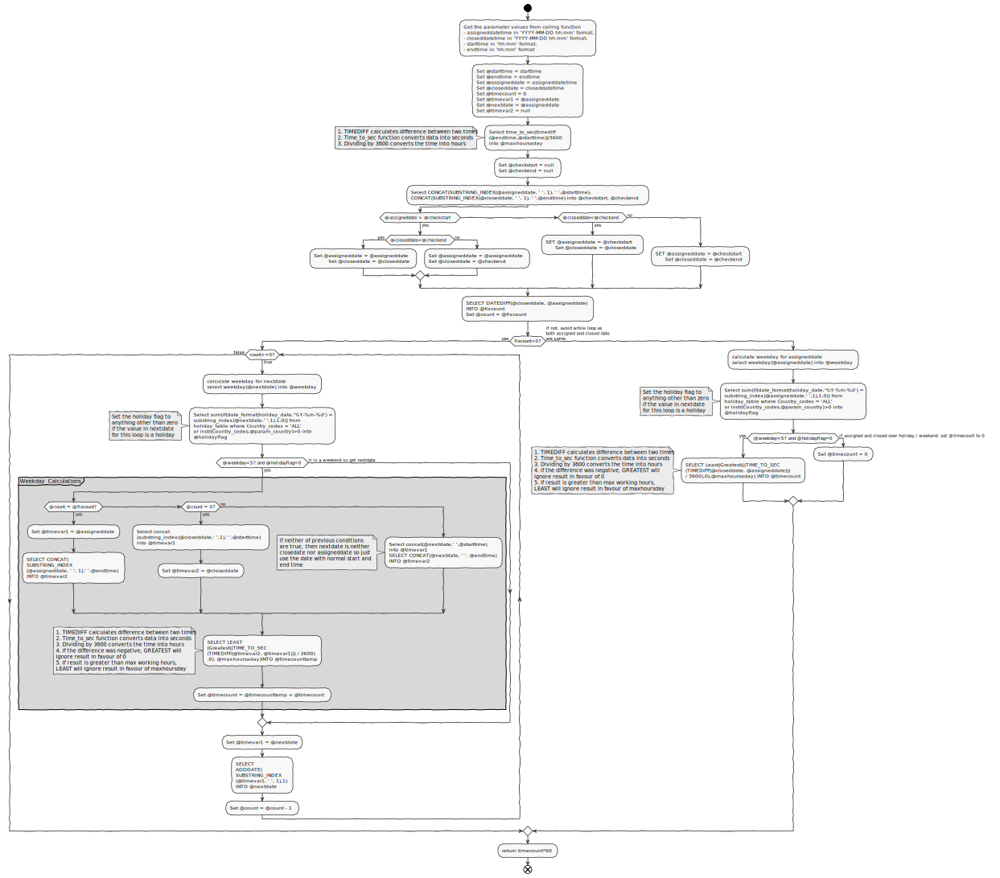
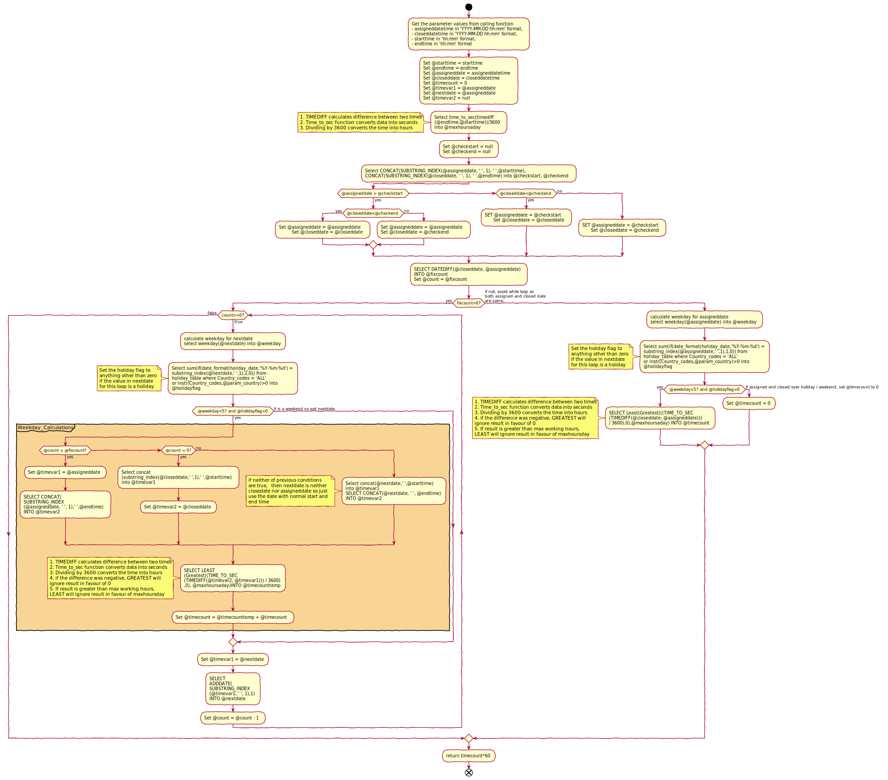

<div class="image-white">

</div>

I wrote this function to cater for a [specific requirement](#problem-statement) and I don't know if there are better ways of doing it but this saved tremendous amount of time and might have real time application elsewhere.

# Problem Statement:

Find out the age of an incident in working minutes, given the following:

1. Time and Date of when an incident was logged
2. Time and date of when the same incident was closed
3. Opening time of the site for which the incident was logged
4. Closing Time of the site for which incident was logged
5. Country of the site for which incident has been logged

{: notice-info}
Assumption: It is assumed that opening and closing times are same on all working days and that all the sites are closed on holidays and weekends

Function should take all the above five "given" as parameter and then calculate age of the incident.

#### Example of problem

Let's say an incident was logged on "Friday 10th June 2016 at 12:00" for a site in the "UK" which opens between 09:00 to 16:00. This incident was then closed on "Tuesday 14th June 2016 at 14:00".

For the above incident function should calculate the age as 960 minutes = 16 hours = [4 hours on Friday (12:00 to 16:00) +  7 hours on Monday (09:00 to 16:00) + 5 hours on Tuesday (09:00 to 14:00)]

# Pre-requisites:

A holiday table for the "Country" of the site for which incident is being provided should already be created on the database with the name `holiday_table`. Created using code below:


CREATE TABLE `holiday_table` (
	`holiday_table_id` INT(11) NOT NULL,
	`holiday_date` DATETIME NULL DEFAULT NULL,
	`week_day` VARCHAR(12) NULL DEFAULT NULL,
	`holiday_name` VARCHAR(45) NULL DEFAULT NULL,
	`Country_codes` VARCHAR(45) NOT NULL DEFAULT 'ALL',
	PRIMARY KEY (`holiday_table_id`)
)
COLLATE='utf8_general_ci'
ENGINE=InnoDB
;



Sample sql-insert Data for holiday_table:


INSERT INTO `holiday_table` (`holiday_table_id`, `holiday_date`, `week_day`, `holiday_name`, `Country_codes`) VALUES (2, '2016-03-25 00:00:00', 'Friday', 'Good Friday', 'ALL');
INSERT INTO `holiday_table` (`holiday_table_id`, `holiday_date`, `week_day`, `holiday_name`, `Country_codes`) VALUES (3, '2016-03-28 00:00:00', 'Monday', 'Easter Monday', 'ALL');
INSERT INTO `holiday_table` (`holiday_table_id`, `holiday_date`, `week_day`, `holiday_name`, `Country_codes`) VALUES (4, '2016-05-02 00:00:00', 'Monday', 'Early May bank holiday', 'ALL');
INSERT INTO `holiday_table` (`holiday_table_id`, `holiday_date`, `week_day`, `holiday_name`, `Country_codes`) VALUES (5, '2016-05-30 00:00:00', 'Monday', 'Spring bank holiday', 'ALL');
INSERT INTO `holiday_table` (`holiday_table_id`, `holiday_date`, `week_day`, `holiday_name`, `Country_codes`) VALUES (6, '2016-08-29 00:00:00', 'Monday', 'Summer bank holiday', 'ALL');
INSERT INTO `holiday_table` (`holiday_table_id`, `holiday_date`, `week_day`, `holiday_name`, `Country_codes`) VALUES (7, '2016-12-26 00:00:00', 'Monday', 'Boxing Day', 'ALL');
INSERT INTO `holiday_table` (`holiday_table_id`, `holiday_date`, `week_day`, `holiday_name`, `Country_codes`) VALUES (8, '2016-12-27 00:00:00', 'Tuesday', 'Christmas Day (substitute day)', 'ALL');
INSERT INTO `holiday_table` (`holiday_table_id`, `holiday_date`, `week_day`, `holiday_name`, `Country_codes`) VALUES (9, '2016-01-01 00:00:00', 'Friday', 'New Year’s Day', 'SG');
INSERT INTO `holiday_table` (`holiday_table_id`, `holiday_date`, `week_day`, `holiday_name`, `Country_codes`) VALUES (10, '2016-02-08 00:00:00', 'Monday', 'Chinese New Year', 'SG');
INSERT INTO `holiday_table` (`holiday_table_id`, `holiday_date`, `week_day`, `holiday_name`, `Country_codes`) VALUES (11, '2016-02-09 00:00:00', 'Tuesday', 'Chinese New Year', 'SG');
INSERT INTO `holiday_table` (`holiday_table_id`, `holiday_date`, `week_day`, `holiday_name`, `Country_codes`) VALUES (12, '2016-05-21 00:00:00', 'Saturday', 'Vesak Day', 'SG');
INSERT INTO `holiday_table` (`holiday_table_id`, `holiday_date`, `week_day`, `holiday_name`, `Country_codes`) VALUES (13, '2016-07-06 00:00:00', 'Wednesday', 'Hari Raya Puasa', 'SG');
INSERT INTO `holiday_table` (`holiday_table_id`, `holiday_date`, `week_day`, `holiday_name`, `Country_codes`) VALUES (14, '2016-08-09 00:00:00', 'Tuesday', 'National Day', 'SG');
INSERT INTO `holiday_table` (`holiday_table_id`, `holiday_date`, `week_day`, `holiday_name`, `Country_codes`) VALUES (15, '2016-09-12 00:00:00', 'Monday', 'Hari Raya Haji', 'SG');
INSERT INTO `holiday_table` (`holiday_table_id`, `holiday_date`, `week_day`, `holiday_name`, `Country_codes`) VALUES (16, '2016-10-29 00:00:00', 'Saturday', 'Deepavali', 'SG');
INSERT INTO `holiday_table` (`holiday_table_id`, `holiday_date`, `week_day`, `holiday_name`, `Country_codes`) VALUES (17, '2016-01-01 00:00:00', 'Friday', 'New Year’s Day', 'IN');
INSERT INTO `holiday_table` (`holiday_table_id`, `holiday_date`, `week_day`, `holiday_name`, `Country_codes`) VALUES (18, '2016-01-26 00:00:00', 'Tuesday', 'Republic Day', 'IN');
INSERT INTO `holiday_table` (`holiday_table_id`, `holiday_date`, `week_day`, `holiday_name`, `Country_codes`) VALUES (19, '2016-07-06 00:00:00', 'Wednesday', 'Idul Fitr', 'IN');
INSERT INTO `holiday_table` (`holiday_table_id`, `holiday_date`, `week_day`, `holiday_name`, `Country_codes`) VALUES (20, '2016-08-15 00:00:00', 'Monday', 'Independence Day', 'IN');
INSERT INTO `holiday_table` (`holiday_table_id`, `holiday_date`, `week_day`, `holiday_name`, `Country_codes`) VALUES (21, '2016-10-11 00:00:00', 'Tuesday', 'Dussehra/Durga Puja', 'IN');
INSERT INTO `holiday_table` (`holiday_table_id`, `holiday_date`, `week_day`, `holiday_name`, `Country_codes`) VALUES (22, '2016-10-31 00:00:00', 'Monday', 'Diwali Privilege Holiday/Gobardhan Puja', 'IN');



# Function code and explanation


CREATE DEFINER=`root`@`localhost` FUNCTION `workday_time_diff_holiday_table`(
`param_country` varchar(10), 
`assigneddatetime` varchar(20), 
`closeddatetime` varchar(20), 
`starttime` varchar(20), 
`endtime` varchar(20)
)
	RETURNS int(11)
	LANGUAGE SQL
	NOT DETERMINISTIC
	CONTAINS SQL
	SQL SECURITY DEFINER
	COMMENT ''
BEGIN 
Set @starttime = starttime;
Set @endtime = endtime;
Select time_to_sec(timediff(@endtime,@starttime))/3600 into @maxhoursaday;
Set @assigneddate = assigneddatetime; 
Set @closeddate = closeddatetime; 
Set @timecount = 0;
Set @timevar1 = @assigneddate;
Set @nextdate = @assigneddate;
Set @timevar2 = null;
Set @param_country = param_country;
############ 
/*Check if the assigned time was before the starttime 
or closed time was after the endtime provided*/
#############
Set @checkstart = null;
Set @checkend = null;
Select CONCAT(SUBSTRING_INDEX(@assigneddate, ' ', 1), ' ',@starttime),
CONCAT(SUBSTRING_INDEX(@closeddate, ' ', 1), ' ',@endtime)  into @checkstart, @checkend;

if (@assigneddate > @checkstart) then
		if (@closeddate<@checkend) then
			Set @assigneddate = @assigneddate;
            Set @closeddate = @closeddate;
		else
			Set @assigneddate = @assigneddate;
			Set @closeddate = @checkend;
		end if;
    else
		if (@closeddate<@checkend) then
			SET @assigneddate = @checkstart;
            Set @closeddate = @closeddate;
		else
			SET @assigneddate = @checkstart;
            Set @closeddate = @checkend;
		end if;
    end if;
####################
/*After above check, the assigneddate and closeddate
variables will be reset in accordance with the checks.*/
####################################    

SELECT DATEDIFF(@closeddate, @assigneddate) INTO @fixcount; # check the difference between assigned date and closed date. 
Set @count = @fixcount; # allocate the difference between closed date and assigned date to a counter
If @fixcount > 0 then #  true if line 57 resulted in more than 1 then run the while loop on next line
	while @count>=0 do # run the while loop until the count which is right now difference between closed and assigned becomes zero
		select weekday(@nextdate) into @weekday; # Assign the weekday value to @weekday. Weekday returns o for Monday, 2 for Tuesday ...5 for Saturday and 6 for Sunday

/*Check if the date stored in nextdate 
(which is assigneddate on first run of while loop and closeddate on last run) 
is a holiday and set the holiday flag*/

        Select sum(if(date_format(holiday_date,'%Y-%m-%d') = substring_index(@nextdate,' ',1),1,0)) 
        from holiday_table 
        where Country_codes = 'ALL' or instr(Country_codes,@param_country)>0
        into @holidayflag; 
		if ( @weekday<5 and @holidayflag=0) then #Proceed if the date in nextdate variable is neither weekend nor a holiday
			if (@count = @fixcount) then #Check if it is first run.ie. if nextdate is assigneddate
				Set @timevar1 = @assigneddate; #assign assigndate to variable timevar1
				SELECT CONCAT(SUBSTRING_INDEX(@assigneddate, ' ', 1), ' ',@endtime) INTO @timevar2;#get site closing time on assigned date and store it on to timevar2
			elseif (@count = 0) then #if the date in nextdate variable is closeddate then do the following otherwise proceed
				Select concat(substring_index(@closeddate,' ',1),' ',@starttime) into @timevar1; # 
				Set @timevar2 = @closeddate;
			else
				Select concat(@nextdate,' ',@starttime) into @timevar1;
				SELECT CONCAT(@nextdate, ' ', @endtime) INTO @timevar2;
			end if;
	SELECT 
        LEAST(Greatest(((TIME_TO_SEC(TIMEDIFF(@timevar2, @timevar1))) / 3600),0),@maxhoursaday) 
        INTO @timecounttemp;
            
			Set @timecount = @timecounttemp + @timecount;
		end if;
        Set @timevar1 = @nextdate;
        SELECT 
        ADDDATE(SUBSTRING_INDEX(@timevar1, ' ', 1),1) 
        INTO @nextdate;
		Set @count = @count - 1;
	end while;
else 
    #check if the assigned date / closed date is a holiday or weekend
    select weekday(@assigneddate) into @weekday; # Assign the weekday value to @weekday. Weekday returns o for Monday, 2 for Tuesday ...5 for Saturday and 6 for Sunday
    Select sum(if(date_format(holiday_date,'%Y-%m-%d') = substring_index(@assigneddate,' ',1),1,0)) from holiday_table where Country_codes = 'ALL' or instr(Country_codes,@param_country)>0 into @holidayflag; #Check if the date stored in assigneddate is a holiday and set the holiday flag
    if ( @weekday<5 and @holidayflag=0) then #Proceed if the date in assigneddate variable is neither weekend nor a holiday
        SELECT Least(Greatest(((TIME_TO_SEC(TIMEDIFF(@closeddate, @assigneddate))) / 3600),0),@maxhoursaday) INTO @timecount;
    else
        Set @timecount = 0;
    end if;
end if;
RETURN @timecount*60;
END


# Calling the function

Function will expect 5 parameters and with specific format as explained below:

- param_country - This is the country code as specified in holiday table
- assigneddatetime - This must be provided in the format `%Y-%m-%d %H-%i-%s`. So for our example it will be **2016-06-10 12:00:00**
- closeddatetime - This must be provided in the format `%Y-%m-%d %H-%i-%s`. So for our example it will be **2016-06-14 14:00:00**
- starttime - This must be in the format `%H:%i`. So for our example it will be **09:00**
- endtime - This must be in the format `%H:%i`. So for our example it will be **16:00**

The call for this function will be as below:

```sql
## To get number of minutes
Select `WORKDAY_TIME_DIFF_HOLIDAY_TABLE`('UK','2016-06-10 12:00:00','2016-06-14 14:00:00','09:00','16:00');

## To get number of hours
Select `WORKDAY_TIME_DIFF_HOLIDAY_TABLE`('UK','2016-06-10 12:00:00','2016-06-14 14:00:00','09:00','16:00')/60;

## To get in number of working days
Select (`WORKDAY_TIME_DIFF_HOLIDAY_TABLE`('UK','2016-06-10 12:00:00','2016-06-14 14:00:00','09:00','16:00')/60)/(substring_index('16:00',':',1)-substring_index('09:00',':',1));

```

# Complete Flowchart

This chart was made using [PlantText](http://www.planttext.com)

<div class="image-white">

</div>

## Chart Code

```
@startuml
scale 0.8
'skinparam monochrome true
skinparam handwritten true
skinparam shadowing false
'title Workday Time Difference Function
start
:Get the parameter values from calling function
- assigneddatetime in 'YYYY-MM-DD hh:mm' format, 
- closeddatetime in 'YYYY-MM-DD hh:mm' format,
- starttime in 'hh:mm' format,
- endtime in 'hh:mm' format;
:Set @starttime = starttime
Set @endtime = endtime
Set @assigneddate = assigneddatetime
Set @closeddate = closeddatetime
Set @timecount = 0
Set @timevar1 = @assigneddate
Set @nextdate = @assigneddate
Set @timevar2 = null;
:Select time_to_sec(timediff
(@endtime,@starttime))/3600 
into @maxhoursaday;
note left 
#TIMEDIFF calculates difference between two times
#Time_to_sec function converts data into seconds
#Dividing by 3600 converts the time into hours
end note
:Set @checkstart = null
Set @checkend = null;
:Select CONCAT(SUBSTRING_INDEX(@assigneddate, ' ', 1), ' ',@starttime),
CONCAT(SUBSTRING_INDEX(@closeddate, ' ', 1), ' ',@endtime)  into @checkstart, @checkend;

if (@assigneddate > @checkstart) then (yes)
		if (@closeddate0?) then (yes)
while (count>=0?) is (true)
:calculate weekday for nextdate
select weekday(@nextdate) into @weekday;
:Select sum(if(date_format(holiday_date,'%Y-%m-%d') = 
substring_index(@nextdate,' ',1),1,0)) from 
holiday_table where Country_codes = 'ALL' 
or instr(Country_codes,@param_country)>0 into 
@holidayflag;
note left
Set the holiday flag to 
anything other than zero
if the value in nextdate 
for this loop is a holiday
end note
if ( @weekday0 into 
@holidayflag;
note left
Set the holiday flag to 
anything other than zero
if the value in nextdate 
for this loop is a holiday
end note
if ( @weekday<5? and @holidayflag=0) then (yes)
:SELECT Least(Greatest(((TIME_TO_SEC
(TIMEDIFF(@closeddate, @assigneddate))) 
/ 3600),0),@maxhoursaday) INTO @timecount;
note left
 #TIMEDIFF calculates difference between two times
 #Time_to_sec function converts data into seconds
 #Dividing by 3600 converts the time into hours
 #if the difference was negative, GREATEST will 
 ignore result in favour of 0
 #If result is greater than max working hours, 
 LEAST will ignore result in favour of maxhoursday
end note
else (if assigned and closed over holiday / weekend, set @timecount to 0)
:Set @timecount = 0;
endif
endif
:return timecount*60;
end
@enduml
```