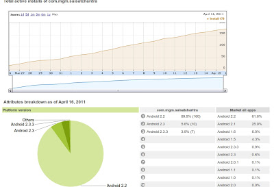
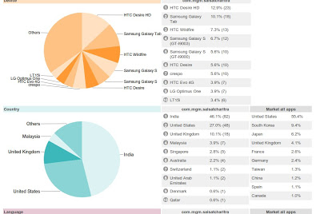
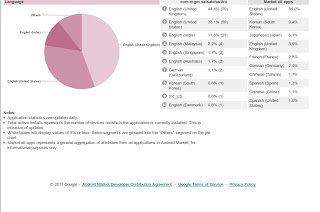

Hey Hey I made an Android app named "Sai Satcharitra". It's a very basic app and
all it does is helps people read Sai Satcharitra on their Android Smartphones,
something that can also be achieved by maybe converting the text ino a pdf, epub
file etc.

<!-- more -->

Anyhoo, all I wanted was to experiment with Android coding to see how much of
that developer is still alive in this business project manager. It took me about
5 hours to complete it after understanding the nuances of Android SDK and
refreshing my java coding skills which were quite minimal to start with :winking:. I
used to be more of a PL/SQL / Lotus Script / C++ kind of developer in my prime.

So well long story short, I paid the amount to be registered as developer so I
can publish this app on android market all the while thinking that if people do
find it useful, I will assume this amount and effort is my way of giving
something as Charity in name of Sai Baba.

I published the app on Market on 26/03/2011 and then I was busy with all the
work that spring brings with it. Then today when I checked my account I was
happily surprised to see the stats. The app has been downloaded over 200 times
with about 180 active installs.

It felt very good to see that many people are finding my work useful.I was a bit
disappointed that of the 200+ downloads only 2 have given feedback but hey, I
wasn't there fishing for reviews so as long as it helps someone, I am a happy
dude.