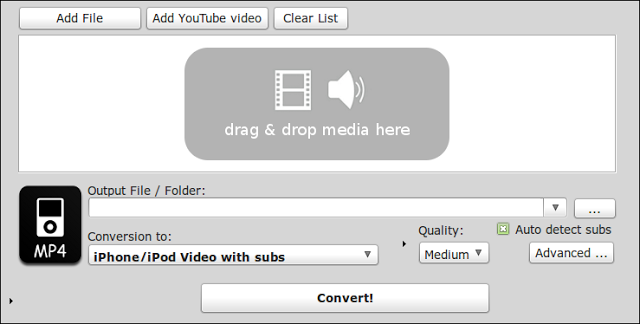
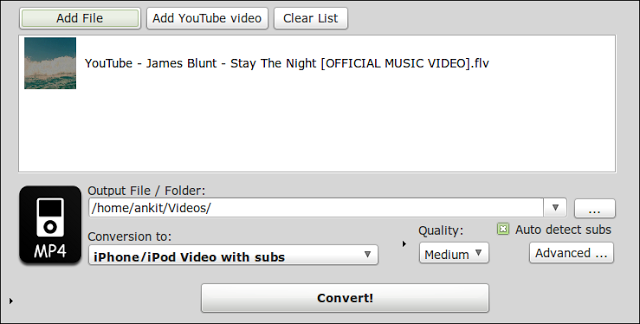
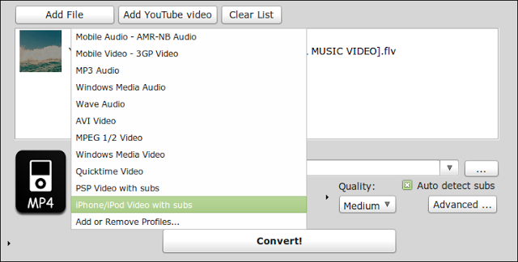

I have been using Mobile Media Converter for almost a year now and it is such a great tool. I think it is a must have at-least on Linux.
It not only converts almost all popular media formats into other formats but also has an inbuilt youtube video downloader which comes very handy for converting all the free official(and unofficial) song videos into MP3.
Let me spell it out, how it all works.

<!-- more -->

## 1. Download and Install MMC

Well you download and install MMC from [this site](http://www.miksoft.net/mobileMediaConverterDown.htm)

Scroll down to the part of screen that shows the following:

Now follow the instructions to add Medibuntu repo if you haven't already done so.

## 2. Download media:

Open youtube and search for a song that you want to have on you mp3 player. Copy the link from browser and open MMC. In Linux Mint follow Menu - All Applications - Sound  &amp; Video, to open following window.

Now clicking on Add YouTube video will open following window:
Only in this window your link copied from youtube would be already populated.
Click on Download and wait till it downloads your song.

## 3. Convert it to MP3

Once downloaded the video gets added into the queue as shown in the following screenshot:

Now you can select the location where you want to store the mp3 and the conversion type as can be seen below.

This also shows how many other formats this nice little piece of software can handle.
Anyway, select MP3 Audio and click on Convert.
That's it all done.
Now I don't condone the download of any material with copyright, I do support use of anything that is legal.
There are some really good official videos (like the one in this example) that can be converted into MP3 or even video formats to enjoy on a long journey.
