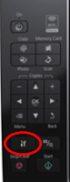

While the majority of settings are covered in my previous post here I found that each time I switched off my printer, it used to change it's IP address and I had to repeat Steps 7 to 16 each time. My printing and scanning needs are pretty limited so I never bothered working out a solution until today and knowing what I now know, it was quite a simple and quick solution I should have done this on the first place. Anyway as they say better late than never. :smile:

So to carry out the magical transformation to your printing experience follow the steps below:

<!-- more -->

1. On your printer (actual machine not on laptop / computer) go to Settings (Press the button with Wrench and Screwdriver symbol as shown in picture).
   
   

2. Using left arrow navigate to Network Settings (Computer and Printer icon)

3. Click OK button.

4. Using down arrow navigate to 'General Setup' and click OK button.

5. Printer will show the question 'After changing the settings, network may be disconnected. Continue?' and present options Yes and No with No selected (highlighted in Yellow.)

6. Using left arrow move to Yes and press OK.

7. Printer will now show the screen for 'Printer Name Setup', do not change anything. Just Click OK to proceed to next screen.

8.  Now printer will show screen for TCP/IP screen with two options Auto which is selected by default and highlighted in yellow and Manual. Here using down arrow key select Manual.

9.  Click OK button.

10. The screen will show current IP address assigned to printer something like 192.168.1.66.

11. Now I am assuming that you have already followed part 1 of this tutorial so on your laptop open the file epkowa.conf from `/etc/sane.d`. You can also open this file by typing the following command in terminal `gedit /etc/sane.d/epkowa.conf`

12. Note down the IP address you entered last time 192.168.1.60 below usb and scsi. (Line 12 on my file.)

13. Now on your printer change IP address to match the one on last step. To do so, first click on left arrow on printer to reach the last digit of displayed IP address and then adjust the number using up or down arrow.

14. Once it is same as that on epkowa.conf file (192.168.1.60 in this example), click OK button. Now continue to click OK button on all remaining screens till you reach Network Settings screen (About 5 times)

15. Press OK one final time and that's it you are done.

If you are to now switch off and switch on the printer and test scan it should work without any issues.
Hope you find this useful.
