## Background

Recently someone asked this question to me and after some search on Google I came across mentions of PDFedit, Scribus, flpsed, Gimp, PDFMod and even the openoffice plugin for importing PDF and I tried all of these. PDFescape is probably a good solution but is only online and limited to 30 pages in it's free avatar. If your aim is similar to the one stated below, these tools are way too complicated (PDFedit), limiting (PDFescape) or ineffective (rest of them).
So, Let's start with the usual what was my aim question.

!!! quote "Objective"
    To be able to highlight and put his own annotations, highlights and comments in the lecture notes that he gets from his college lecturers in pdf and be able to print the amended notes from any platform. (Linux / Mac / Windows.)

<!-- more -->

**What Worked?**

What I gave my friend as his final solution, in the end, kills two birds with one stone -  Use of 'Calibre' to convert the pdf to rtf and then use the open office to edit the notes. Where is the second bird, you ask...well Calibre is a great tool, infact in my opinion the best tool for ebook management. Using Calibre will not only help in editing the notes from the pdf but enable us to have a copy of final notes for ready reference right on our smartphone. There you have the second bird. :smile:

## Step 1 - Install and set-up Calibre:

The current version of Calibre at the time of writing is 0.8 while the one in ubuntu repository is 0.6 so I recommend you should update after installing from repo as that will ensure all dependencies are satisfied and then you have the latest version as well.
So first open your package manager (on Linux Mint: Menu - Package Manager). You will need to provide root password and then search for Calibre and install it.
Now to update to latest version, open the terminal (on Linux Mint: Menu - Terminal) and type the following command:
   
```bash
sudo python -c "import urllib2; exec urllib2.urlopen('http://status.calibre-ebook.com/linux_installer').read(); main()"
```

You will be asked for your root password so provide that and terminal will show a question:

```bash
Enter the installation directory for calibre [/opt]: # (1)
```
1.  Type `/opt` and press enter.
   
Now type Calibre and it will fire up the welcome wizard.

**Follow these screen-shots:**

Select your language and Directory where you will want your ebooks to be stored. I keep it default.


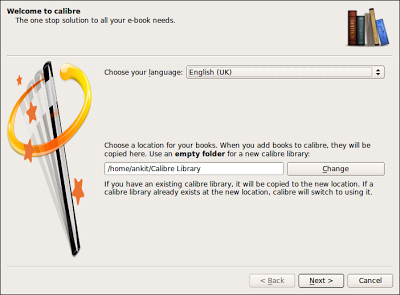

Select your ebook Device. I have selected Android as that is the smartphone I use for reading ebooks.


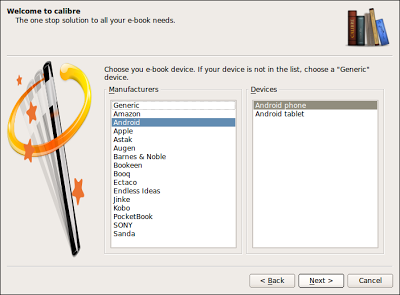

That's Calibre configured. Easy-Peasy !!! :)


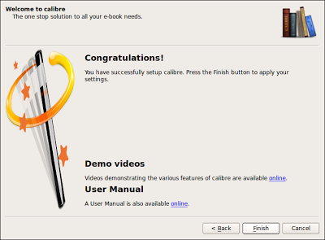


## Step 2: Import pdf into Calibre

Open Calibre (On Linux Mint: Menu - All Applications - Office - Calibre or just by typing calibre on terminal).

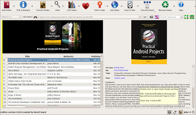

Now click on 'Add Books' and select 'Add books from single directory.

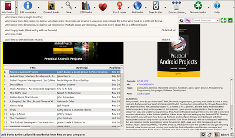

It will open the dialogue box for you to select file. Go to the location where you have saved your pdf. In my case it was in /Downloads/Tutorials as you can see in next screenshot.

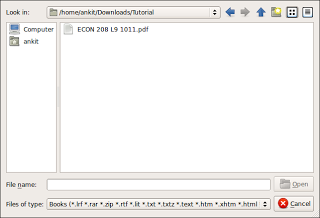

Select the file and click open. Calibre will then import the pdf. While importing it shows the 'Adding' screen as can be seen in screenshot below.

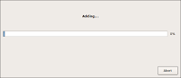

Depending on size of the pdf it can take a while or be very quick. In this case as it's a small lecture note it was hardly few seconds. Once completed, imported file will appear in your library as shown.

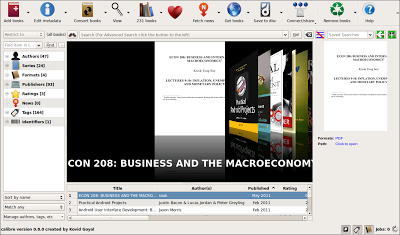

Once completed, it's time to move to next step.


## Step 3: Convert pdf to rtf using Calibre

Select and right click on the pdf imported into Calibre and select Convert - Convert Individually.

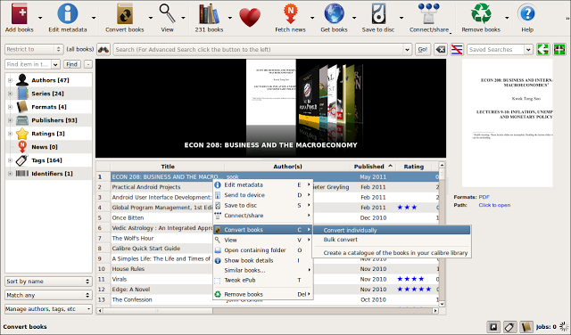

It will open the window to show options for conversion as shown below. In this window on right hand side corner select 'rtf' from the drop-down against 'Output'.

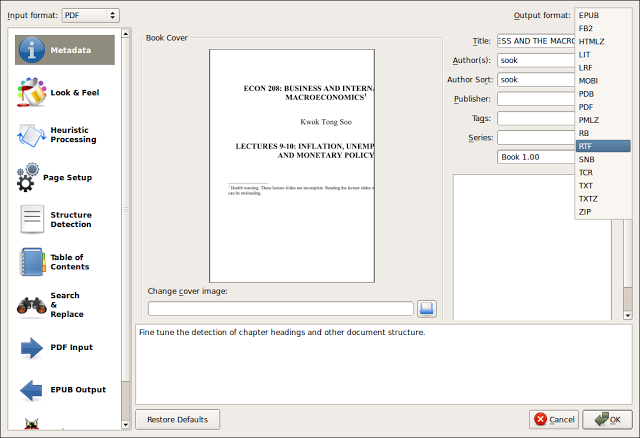

Now click OK. Once Converted it will show the rtf format in right pane as shown in red circle in following figure.

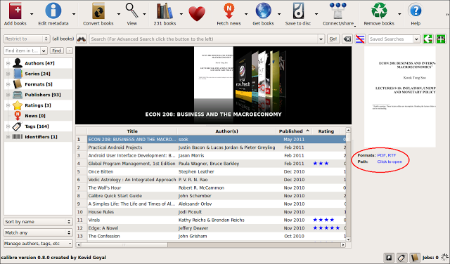


## Step 4: Open rtf file and start editing

Click on rtf and it will open the file in open-office and you are ready to edit, highlight and do pretty much what you like.
You may notice that some pictures are not coming on the page but all that is required is to do some formatting for openoffice which is quite straight forward.

Double click on the picture and in most cases it will be fixed if you click on 'keep Ratio' and changing the anchor to Page.

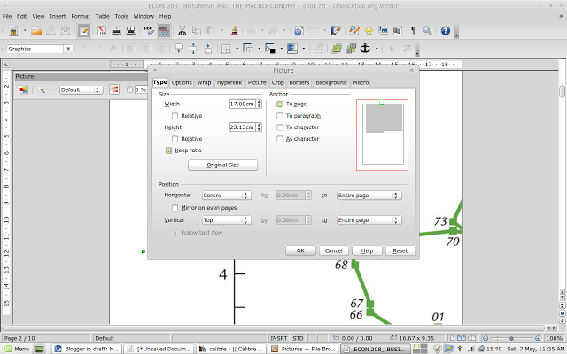

Some changes to page layout from Portrait to landscape may also help. To do so go to Format and select Page. It will open the dialogue box as shown below where you can switch between Portrait and landscape.

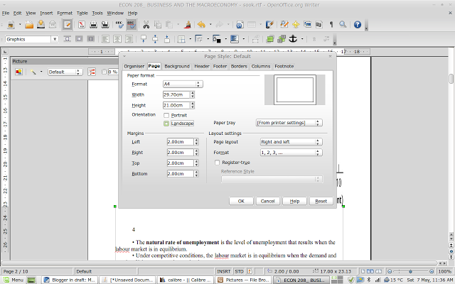


## Step 5: Convert final version of rtf to epub and transfer to your phone (Optional)

Once done save your work with a different filename and follow steps 2 and 3 to import the saved rtf file into calibre and convert to epub this time (Keep output to epub in step 3) and then transfer it to your smartphone through mail or by usb transfer.
That's it all done. It's a long tutorial keeping in mind people who are new to Linux but carrying out the steps to convert doesn't take more than 2 minutes so trying this will be well worth it.

I must add that this may not be required if all you will ever need is to add notes and comments and highlight in pdf and then print from your own laptop / computer. In which case OKULAR is a far superior way of doing it and you must try it out. However, having said that I don't know many college going students who have easy access to Printers at their hostel and in all likelihood their print-outs will be from college library in which case solution above should come handy.