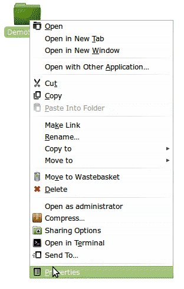

{ width=50% }

Let me clear the air before anyone mentions. Yes, I know it's directories and not folders and yes I know many still call these folders and this may encourage the wrong usage but my aim is to help not educate but hopefully making this the first line in post will have some educational effect :smile:.

<!-- more -->

Right, so to start with, presented below is the problem statement:

We want to share particular folder on our home WiFi network such that all members of the family can access it using their gadget - laptop / smartphone / netbook etc. Now like a true project manager, I will scope it down by making an assumption that any gadget that runs a variant of linux - Android included. It's not to say that the solution will not work on iOS or Windows, it's to say that these operating systems are not covered but might as well work with right application downloaded.However the solution offered will make no such claims...:p. Having said that, I will actually only be covering Android in this article as for Linux on desktop, it is fairly straight forward by going through 'Network' places.

Ok now to the exciting stuff:

## Step 1: Decide which Directory (Folder) you want to share.

For purpose of this demonstration, let's create a new folder called 'DemoShare'.

## Step 2: Decide whether you want it to be accessed by specific users or anyone and everyone connected to your home network

a) If you would want the shared directory (folder) to be password protected go through all steps below.

b) If you would want to give guest access to all users, skip to Step 4.

## Step 3

a) Create new User(s) - Let's create a new user - androshare. This can be done by following the images below:

{ width=50% }

{ width=50% }

{ width=50% }

{ width=50% }

{ width=50% }

{ width=50% }

{ width=50% }

Obviously you are free to be creative with the username. Just replace `androshare` with your username in subsequent commands.

b) Create samba username(s)/password(s)

Open the terminal and type the following command:

`sudo smbpasswd -a androshare`. 

You will be asked for the root password and then new password for the username. Once you type in new password, you will be asked to retype the new password. Again as shown in image.

{ width=50% }

c) Restart Samba

Open the terminal and type the following command:

`sudo service smbd restart`

## Step 4: Update Share Properties of the Directory(ies) to be shared

Goto the folder "DemoShare" created in Step 1, right click on the folder and select properties. On the properties dialogue box click on Share tab. Click on share the folder checkbox.

{ width=50% }

For scenario (a) of Step 2 click on checkbox - "Allow users to create and delete files in this folder" as shown in the figure below and click on Create Share.

{ width=50% }

For scenario (b) of Step 2, mark the "Guest access" Checkbox too as shown in next figure before clicking the Create Share button.

{ width=50% }

After the Create Share button is clicked following dialogue will appear. Select "Add the permissions automatically"

{ width=50% }

The folder icon will then change to show a share flag as shown below.

{ width=50% }

## Step 5: Download and install the file explorer app

ES File explorer is what I use and recommend. It can be downloaded from market here - [https://market.android.com/details?id=com.estrongs.android.pop](https://market.android.com/details?id=com.estrongs.android.pop)

{ width=50% }

## Step 6: Configure the app to access the shared directory

On your computer, open the terminal and type:
`ifconfig`

In the resulting information, locate wlan0 (last entry) and under that in second line you will find something like 'inet addr: 192.168.1.74', Note this down.

Open the app and goto LAN tab.

{ width=50% }

Press the menu button and click on 'New'.

Now click on 'Server'. This will open the 'New/Edit Samba Server Screen'.

{ width=50% }

Complete it as shown with following information:

| Field     | Scenario A            | Scenario B            |
|-----------|-----------------------|-----------------------|
| Server    | IP Address from above | IP Address from above |
| Username  | Androshare            | BLANK                 |
| Password  | As given in Step 3a   | BLANK                 |
| Anonymous | BLANK                 | Select the checkbox   |

Click OK.

Now if you click on the IP address, it should show the shared directory. As you can see in the screenshot at the beginning of this post, I have already shared my Calibre Library and it does make life really simple. I can download files and e-books without actually going to my laptop.

That is all there is to it.

Hope you find it useful.
