## Background

The start of this week was like a nightmare for me. Whole family was down with flu and I had the fever that is probably the highest ever of my entire life at 40.5 C (~ 106 F).

Anyway, surviving that was easier compared to the aftermaths of this health problem that forced me to stay in bed and inadvertently deal with office mails at home on a non-IE browser with Lite version which is crap and makes you feel miserable enough to kill yourself.

So the option I had was to either boot windows on a virtual machine or find a solution within linux. Obviously, I prefer the latter and was glad to work out a solution that can help me avoid booting windows.

I have listed below the steps I followed to achieve this, though in all honesty the documentation is quite good on sourceforge site itself. It's just that some of their screenshots are dated and in French (literally, no pun intended).

Now there are several options floating around but this set-up works flawlessly for me and so I will obviously recommend this over other methods.

It's so easy to configure that there really is no reason not to give it a shot.

<!-- more -->

## Step 1. Install DAVMail

You can get the latest version from sourcefourge by following [this link](http://davmail.sourceforge.net/download.html).

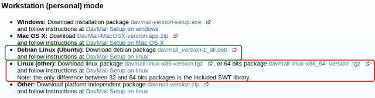

!!! site-tip "Tip"
    Select the download based on your distro. For Linux Mint 12 it will be Green Box and for non-debian based distros the red.
    
Now double click on the downloaded .deb file and DAVMail will be installed taking care of any required dependencies.

## Step 2. Configure DAVMail

Once installed, you can open DAVMail on Linux Mint 12 under Internet.

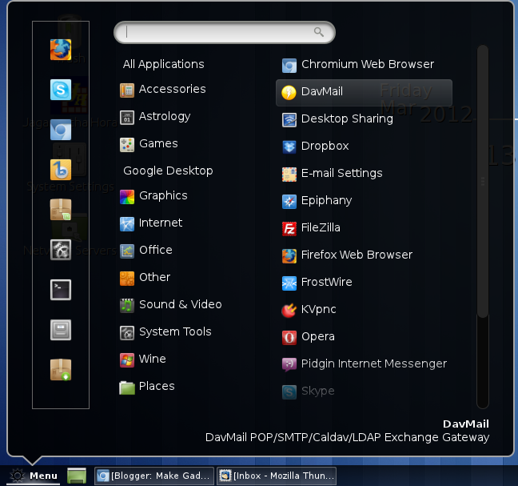

You can copy all the settings from this screenshot, leave them with what is there by default or change if you need to. Most important part is the first field OWA (Exchange) URL. You must paste your exchange 2007 OWA URL here.

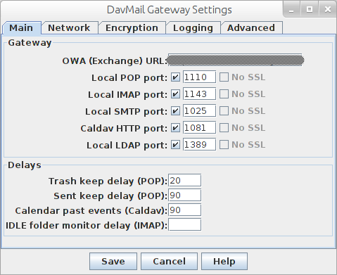

Believe it or not, that's all the configuration you need to do for DavMail.

## Step 3. Configure Thunderbird Email Client

Now over to configuring the Thunderbird Email Client. Enter Details and Click on Continue. It will show next screen by itself.

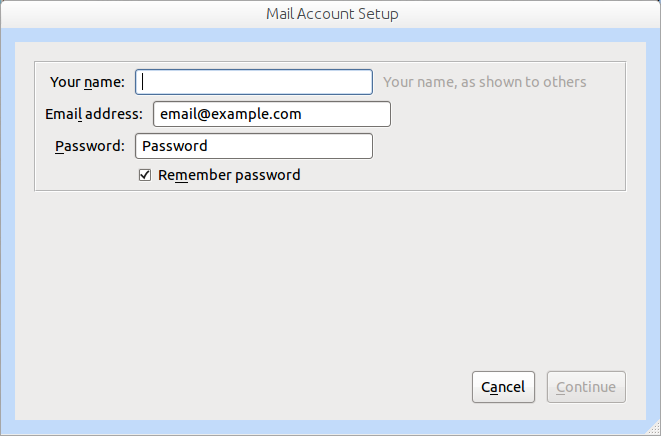

Follow instructions as per next screenshot.

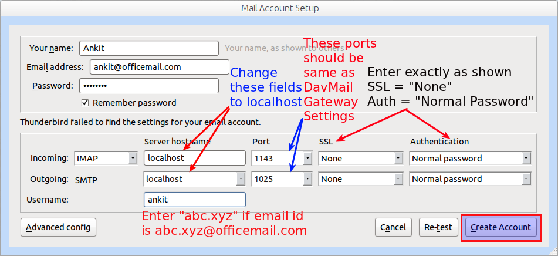

If you see following warning, tick the checkbox and Click on Create Account.

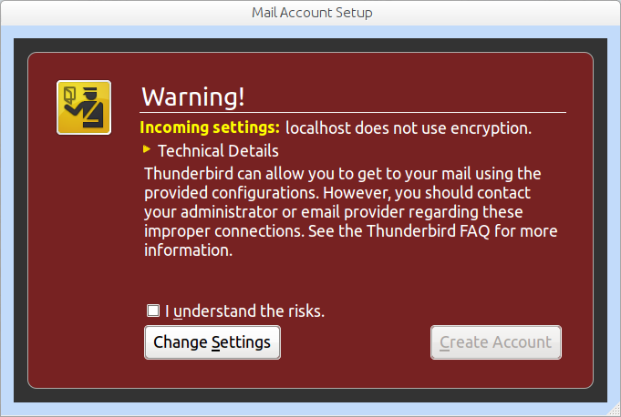

After this you may be presented with a dialogue box to enter the username and password once again. If so provide details. Remember to try just `abc.xyz` as username for `abc.xyz@officemail.com` and only if that does not work and you are presented with the dialogue box again should you try the whole email id as username.

It does take quite some time in first run as Thunderbird downloads all the mails. I was happy with the speed though YMMV.

I have applied an MS Office based theme that you can find in add-ons directory on [this link.](https://addons.mozilla.org/en-US/thunderbird/addon/ms-office-2003-jb-edition/)

Finally my mailbox looks as below:

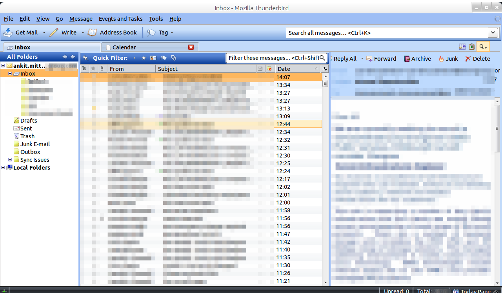

## Step 4. Configure Calendar

On Linux Mint 12 Lightning the Thunderbird calendar client does not come pre-installed. So head over to Synaptic package manager and search for 'xul-ext-light', select the shown items and install them.

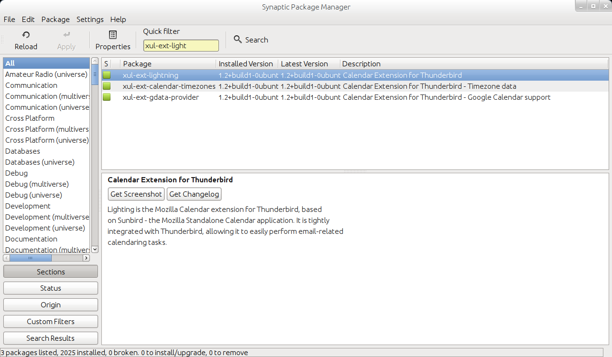

Once installed, restart thunderbird and you will see calendar icon and Task Pane.

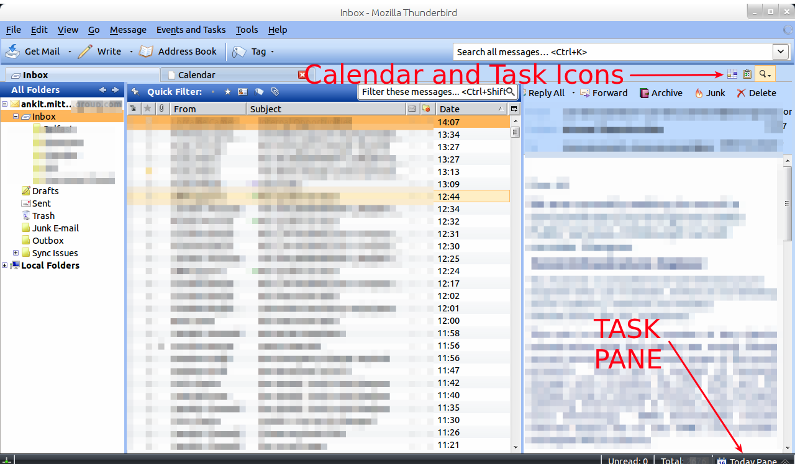

Either click on Calendar or just press ++ctrl+shift+c++. This will open Calendar view as shown below:

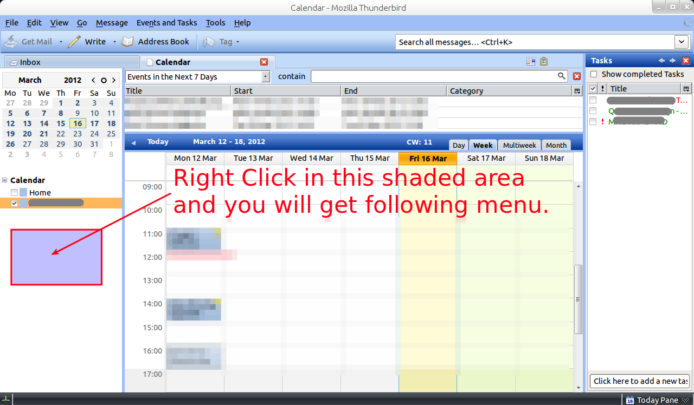

Select 'New Calendar'.

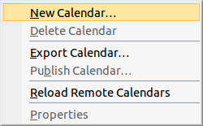

Select 'On the Network' radio button and click on 'Next'

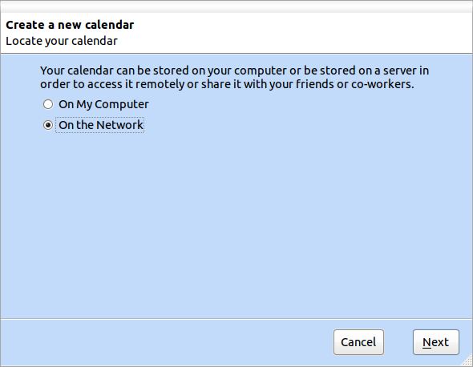

Select CalDAV radio button, and fill the location field with `http://localhost:1081/users/ankit@officemail.com/calendar`.

!!! important
    Make sure you adjust the port as per your settings of Step 2.

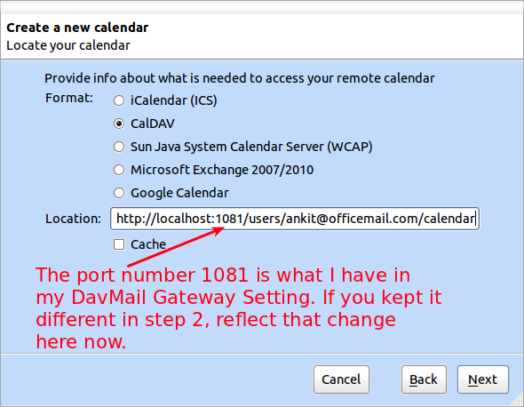

Give a name to this Calendar - say Office Cal for instance - and click Next.

After this you may be presented with a dialogue box to enter the username and password once again. If so provide details. Here provide `abc.xyz@officemail.com` and if that does not work and you are presented with the dialogue box again try with just the abc.xyz as username.

Once connected, your Calendar will be in sync as will be your tasks.

## Step 5: Configure Global Address Book

Open Address Book and then select File > New > LDAP Directory. It will open the following box.

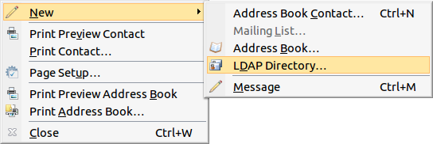

Fill as shown below and make sure Port number is as advised in red text. Then Click 'OK'

That is it. Test and see if you are now able to update your calendar, tasks, emails etc. and if all has gone as explained above you should be good to go.
