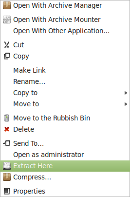
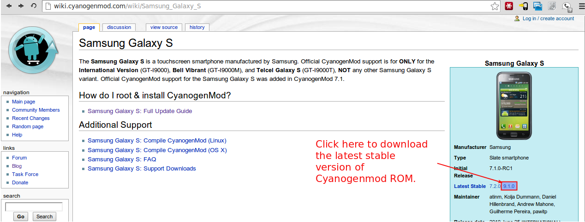
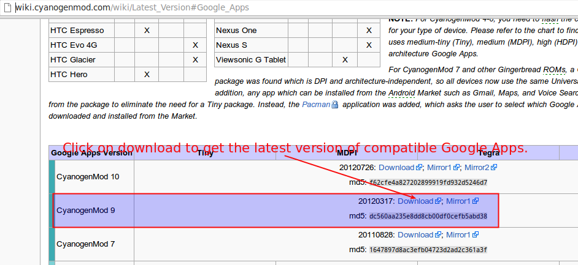

I had an old Samsung Galaxy S which was still on stock ROM hence it only ever got to gingerbread and then Samsung just decided not to upgrade and I upgraded the phone so this little gadget was till yesterday destined to live with the old gingerbread.
Then yesterday, I just decided to play around with it and started reading so I know what are my options. Now wiki guide on Cyanogenmod site is quite nicely written but there were one or two steps here and there which had me confused for a little while so here is my usual step-by-step guide on how to go about it.

!!! site-abstract "UPDATE"
    Uploaded all the files to mediafire as requested in one of the comments below. These can be downloaded from [this link](http://www.mediafire.com/?ims1bxp6b8yp8).

<!-- more -->

**Step 1:**

1. Download Heimdall Suite 1.3.2 Command-line Binary for your OS from here ; for Linux Mint you can use the Ubuntu link and install the downloaded 'heimdall_1.3.2_i386.deb' file.
2. Download hardcore's Kernel with the ClockworkMod Recovery 2.5 here. This will download a file named 'hardcore-speedmod.tar'. I am assuming that it will be saved in 'Downloads' directory but if you have a different location, please replace 'Downloads' with appropriate directory.

**Step 2:** Just to avoid any confusion, make a new directory in Downloads and name it 'Galaxy_S'.

**Step 3:** Copy the downloaded file (from 1-b) 'hardcore-speedmod.tar' into the new directory 'Galaxy_S'

**Step 4:** Now right-click on 'hardcore-speedmod.tar' and select extract here as shown. This will extract the file zImage into the directory Galaxy_S.



**Step 5:** Connect microUSB cable to your computer but not the phone.

**Step 6:** Power off the Samsung Galaxy S.

**Step 7:** Connect the microUSB cable to Samsung Galaxy S.

**Step 8:** Boot the phone in download mode by holding 'HOME+Volume Down+POWER' buttons.

**Step 9:** Open the terminal and type following commands:

```bash linenums="1"
cd Downloads/Galaxy_S
sudo heimdall flash --kernel zImage
```

A blue transfer bar will appear on the phone showing the kernel being transferred. Once completed, the device will reboot automatically.
**Step 10:** Disconnect the phone from microUSB cable, switch it on and connect to your computer using the microUSB cable as mass storage.

!!! site-tip "Tip"
    You may need to go to phone settings and change USB connection settings to be able to connect the phone as mass storage.

**Step 11:** Download the latest Cyanogenmod ROM from [here](http://wiki.cyanogenmod.com/wiki/Samsung_Galaxy_S).



**Step 12:** Follow this [link](http://wiki.cyanogenmod.com/wiki/Latest_Version#Google_Apps) to land at above page and then download the latest version of Google Apps.



**Step 13:** You will now have following two zip files in your 'Downloads' directory:

1. cm-9.1.0-galaxysmtd.zip from Step 11.
2. gapps-ics-20120317-signed.zip from Step 12

Copy these two files into the root directory of the Samsung Galaxy S.

**Step 14:** Now, disconnect the phone from microUSB and switch it off.

**Step 15:** Boot the phone in Recovery mode by holding 'HOME+Volume Up+POWER' buttons. You will be presented with various recovery options such as reboot phone etc.

**Step 17:** Now use the Volume Up and Volume Down buttons to navigate options. Use Volume Down button to reach the option to Wipe data/factory reset and press POWER button to select this option.

**Step 18:** Once done, Use Volume Down button to reach the option to wipe cache partition and press POWER button to select this option.

**Step 19:** Next select 'Install zip from sdcard' which will present another set of options where you should select 'Choose zip from sdcard'

**Step 20:** Now you will see the list of files on your SD Cards root directory. Select the file 'cm-9.1.0-galaxysmtd.zip' and on following screen of options select 'Yes'.

**Step 21:** Once installed, select +++++Go Back+++++ and again select 'Install zip from sdcard' which will present another set of options where you should select 'Choose zip from sdcard'

**Step 22:** This time select the file 'gapps-ics-20120317-signed.zip' and on following screen of options select 'Yes'.

**Step 23:** Once installed, select +++++Go Back+++++ to return to main menu.

**Step 24:** On main menu select 'Reboot System now' option.

**Step 25:** If all has gone as above, your phone will restart and after a while you will see cyanogenmod flash screen. This screen will be there for a good 1 to 2 minutes. Don't panic and dont mess. Let system do it's work and in some time you would have given a fresh lease of life to your old dieing Samsung Galaxy S.