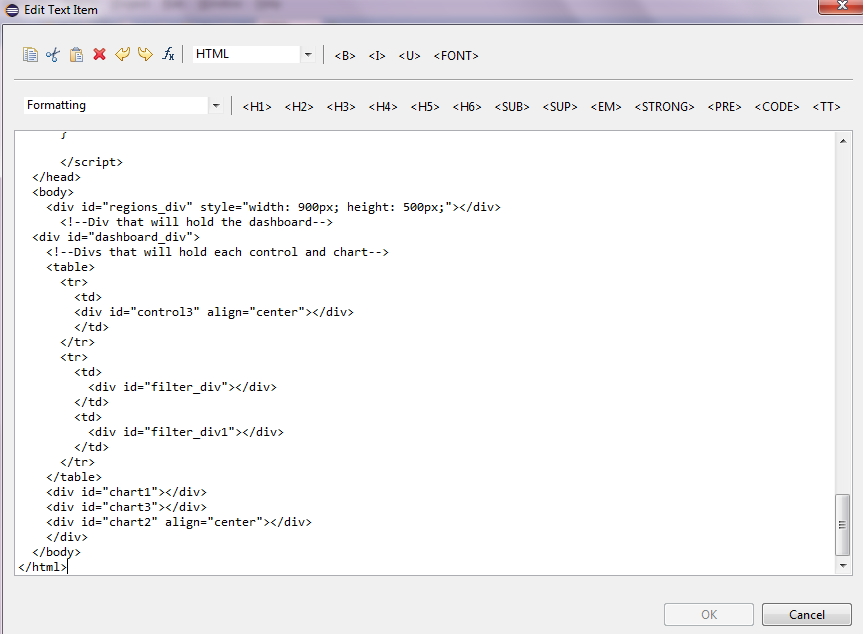
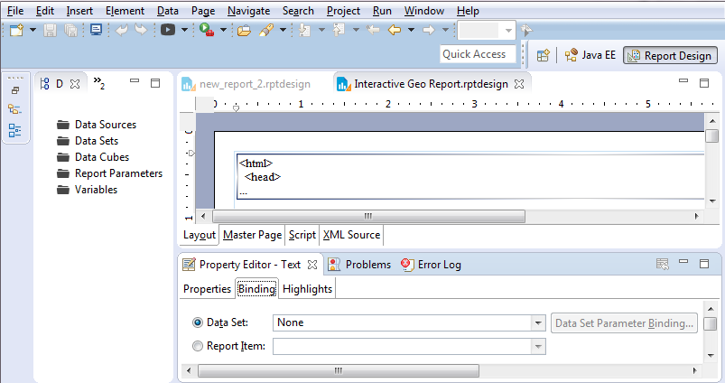
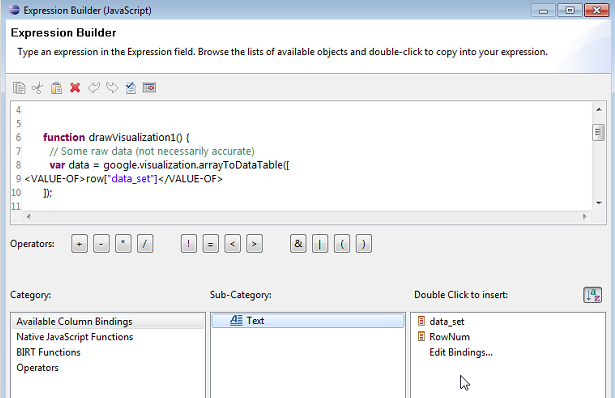

## Background

My requirement was to get the data in a format that google chart can use to draw the chart I want. Now gogle chart accepts data in json format where all column names separated with comma are in first square bracket set followed by values in rest of the square bracket sets and each square bracket set is separated by comma as well.

<!-- more -->

Having searched on good old google, there did not appear to be any quick way of doing it without getting hands dirty with likes of php and as I was to plug this into a BIRT report where a simple html would do the trick, I really just needed the data-set to be returned in format that google-chart understood.

I figured it can be easily done using a MySQL stored procedure and can be a repeatable process which resulted in creation of stored procedure presented below.

## The code

```sql linenums="1"
CREATE DEFINER=`root`@`localhost` PROCEDURE `json_builder_multiple_string`(IN `var1` varchar(10000), IN `tab_name` text, IN `int_col_as_str` int)
	LANGUAGE SQL
	NOT DETERMINISTIC
	CONTAINS SQL
	SQL SECURITY DEFINER
	COMMENT ''
BEGIN
/*
- This procedure will take columns and tablename as parameter.
- Third parameter is to tell the procedure how many columns are to be returned as string - surrounded by quotes
- Third parameter must always be less than the total columns being requested.
- Rest of the columns must have numerical values as they won't be surrounded with quotes
- Procedure returns 0 for each null value.
​
SAMPLE PROCEDURE CALL
CALL `json_builder_multiple_string`('Year,Month,Region,Sales,Expenses', 'myjsonexample',4);
​
SAMPLE QUERY GENERATED:
SELECT 
    CONCAT('[\'Year\',\'Month\',\'Region\',\'Sales\',\'Expenses\'],',
            GROUP_CONCAT('[',
                CONCAT_WS(',',
                        CONCAT('\'',
                                IFNULL(`Year`, 0),
                                '\',\'',
                                IFNULL(`Month`, 0),
                                '\',\'',
                                IFNULL(`Region`, 0),
                                '\',\'',
                                IFNULL(`Sales`, 0),
                                '\''),
                        IFNULL(`Expenses`, 0))
                SEPARATOR '],'),
            ']') AS data_set
FROM
    myjsonexample
​
SAMPLE OUTPUT:
['Year','Month','Region','Sales','Expenses'],['2004','JAN','NW','1000',400],['2005','Feb','SW','1170',460],['2006','Mar','NE','2000',1210],['2007','Apr','SE','650',540],['2008','May','EC','0',0]
​
SAMPLE TABLE USED:
Drop Table if exists `myjsonexample`;
CREATE TABLE `myjsonexample` (
  `Year` int(11) NOT NULL,
  `Month` varchar(25),
  `Region` varchar(25),
  `Sales` int(11) ,
  `Expenses` int(11) 
) ENGINE=InnoDB DEFAULT CHARSET=utf8;
INSERT INTO `myjsonexample`
(`Year`,
`Month`,
`Region`,
`Sales`,
`Expenses`)
VALUES
(2004,'JAN','NW',1000,400),
(2005,'Feb','SW',1170,460),
(2006,'Mar','NE',2000,1210),
(2007,'Apr','SE',650,540),
(2008,'May','EC',null,null);
*/
SET SESSION group_concat_max_len = 1000000;
Set @stmt1 = null;
select concat('Select concat(\'',concat('[\\\'',replace(replace(var1,'_',' '),',','\\\',\\\''),'\\\'],'),'\'',
', group_concat(\'[\',
concat_ws(\',\',
CONCAT(\'\\\'\', ifnull(`',replace(substring_index(var1,',',int_col_as_str),',','`,0),\'\\\',\\\'\',ifnull(`'),
'`,0), \'\\\'\'),',
(concat('ifnull(`',
replace(
                SUBSTRING(var1,LENGTH(SUBSTRING_INDEX(var1, ',', int_col_as_str)) + 2,LENGTH(var1)),
                ',',
                '`,0),ifnull(`'),
'`,0)')
)
,') SEPARATOR \'],\'),\']\') as data_set from ', tab_name) into @stmt1;
Prepare stmt2 from @stmt1;
Execute stmt2;
END
```
## The alternative code

Another variation of above stored procedure where the output is returned in an output parameter can be created simply by adding two more lines to above code after Execute stmt2 and also including the output parameter in first line. Complete code below:

```sql linenums="1"
CREATE DEFINER=`root`@`localhost` PROCEDURE `json_builder_outparam`(IN `var1` varchar(10000), IN `tab_name` text, OUT `varout` text)
	LANGUAGE SQL
	NOT DETERMINISTIC
	CONTAINS SQL
	SQL SECURITY DEFINER
	COMMENT ''
BEGIN
/*
- This procedure will take columns and tablename as parameter.
- Third parameter is to tell the procedure how many columns are to be returned as string - surrounded by quotes
- Third parameter must always be less than the total columns being requested.
- Rest of the columns must have numerical values as they won't be surrounded with quotes
- Procedure returns 0 for each null value.
​
SAMPLE PROCEDURE CALL
CALL `json_builder_multiple_string`('Year,Month,Region,Sales,Expenses', 'myjsonexample',4);
​
SAMPLE QUERY GENERATED:
SELECT 
    CONCAT('[\'Year\',\'Month\',\'Region\',\'Sales\',\'Expenses\'],',
            GROUP_CONCAT('[',
                CONCAT_WS(',',
                        CONCAT('\'',
                                IFNULL(`Year`, 0),
                                '\',\'',
                                IFNULL(`Month`, 0),
                                '\',\'',
                                IFNULL(`Region`, 0),
                                '\',\'',
                                IFNULL(`Sales`, 0),
                                '\''),
                        IFNULL(`Expenses`, 0))
                SEPARATOR '],'),
            ']') AS data_set
FROM
    myjsonexample
​
SAMPLE OUTPUT:
['Year','Month','Region','Sales','Expenses'],['2004','JAN','NW','1000',400],['2005','Feb','SW','1170',460],['2006','Mar','NE','2000',1210],['2007','Apr','SE','650',540],['2008','May','EC','0',0]
​
SAMPLE TABLE USED:
Drop Table if exists `myjsonexample`;
CREATE TABLE `myjsonexample` (
  `Year` int(11) NOT NULL,
  `Month` varchar(25),
  `Region` varchar(25),
  `Sales` int(11) ,
  `Expenses` int(11) 
) ENGINE=InnoDB DEFAULT CHARSET=utf8;
INSERT INTO `myjsonexample`
(`Year`,
`Month`,
`Region`,
`Sales`,
`Expenses`)
VALUES
(2004,'JAN','NW',1000,400),
(2005,'Feb','SW',1170,460),
(2006,'Mar','NE',2000,1210),
(2007,'Apr','SE',650,540),
(2008,'May','EC',null,null);
*/
SET SESSION group_concat_max_len = 1000000;
Set @stmt1 = null;
select concat('Select concat(\'',concat('[\\\'',replace(replace(var1,'_',' '),',','\\\',\\\''),'\\\'],'),'\'',
', group_concat(\'[\',
concat_ws(\',\',
CONCAT(\'\\\'\', ifnull(`',replace(substring_index(var1,',',int_col_as_str),',','`,0),\'\\\',\\\'\',ifnull(`'),
'`,0), \'\\\'\'),',
(concat('ifnull(`',
replace(
                SUBSTRING(var1,LENGTH(SUBSTRING_INDEX(var1, ',', int_col_as_str)) + 2,LENGTH(var1)),
                ',',
                '`,0),ifnull(`'),
'`,0)')
)
,') SEPARATOR \'],\'),\']\') as data_set from ', tab_name) into @stmt1;
Prepare stmt2 from @stmt1;
Execute stmt2;
Set varout = @varouttemp;
Select varout;
END
```

## The BIRT usage explained

My sample BIRT reports are available for download [HERE](https://www.mediafire.com/folder/n96sq03xvhrjz/BIRT_Examples). Enabling the google chart on BIRT couldn't be simpler.


* Create a new report

* Add a text field, open it and change it to HTML as shown in the image below
  
    

* Copy the html from codeblock below.
    ```html linenums="1"
    <html>
      <head>
        <script type="text/javascript" src="https://www.gstatic.com/charts/loader.js"></script>
        <script type="text/javascript" src="https://www.google.com/jsapi"></script>
        <script type="text/javascript">
    google.charts.load('current', {
            'packages': ['geochart', 'corechart', 'table', 'controls']
          });
          google.charts.setOnLoadCallback(drawRegionsMap);

          function drawRegionsMap() {
            // Create our data table.
                var data = google.visualization.arrayToDataTable([
                ['Country', 'Period', 'RMPV', 'TARGET', 'Average'],
                ['Germany', 'Nov-2015', 75, 120, 97.5],
                ['Germany', 'Dec-2015', 55, 65, 60],
                ['Canada', 'Nov-2015', 200, 85,42.5],
                ['Canada', 'Dec-2015', 55, 65, 60],
                ['IN', 'Nov-2015', 328, 30, 179],
                ['IN', 'Dec-2015', 55, 65, 60],
                ['France', 'Dec-2015', 30, 100, 65],
                ['France', 'Nov-2015', 75, 120, 97.5],
                ['Brazil', 'Dec-2015', 50, 100, 75],
                ['Brazil', 'Nov-2015', 200, 85, 142.5],
                ['United States', 'Dec-2015', 55, 65, 60],
                ['United States', 'Nov-2015', 328, 30, 179]
              ]);

            var data1 = google.visualization.data.group(data,[0],
            [{'column': 4, 'aggregation': google.visualization.data.avg, 'type': 'number'}]
            );

            var options = {
              colorAxis: {
    //          values: [0,30,90,150],
              colors: ['#F40EF4','#FCFC2A','#7BFC2A', '#FC4A2A']
              },
              backgroundColor: '#F1F7FD',
              datalessRegionColor: '#8B8E91',
              defaultColor: '#f5f5f5'
            };
            var chart = new google.visualization.GeoChart(document.getElementById('regions_div'));

            function selectHandler() {
              var selectedItem = chart.getSelection()[0];
              if (selectedItem) {
                var message = data1.getValue(selectedItem.row, 0);
    //            alert(message)
                //if(message=='Canada'){
                var display_value = [message];
              //};
              };
              /* Start of testing*/
              
              // Create a dashboard.
              var dashboard = new google.visualization.Dashboard(
                document.getElementById('dashboard_div'));

              // Create a range slider, passing some options
              var donutRangeSlider = new google.visualization.ControlWrapper({
                'controlType': 'NumberRangeFilter',
                'containerId': 'filter_div',
                'options': {
                  //'filterColumnLabel': 'M602'
                  'filterColumnIndex': [2]
                }
              });

              // Create a range slider, passing some options
              var donutRangeSlider1 = new google.visualization.ControlWrapper({
                'controlType': 'NumberRangeFilter',
                'containerId': 'filter_div1',
                'options': {
                  //'filterColumnLabel': 'M525'
                  'filterColumnIndex': [3]
                }
              });

              var categoryPicker = new google.visualization.ControlWrapper({
                controlType: 'CategoryFilter',
                containerId: 'control3',
                state: {
                  selectedValues: display_value
                },
                options: {
                  //filterColumnLabel: 'Location Type',
                  filterColumnIndex: [0],
                  ui: {
                    labelStacking: 'vertical',
                    allowTyping: false,
                    allowMultiple: false,
                    allowNone: false
                  }
                }
              });
              // Create a column chart, passing some options
              var ColumnChart = new google.visualization.ChartWrapper({
                'chartType': 'ColumnChart',
                'containerId': 'chart1',
                'options': {
                  'width': '900px',
                  'legend': 'bottom',
                  'vAxes': {
                    0: {
                      title: 'Average Utilisation/Target Utilisation'
                    },
                    1: {
                      title: 'RMPV Utilisation'
                    }
                  },
                  'series': {
                    1: {
                      targetAxisIndex: 1
                    }
                  }
                },
                view: {
                  columns: [1, 2, 3, 4]
                }


              });

              // Create a table chart, passing some options
              var tableChart = new google.visualization.ChartWrapper({
                'chartType': 'Table',
                'containerId': 'chart2',
              });

              var pie = new google.visualization.ChartWrapper({
                chartType: 'PieChart',
                containerId: 'chart3',
                options: {
                  legend: 'bottom',
                  title: 'Average Utilisation per month',
                  pieSliceText: 'value'
                },
                // Instruct the piechart to use colums 0 (Name) and 3 (Donuts Eaten)
                // from the 'data' DataTable.
                view: {
                  columns: [1, 4]
                }
              });

              // Establish dependencies, declaring that 'filter' drives 'pieChart',
              // so that the pie chart will only display entries that are let through
              // given the chosen slider range.
              dashboard.bind([donutRangeSlider, donutRangeSlider1, categoryPicker], [ColumnChart, tableChart, pie]);

              // Draw the dashboard.
              dashboard.draw(data);
              //redraw the main chart so selection doesn't retun empty
              chart.draw(data1, options);
              // End of testing*/
            };

            google.visualization.events.addListener(chart, 'select', selectHandler);

            chart.draw(data1, options);
          }

        </script>
      </head>
      <body>
        <div id="regions_div" style="width: 900px; height: 500px;"></div>
        <!--Div that will hold the dashboard-->
      <div id="dashboard_div">
        <!--Divs that will hold each control and chart-->
        <table>
          <tr>
            <td>
            <div id="control3" align="center"></div>
            </td>
          </tr>
          <tr>
            <td>
              <div id="filter_div"></div>
            </td>
            <td>
              <div id="filter_div1"></div>
            </td>
          </tr>
        </table>
        <div id="chart1"></div>
        <div id="chart3"></div>
        <div id="chart2" align="center"></div>
        </div>
      </body>
    </html>
    ```

* Modify as required and paste in to the text field. I used jsfiddle for checking the code and making changes, [link here](https://jsfiddle.net/mrmittal/656Lts2e/).

* Run

* Once the BIRT preview is working fine, create a dataset by calling the stored-procedure above and bind it to this text field.

* To bind a dataset, in 'Report Design' perspective, click on the field and then in 'Property Editor' select 'Binding' as shown below:
  
    

* Then right click on the text field and click on edit and then click on the 'Fx' symbol next to where field was changed to HTML on top of the window. This will open javascript editor.

* On javascript editor select the static dataset and replace it by selecting the dataset like so:
    
    

* That should change the HTML to dynamically get the data from json builder.