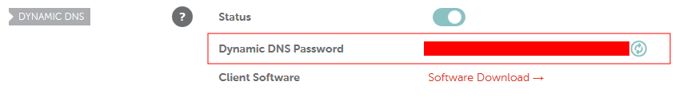

## Configure Namecheap

Follow the Namecheap guide [here](https://www.namecheap.com/support/knowledgebase/article.aspx/43/11/how-do-i-set-up-a-host-for-dynamic-dns)

!!! site-tip "Tip"
    For a subdomain "oxygen.copper.com", just replace @ with "oxygen"
	
<!-- more -->

## Set-up DDCLIENT

```bash linenums="1"
#Install DDCLIENT on Fedora
sudo dnf install ddclient
#Edit the configuration file to update IP on your Dynamic DNS host
sudo nano /etc/ddclient/ddclient.conf
```

Press ++ctrl+w++ and type the name of host for your Dynamic DNS. Mine is with Namecheap and I needed to configure for the subdomain hence following config reflects how to do it for [Namecheap guidance](https://www.namecheap.com/support/knowledgebase/article.aspx/583/11/how-do-i-configure-ddclient/). For other hosts, you will need to refer their documentation.

```bash linenums="1"
### NameCheap (namecheap.com)
use=web, web=dynamicdns.park-your-domain.com/getip
protocol=namecheap
server=dynamicdns.park-your-domain.com
login=copper.com
password= your ddns password # (1)
oxygen
## myhost.namecheap.com
```

1. Copy the password from namecheap advanced DNS section

---


The password to be provided above is what you will find on namecheap dashboard (Ref. Screenshot above).

* Log in to the namecheap account.
* Go to Advanced DNS
* Scroll down to Dynamic DNS section
* Copy the password
* Paste in ddclient config file

---

## Test DDCLIENT

Before we schedule ddclient to run at boot, we need to test if it has been configured properly and is able to communicate with Namecheap by `sudo ddclient -daemon=0 -debug -verbose -noquiet`. If it is configured properly, you will see a message similar to this as part of the final output.

```bash
SUCCESS: updating oxygen: good: IP address set to 92.117.273.56
```

!!! important
    If it is not what you see, and more importantly, if you do not see last line as "Success", then there is something wrong with configuration and you must correct it before proceeding.

If this test worked, we are ready to update the DDCLIENT service.

## Set up DDCLIENT to run at start-up

When we install ddclient using `dnf`, a `ddclient.service` file is automatically created in the location `/etc/systemd/system/ddclient.service` with following content.

```bash linenums="1" title="/etc/systemd/system/ddclient.service"
[Unit]
Description=A Perl Client Used To Update Dynamic DNS
After=syslog.target network.target nss-lookup.target

[Service]
User=ddclient
Group=ddclient
Type=forking
PIDFile=/var/run/ddclient/ddclient.pid
EnvironmentFile=-/etc/sysconfig/ddclient
ExecStartPre=/bin/touch /var/cache/ddclient/ddclient.cache
ExecStart=/usr/sbin/ddclient $DDCLIENT_OPTIONS

[Install]
WantedBy=multi-user.target
```

We will enable and start this service by issuing following commands:

```bash linenums="1"
sudo systemctl enable ddclient.service
sudo systemctl start ddclient.service
```

One would think that enabling and starting this service is all you need to do but that is not usually the case. I was getting following error:

!!! failure "Error"
    /bin/touch: cannot touch `/var/cache/ddclient/ddclient.cache': Permission denied
	
So if `sudo systemctl start ddclient` results in above error, you may need to do the following:

```bash linenums="1"
#Go Root
su
#Create a directory for ddclient
mkdir /var/run/ddclient
#Chown the various directories for ddclient as user
chown ddclient:ddclient /etc/ddclient.conf
chown ddclient:ddclient /var/run/ddclient/
#change directory
cd /var/run/ddclient
#delete ddclient.cache if it exists
rm ddclient.cache
#change directory
cd /etc/sysconfig
#delete ddclients.cache
rm ddclients.cache
#create a blank ddclient.cache
nano /var/run/ddclient/ddclient.cache
#chown it for ddclient user
chown ddclient:ddclient /var/run/ddclient/ddclient.cache
#exit root
exit
#enable and start ddclient service
sudo systemctl enable ddclient.service
sudo systemctl start ddclient.service
```

Done. :partying_face:

## Known Issue with DDCLIENT

There is a known issue and I can confirm that I have seen on my logfile as recently as today.

!!! failure "Error"
    WARNING: cannot connect to dynamicdns.park-your-domain.com:80 socket: IO::Socket::INET: Bad hostname 'dynamicdns.park-your-domain.com'

It isn't major but it is there and restarting the service by issuing the command `sudo systemctl restart ddclient.service` fixes the problem.
 