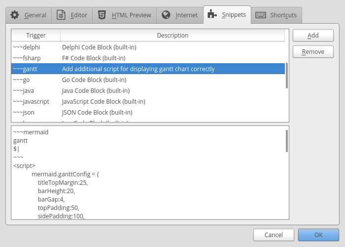
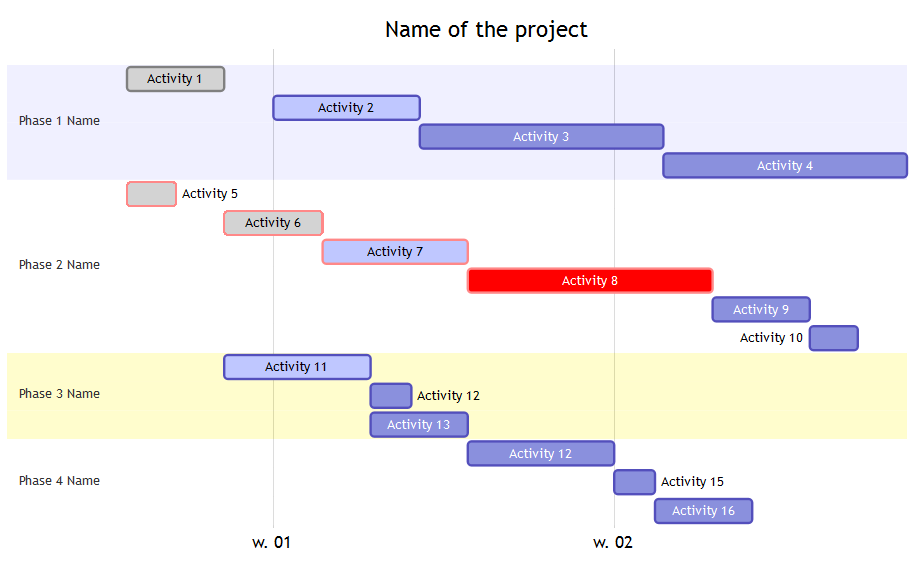

For a fairly long time, I have been looking for a simple markdown type of solution to be able to quickly draw Gantt charts but never came across what one would call a quick option. It has always been an involved process.

To my simplistic mind, a simple solution would just be an option where I can type the action, a start date and an end date for the action line after line and it get's displayed in the Gantt chart.

<!-- more -->

The latest edition of Linux Format (Issue 221, Page 52) had <a href="https://knsv.github.io/mermaid/">mermaid</a> as one of the hotpicks and highlighted the availability of Gantt charts which piqued my interest, I tried the solution and it is indeed what I was looking for. There are a few rough edges but it is a working solution and in normal circumstances will save considerable time and hence will become my tool of choice.
There are few ways of using it and because it has been made to work with MarkDown syntax, it can work on a number of tools too. I found CuteMarkEd to be the easiest one to use but the various ways to use it are listed below.

## Install CuteMarkEd

CuteMarkEd is not available in debian repositories nor does it have a binary for debian. Although it does have an rpm binary. As I have been playing with Debian / Ubuntu based Elementary OS lately, instead of my regular Fedora install, I figured might as well compile from source code. Steps are as below and are also available on the [github page for CuteMarkEd](https://github.com/cloose/CuteMarkEd/wiki/Build-Instructions#ubuntu-1404)

```bash linenums="1"
#Prepare the environment for building from source code.
sudo apt-get install build-essential checkinstall git

#Get the code from github
git clone --recursive https://github.com/cloose/CuteMarkEd.git

#Install dependencies for CuteMarkEd
sudo apt-get install libqt5webkit5-dev qttools5-dev-tools qt5-default discount libmarkdown2-dev libhunspell-dev

#Compile and install CuteMarkEd
qmake CuteMarkEd.pro
cd CuteMarkEd/
qmake CuteMarkEd.pro
make
echo 'A Qt-based Markdown editor with live HTML preview and syntax highlighting of markdown document.' > description-pak
sudo checkinstall --requires 'libqt5webkit5, libmarkdown2, libhunspell-1.3-0, discount'
sudo ln -s /usr/lib/x86_64-linux-gnu/qt5/bin/cutemarked /usr/local/bin/
sudo mkdir -p /usr/local/share/icons
sudo cp app/icons/scalable/cutemarked.svg /usr/local/share/icons/cutemarked.svg
sudo apt-get install fcitx-libs-qt5
```

Now there is a [bug](https://github.com/cloose/CuteMarkEd/issues/241) in the tool which makes the Gantt charts appear as monochrome but fear not for there is a workaround for it. Once installed, open CuteMarkEd and add a snippet in the tool to ensure Gantt charts display properly. Steps below:

1. Enable diagram support by clicking `Extras->Options->Diagram Support`
   
      * 

2. Add the snippet for quick creation by clicking `Extras->Options->Snippets->Add`
   
3. Then type `~~~gantt` and in description something to the effect of `Adds the codeblock for mermaid with the necessary javascript`
   
4. Now in the snippet box add the following code.
   
5. To invoke the snippet simply type in editor `~~~gantt` followed by pressing the ++ctrl+space++ keys.

```javascript linenums="1"
~~~mermaid
gantt  
    dateFormat  YYYY-MM-DD
    title <Name of the project>

%%	<Name of Activity>		: crit if critical else empty,done, active or empty, reference name or empty, Start Date or dependency, End Date or Duration
    section Phase 1 Name
    Activity 1			:	 done,    des1, 2017-01-06, 2017-01-08
    Activity 2          :	 active,  des2, 2017-01-09, 2017-01-12
    Activity 3          :        	  des3, 2017-01-12, 5d
    Activity 4          :         	  des4, after des3, 5d

    section Phase 2 Name
    Activity 5 			: crit, done,		2017-01-06, 24h
    Activity 6		    : crit, done, 		after des1, 2d
    Activity 7		    : crit, active, 		    3d
    Activity 8			: crit,			 	    5d
    Activity 9			:			 	    2d
    Activity 10			: 			 	    1d

    section Phase 3 Name
    Activity 11			: 	active,   a1,	after des1, 3d
    Activity 12			:			after a1  , 20h
    Activity 13			:		 doc1, 	after a1  , 48h

    section Phase 4 Name
    Activity 12			:			after doc1, 3d
    Activity 15			: 	  			    20h
    Activity 16			: 			   	    48h
~~~
<script>  
mermaid.ganttConfig = {
    titleTopMargin:25,
    barHeight:20,
    barGap:4,
    topPadding:50,
    sidePadding:100,
    gridLineStartPadding:35,
    fontSize:11,
    numberSectionStyles:3,
    axisFormatter: [
        // Within a day
        ['%I:%M', function (d) {
            return d.getHours();
        }],
        // Monday a week
        ['w. %U', function (d) {
            return d.getDay() == 1;
        }],
        // Day within a week (not monday)
        ['%a %d', function (d) {
            return d.getDay() &amp;&amp; d.getDate() != 1;
        }],
        // within a month
        ['%b %d', function (d) {
            return d.getDate() != 1;
        }],
        // Month
        ['%m-%y', function (d) {
            return d.getMonth();
        }]
    ]
};
</script>
```

This will then show in the preview pane following Gantt Chart and we can edit, add and modify the data as per the requirements:



!!! site-tip "Tip"
    You can make as many snippets as you want and for the simple solution that I mentioned right at the top, I made one snippet called dategantt replacing the code between line 3 to line 29 of the snippet above

	```javascript linenums="1"
    dateFormat  DD/MM/YY
	title Project Name

	Section Pre-condition
	Activity 1			:21/12/16, 22/12/16
	Activity 2 		:21/12/16, 22/12/16
	Activity 3 	:16/01/17, 02/02/17
	Activity 4 		:01/02/17, 02/02/17

	Section Kick-off
	Activity 5	:01/02/17, 03/02/17
	Activity 6	:01/02/17, 03/02/17
	Project Initiated		:01/02/17, 03/02/17

	Section Tech Design
	Technical Design		:crit, active, T1, 06/02/17, 21/03/17

	Section Delivery	
	Activity 7		:06/02/17, 10/02/17
	Activity 8			:10/02/17, 14/02/17
	Order				:15/02/17, 14/03/17
	Deployment			:crit, 15/03/17, 21/03/17
	Activity 9			:crit,T2, after T1, 23/03/17
	Project Close-Down		:after T2, 24/03/17
    ```

    Once done, just type dategantt followed by ++ctrl+space++ and you will have the framework to enter activities, start dates and end dates. Gantt Chart will be ready.


## Install Mermaid CLI

One of the drawbacks of the CuteMarkEd is that the pdf export there just does not work and you will need to rely on a screenshot. Now if the Gantt chart is really huge a screen shot wont cut it and mermaid does offer the ability to generate svg file for your effort. It is ofcourse a command line tool but is actually fairly easy to use once installed.

```bash linenums="1"
#check if nodejs is installed. If command below results in nothing then you need to install nodejs
nodejs -v

## Instal nodejs
sudo apt install nodejs
#On Ubuntu there is some link issue where node is 
#referenced as nodejs which results in issues 
#while installing npm modules. This can be avoided 
#by creating a symlink using following command.
sudo ln -s /usr/bin/nodejs /usr/bin/node

#Install npm
sudo apt install npm

#In order to install npm modules without sudo,
#As explained in one of my previous post:
#    http://mgw.dumatics.com/ghost-on-fedora-24/#step3installnpmmodules, 
#it requires fixing the permissions using following steps.
#This needs to be done only once so if you have 
#done this in past, then there is no need to repeat.

mkdir ~/.npm-global
npm config set prefix '~/.npm-global'
nano ~/.profile
source ~/.profile

#Install Mermaid and phantomjs on which mermaid depends.

npm install -g phantomjs
npm install -g mermaid

#Check if mermaid is installed by issuing the command
mermaid --h

#Generate a png using following command
mermaid -p path/to/markdown file with .md or .mmd extension.
```

## Install Markdown-plus

MarkdownPlus is a good markdown editor and can be used on their [hosted solution](http://mdp.tylingsoft.com/) or for offline use it can be installed as a local copy and accessed from the browser by pointing the browser to the index.html. The bug from CuteMarkEd is not present here.
To access offline, you can clone it from github using following command.

```bash
git clone --recursive https://github.com/tylingsoft/markdown-plus.git
```

Then open the folder markdown-plus and right click on the index.html file and open it using your browser of choice. Alternatively, in the browser enter `file:///home/path/to/markdown-plus//index.html`.

## Mermaid Live Editor

While Markdown Plus is quite a versatile browser based editor, I did not like the fact that there is no easy way to save the file you have created and all I could work out was that you will have to copy paste your text and save it using another text editor.
I felt, for this reason that the [Mermaid Live editor](http://knsv.github.io/mermaid/live_editor/) was better compared to this option and the live editor is quite basic to be honest and can't be used offline.
