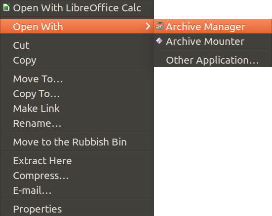

A friend of mine today had an issue. He had created a template for some really complex calculations and to ensure he does not mess up with the forumlae by mistake he had password protected sheets and cells. He had done this back in 2012 and now he wanted change something in there but he had forgotten the password so he asked me if I can help.

Now, I do not know much about how it could be done on windows or on excel but I knew a small trick on LibreOffice so I asked him to send me that excel file by email. I then took following steps:

<!-- more -->

1. Opened the excel file `Locked.xls` in LibreCalc.
   
2. Saved it as an `Locked.ods` file.
   
3. From file browser, right click on newly saved `Locked.ods` file -&gt; Open With -&gt; Archive Manager as shown below.
   
      * 
   
4. Now open the `content.xml`
   
5. Find `table:protected='true'` and Replace All with `table:protected='false'`
   
6. Save the xml file.
   
7. Now open the `Locked.ods` in LibreCalc and save it as `Unlocked.xlsx`

This should do the trick and unlock all password protected sheets and cells to be freely modified.
