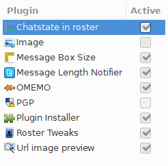

## Genreal Guidance

This how-to assumes that:

- User has access to a registered domain - `domain.name`. Any reference to `domain.name` throughout the tutorial therefore, must be replaced with your own domain name. 
- If stuck anywhere, please do get in touch with [prosody support chat](https://chat.prosody.im/) - They are a very helpful lot and are very kind too.

<!-- more -->

## Network Setup:

It is not mandatory to follow the flow of this how-to but if you do, please do it till the end before you try and access the IM server from any client to save yourself some pain.

### Obtain the IP address

\.... of the machine where your XMPP server will be installed using following command on the terminal `ip -a address` On the result shown, IP address against inet family is the one we are interested in as can be seen in screenshot below:


**Copy this ip address, we will need it in next step.**

### Port Forwarding on router if hosting from home.

You have to ensure that following ports are opened and directed to above IP address from your router. `5222, 5269, 5280, 5281` On DD-WRT this can be done as shown in screenshot below. This will, ofcourse, vary based on router you are using.


Use the IP address from previous step to fill the IP address field. Basically this set-up is informing your router that if a request comes to you asking for one of the above mentioned ports direct that request to this IP address on the same port.

### Create a sub-domain record

!!! danger
    Please note that the official Prosody Documentation recommends using Server Record and even the experts on their chat support strongly recommend that approach.

    I did not have that option unfortunately - read I was being lazy / adventurous - anyway the C-Name set-up has worked fine for me and hence the guide follows this route.

    You have been warned !!!


This step will vary based on the domain name registrar you use. I use Namecheap for which you could do it as shown in screenshot below:


### Ensure you have some sort of Dynamic DNS update set-up in place

You can create an account here -\> [DNSOMATIC](https://dnsomatic.com/) If you are going to use DNSOMATIC which allows you to update several places like so:


For namecheap in order to get the value for password, login to Namecheap dashboard, go to Advanced DNS and scroll down to \"Dynamic DNS\" section and copy the value in front of the field named \"Dynamic DNS Password" as shown below:


The setting to update DNSOMATIC on DD-WRT are as shown below: 

```yaml
DYDNS Server:`updates.dnsomatic.com` 
Hostname: `all.dnsomatic.com` 
URL: `https://updates.dnsomatic.com/nic/update?hostname=`
```


For all other Dynamic DNS set-ups ensure that your subdomain will always get updated with latest IP address to ensure continuity of service.

## Server Setup:

Normally the XMPP clients on phone directly access port 5222 or 5269 for MUC (Multi User Chats aka Group Chats) but to make sure image uploads work and for being able to access IM from web we need to enable reverse proxy using Apache server. As this is fairly straight forward, lets get that out of the way.

### Apache with reverse Proxy enabled

Make directory for subdomain:

`sudo mkdir /var/www/html/im` 

Then create a server conf file and open for editing in nano using following command:\

`sudo nano /etc/apache2/sites-available/prosody.conf` 

Paste the following in conf file:

```javascript linenums="1"
<VirtualHost *:80>
    ServerName im.domain.name
    ServerAlias im.domain.name
    DocumentRoot /var/www/html/im

    ErrorLog ${APACHE_LOG_DIR}/error_im.log
    CustomLog ${APACHE_LOG_DIR}/access_im.log combined

    ProxyPass /http-bind/ http://im.domain.name:5280/http-bind/
    ProxyPassReverse /http-bind/ http://im.domain.name:5280/http-bind/


RewriteEngine on
RewriteCond %{SERVER_NAME} =im.domain.name
RewriteRule ^ https://%{SERVER_NAME}%{REQUEST_URI} [END,NE,R=permanent]
</VirtualHost>
```

Save the file with `Ctrl+x`, `y` and `Enter`. Finally enable site and reload server.

```bash linenums="1"
    sudo a2ensite prosody.conf
    sudo systemctl reload apache2
```

### Enable SSL set-up using Let's Encrypt

It is assumed at this point that certbot is already installed but if not, follow the tutorial [here](https://certbot.eff.org/lets-encrypt/debianstretch-apache) On terminal give the command `sudo certbot`


Then follow the wizard and once completed check that an additional conf file named prosody-le-ssl.conf is created. If not something did not go well so check again and repeat but if yes move to next step.

#### Ensure certbot is renewing automatically

Debian stretch gets the service certbot.timer already on it which when enabled will try to autorenew twice a day ensuring a continuous certificate availability. To locate and edit the `certbot.timer`following commands are helpful:


```bash linenums="1"
locate certbot.timer
nano /etc/systemd/system/timers.target.wants/certbot.timer
```
The certbot.timer entry on my system is as below:


Once edited, make sure it is enabled using following commands:

```bash linenums="1"
sudo systemctl enable certbot.timer
sudo systemctl start certbot.timer
```

### Prosody XMPP server

!!! question "Assumption"
    Apache 2.4 web server is already installed and functioning.

#### Install

**Option 1** (Not Recommended): 

```bash
sudo nano /etc/apt/sources.list`
```

Then add this -> `deb http://packages.prosody.im/debian stretch main`on the last line. 

**Option 2** (Recommended):

```bash
echo deb http://packages.prosody.im/debian $(lsb_release -sc) main | sudo tee -a /etc/apt/sources.list
```

Above command is recommended because it takes the release of your installed version and adds it directly rather than the hard coded "stretch" in Option 1 which must be changes specific to the version of debian. Now add the key, update repository, upgrade for good measure and then install using the following commands:

```bash linenums="1"
wget https://prosody.im/files/prosody-debian-packages.key -O- | sudo apt-key add
sudo apt-get update
sudo apt-get upgrade
sudo apt-get install prosody
```
#### Install plugins / modules

Latest updated documentation is ofcourse on [project website](https://prosody.im/doc/installing_modules.html) but at the time of writing these are the instructions that were followed:

```bash linenums="1"
cd /usr/lib/prosody/
sudo hg clone https://hg.prosody.im/prosody-modules/ prosody-modules
```

To update:

```bash linenums="1"
cd /usr/lib/prosody/prosody-modules/
sudo hg pull --update
```

#### Import SSL using certbot

Issue following commands to get the SSL activated for Prosody:

```bash linenums="1"
sudo certbot renew --deploy-hook "prosodyctl --root cert import /etc/letsencrypt/live"
sudo prosodyctl --root cert import /etc/letsencrypt/live
sudo prosodyctl cert generate localhost 
```

#### Configure

The configuration file for prosody is very well documented and only needs minor tweaks. However, it is lot of commenting and to keep this readable, I have put my configuration here that can either be directly pasted or can be compared to update the default conf file. Either way, first you would need to open the config file:

`sudo nano /etc/prosody/prosody.cfg.lua` 

Now the working config file for me is as shown below and can be compared to amend or can be directly copy pasted.

Bear in mind that all references to `domain.name` must be replaced with your registered domain name.

```lua linenums="1"
admins = {"admin1@im.domain.name"} -- (1)

plugin_paths = {"/usr/lib/prosody/prosody-modules" }
consider_bosh_secure = true
cross_domain_bosh = true
modules_enabled = {

        -- Generally required
                "roster"; -- Allow users to have a roster. Recommended ;)
                "saslauth"; -- Authentication for clients and servers. Recommended if you want to log in.
                "tls"; -- Add support for secure TLS on c2s/s2s connections
                "dialback"; -- s2s dialback support
                "disco"; -- Service discovery

        -- Not essential, but recommended
                "carbons"; -- Keep multiple clients in sync
                "pep"; -- Enables users to publish the1ir mood, activity, playing music and more
                "omemo_all_access"; -- xep-0060 for enabling omemo access to non subscribers
                "private"; -- Private XML storage (for room bookmarks, etc.)
                "blocklist"; -- Allow users to block communications with other users
                "vcard"; -- Allow users to set vCards

        -- Nice to have
                "version"; -- Replies to server version requests
                "uptime"; -- Report how long server has been running
                "time"; -- Let others know the time here on this server
                "ping"; -- Replies to XMPP pings with pongs
                "register"; -- Allow users to register on this server using a client and change passwords
                "mam"; -- Store messages in an archive and allow users to access it
                --"mam_muc"; -- store group chat messages

        -- Admin interfaces
                "admin_adhoc"; -- Allows administration via an XMPP client that supports ad-hoc commands
                --"admin_telnet"; -- Opens telnet console interface on localhost port 5582

        -- HTTP modules
                "bosh"; -- Enable BOSH clients, aka "Jabber over HTTP"
                "websocket"; -- XMPP over WebSockets
                "http_files"; -- Serve static files from a directory over HTTP
                "http_upload"; -- module to enable file upload in group chat

        -- Other specific functionality
                "groups"; -- Shared roster support
                "proxy65"; -- Enables a file transfer proxy service which clients behind NAT can use
                "smacks";
                "csi";
                "cloud_notify";
                "conversejs";
}

modules_disabled = {
        -- "offline"; -- Store offline messages
        -- "c2s"; -- Handle client connections
        -- "s2s"; -- Handle server-to-server connections
        -- "posix"; -- POSIX functionality, sends server to background, enables syslog, etc.
}

allow_registration = false

c2s_require_encryption = false

s2s_require_encryption = true

s2s_secure_auth = true

s2s_secure_domains = { "domain.name" } -- (2)

pidfile = "/var/run/prosody/prosody.pid"

authentication = "internal_hashed"

archive_expires_after = "1w" -- Remove archived messages after 1 week

log = {
        info = "/var/log/prosody/prosody.log"; -- Change 'info' to 'debug' for verbose logging
        error = "/var/log/prosody/prosody.err";
        -- "*syslog"; -- Uncomment this for logging to syslog
        -- "*console"; -- Log to the console, useful for debugging with daemonize=false
}

certificates = "certs"

----------- Virtual hosts -----------
-- You need to add a VirtualHost entry for each domain you wish Prosody to serve.
-- Settings under each VirtualHost entry apply *only* to that host.

VirtualHost "localhost"

VirtualHost "im.domain.name" -- (3)

------ Components ------
---Set up a MUC (multi-user chat) room server on conference.example.com:
    Component "conference.im.domain.name" "muc" -- (4)
        restrict_room_creation = "local"
```

1. :bulb: Replace with your registered domain name.
2. :bulb: Replace with your registered domain name.
3. :bulb: Replace with your registered domain name.
4. :bulb: Replace with your registered domain name.

Once completed, save it and proceed to next steps.

```bash linenums="1"
sudo service prosody start
sudo service prosody stop
sudo service prosody start -v
sudo service prosody stop

## Enable prosody as a service so it restarts each time after system reboot

sudo systemctl is-enabled prosody.service
sudo service prosody restart
```

#### Add User

Use `prosodyctl` command to add user like so:

`sudo prosodyctl adduser admin1@im.domain.name` 

and then provide password for the user. Ofcourse you must add as many users as you need and bear in mind the conf file above has registration switched-off so the users must be manually added using this step. Check the manpage using `man prosodyctl` to see how to update password for an existing user and to delete a user.

## Clients Setup

### Conversations on Android

Conversations is the best client for XMPP on Android and is available on playstore for a small amount or it can be installed from f-droid for free. The free version has some limitations with regards to push but I have been using it with no issues what-so-ever.

#### OpenPGP using OpenKeyChain

Install the OpenKeyChain app, create the key pair and trigger Conversations to start from OpenKeyChain. The other person must also have OpenPGP Key pair and you should have the public key of other person added on openkeychain instaled on your phone. Do bear in mind Conversations developer says it is an experimental feature. Although it did work perfectly fine for me while I tested with about 4 or 5 users.

### Conversejs.org on web

Go to the web root we defined initially and create an index.html:

`sudo nano /var/www/html/im/index.html` 

Then add following html code in there:

Bear in mind that all references to `domain.name` must be replaced with your registered domain name.

```html linenums="1"
    <!doctype html>
    <html class="no-js" lang="en">
    <head>
        <meta charset="utf-8"/>
        <meta name="viewport" content="width=device-width, initial-scale=1.0"/>
        <title>Converse</title>
        <link rel="shortcut icon" type="image/ico" href="css/images/favicon.ico"/>
        <link type="text/css" rel="stylesheet" media="screen" href="https://cdn.conversejs.org/3.3.4/css/converse.min.css" />
        <link type="text/css" rel="stylesheet" media="screen" href="https://cdn.conversejs.org/3.3.4/css/mobile.min.css" />
        <script src="https://cdn.conversejs.org/3.3.4/dist/converse.min.js"></script>
    </head>
    <body class="reset">
        <div class="content">
            <div class="inner-content">
                <h1 class="brand-heading"><i class="icon-conversejs"></i> Converse</h1>
            </div>
        </div>
    <script>
        converse.initialize({
            authentication: 'login',
            auto_away: 300,
            auto_reconnect: true,
            bosh_service_url: 'https://im.domain.name/http-bind/', //<!-- (1) -->
            show_controlbox_by_default: true,
            message_archiving: 'always',
            allow_logout: true,
            allow_dragresize: true
        });
    </script>
    </body>
    </html>
```

1. :bulb: Replace with your registered domain name.

Save the file with ++ctrl+x++, ++Y++ and ++Enter++. Once done restart the webserver as well as prosody for good measure:

```bash linenums="1"
sudo systemctl restart apache2.service
sudo prosodyctl restart
```

### ChatSecure on iOS

Now I do not have an iphone but a few of my friends do. They were able to use ChatSecure which is also an opensource app. Unfortunately ChatSecure is unable to get the images on group chat from Conversations but I am hoping that developer of ChatSecure will fix this issue sooner rather than later.

### Desktop Client

For desktop I found Gajim to be most polished and it can be downloaded for your OS from [here](https://gajim.org) All works great on it except for the http_upload which seems to fail for transferring images with an error "Unsecured". I am not sure what the issue is a search results did not help much - I left it because I dont really need this feature from desktop. However if someone has any ideas on how to fix this, please do leave it in the comments. The plugins on Gajim that I have applied and activated can be seen below:



## Maintenance

The service does generate a lot of logs and it will serve you well to delete generated logs daily using Cronjob like so

```bash
sudo crontab -e
```

Then add the following on the cronjob:

```bash linenums="1"
############## DELETE PROSODY LOG FILE ARCHIVES ###########################
MAILTO="your@email.com"
0 0 * * 0-6 rm  /var/log/prosody/*.gz
```