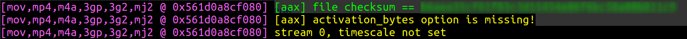
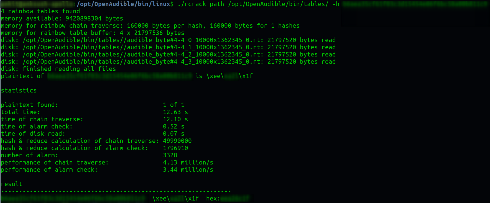

Lately I have been a bit frustrated because while I subscribe to Audible services, Amazon and Google do not play nice with each other limiting me - *the owner of books with rights to listen my purchase on any device* - in my options on where I can listen. Now I am yet to find a good solution that can get my files playing on google home and not just Alexa, I guess first step was to free my audiobooks from Amazon jail. That as it turns out is rather simple to do.I must at this point mention [OpenAudible](https://openaudible.org/) which is one fine tool. However, their latest version (2.0.7 at the time of writing) added some limitations whereby you can get it to download the AAX files but not convert them to mp3 without purchasing their license. However,converting AAX to mp3 is accomplished using `ffmpeg` and I do not believe a nice GUI wrapper is what I need and hence I do not believe my money is well spent in getting a license just to achieve from a graphical user interface what I can achieve for free from the terminal with a single line.There are 3 steps in the conversion process:

<!-- more -->

1.  Get a copy of the AAX file you own from your audible account: This
    can be done in one of two ways as listed below:
    
    a. Install OpenAudible and follow instructions to download the AAX
    files.  
    b. Copy it from the filesystem of your Android phone.

2.  Obtain the `activation_bytes` for your AAX file: 
    a. If you installed OpenAudible, you can use the following steps:
    ```bash linenums="1"
    cd /opt/OpenAudible/bin/linux/
    ffprobe /home/OpenAudible/aax/name_of_the_book.AAX 
    ```
    b. This should give you a lot of output and a hash code. Let's say
    the hashcode you get is `a6ger35cf22u03c9x16743j06f6df50a00b811c3`
    
    c. Use this hashcode with following command to get the `activation_bytes`:
       ```bash linenums="1"
       ./rcrack path /opt/OpenAudible/bin/tables/ -h a6ger35cf22u03c9x16743j06f6df50a00b811c3
       ```
    d. This should then output the `activation_bytes` in last line - something like `hex:abc43opu` as shown below:
    
    
    !!! info
        Above steps are required only once. Keep the activation_bytes code that you obtain above safe as it can be used for converting all your audiobooks.
    
3.  Now use the following commands to convert AAX file to mp3:
    ```bash linenums="1"
    #change directory to where the AAX files are saved. If using OpenAudible it will be in /home/<username>/OpenAudible/aax
    cd /home/<username>/OpenAudible/aax
    ffmpeg -activation_bytes xxxxxxxx -i 'name of the book.AAX' -map_metadata 0 -codec:a libmp3lame -qscale:a 6 /home/<username>/OpenAudible/mp3/name\ of\ the\ book.mp3
    ```
    
    !!! note
        Remember to change xxxxxxxx with the activation_bytes code you obtained in step 2 and the name of book as well as destination path and name of the book.

Now ofcourse you can accomplish first the Step 2 above without OpenAudible. If you would want to do so, just follow the [guidance on github](https://github.com/inAudible-NG/tables). 

Hope this will be helpful for a few. In the meantime, I am yet to work out the best way to make google home to play my audiobooks when I so desire. If anyone has any tips they will be gratefully received.Have fun !!!