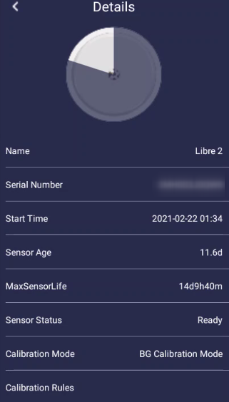
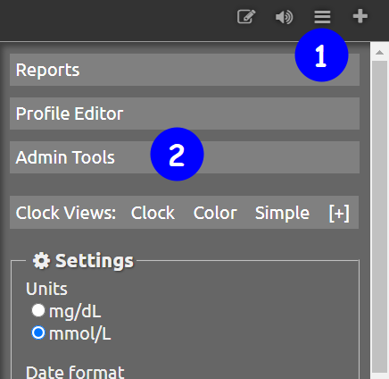

## Background

As a diabetic there are a number of things we are not able to control but one thing we can do is keep tabs on our data and while in past it would have meant meticulously noting down BG readings in a diary, today it is much much easier with all the apps and connected services. In this article, I aim to go through the list of technologies that I am aware of and use to keep on top of my diabetic data right from my phone.

<!-- more -->

## Blood Glucose Meter

While there are a number of options available, I settled for [CareSens Dual](https://shop.spirit-health.co.uk/collections/caresens-dual). The biggest advantage with this model is that it plays very nicely with xdrip+ app although lately I am relying more on Diabox so the point is kind of moot. Apart from that, one factor we must bear in mind while chosing the device is not just the cost of the device itself but also that of testing strips as it will be a recurring expense and this device has one of the most reasonably priced testing strips.

## Freestyle Libre 2 (FSL2)

FSL2 became available in the UK only from Jan'21 and this or it's previous version allow for a more regular check of the BG trends. FSL1
in my experience was a bit less accurate than FSL2. However these sensors along with the official app from manufacturer require manual
scan, don't give all datapoints and can not be calibrated which is again where xdrip+ / Diabox apps come into the picture.

!!! info "Freestyle Libre 1 (FSL1) with Transmitter (Miaomiao / Bubble)"
    Before Jan'21, in the UK we only had the option of FSL1 and as this version does not have bluetooth communication; the possibility to calibrate and get automated data points required usage of a transmitter device such as Miaomiao or Bubble. I ordered a Miaomiao transmitter back then and I still can use it with FSL2 albiet with slightly modified approach. I do it because I have the device but with FSL2 a transmitter is not needed as explained later.

## Freestyle Libre App

Now the fact is I dont really use this app for anything other than activating the sensor but it is for this reason alone an app you can not avoid or do without. In order to use the sensors to feed data directly and automatically to Diabox the sensor at the time of activation should not be paired through bluetooth to this app. Now there are several ways to achieve this. One is to install the app on a completely separate phone and turn off Bluetooth on that phone. Another is just do not give this app the "Location" permission which would then not allow app access to Bluetooth. Either scenario should work in theory but I use the safest approach of activating sensor through this app on a compltely different phone (that of my daughter actually :smile:)

## [Diabox](https://www.bubblan.org) (Especially with FSL2)

I have been using this app only for 10 days at the time of writing but it works really well with FSL2 and as it gets the data directly from the sensor it removes the additional cost of the transmitter and that makes this a very useful app indeed. The app is available or both iOS as well as Android but from what I gathered at some point Abbot Laboratories (Manufacturers of FSL sensor) complained about he app to Google and so google was obligated to takedown this app from playstore. App therefore is available as an apk file on github and the latest release for it can be downloaded from this [GitHub Link](https://github.com/bubbledevteam/diabox/releases) The developer has a [Diabox Dev website](https://www.bubblan.org/docs/installation-guide-for-bubblan/diabox/understanding-the-ui/) with lot more information on user interface and setup etc. but I will explain my setup below.

-----

1.  Download the latest version of the app from [GitHub Link](https://github.com/bubbledevteam/diabox/releases)

2.  Install the app - As it is not from playstore, the permission to install from unknown sources[^fn1] should be activated in Android Settings.
[^fn1]: [Reference on how to activate installation from unknown sources](https://developer.android.com/distribute/marketing-tools alternative-distribution#unknown-sources)

3.  Once installed, open the app. It will ask to scan the sensor. Once you scan, the phone will automatically pair the sensor with the Bluetooth of the Libre.

4.  Now to enable calibration tap on the sensor image as shown in screenshot below:

    

5.  Now tap 5 times on the text "Factory" in the last entry "Calibration Mode" as shown below:

    

6.  This will present a dialogbox =="Sensor Magic Code"==. Type =="GODMODE"== in the dialogbox field and press "OK". 

7.  This should activate the calibration mode and screen should look as shown below:

    

8.  Go back to homepage and you will now see a red coloured circular button with "+" symbol on it as you can see on the first screenshot above.

9.  Tapping on the add button will reveal an icon with a glucometer as shown below:
        
    

10. Tapping on the glucometer icon will open a sliding scale to provide the calibration value.
        
    

11.  Add your calibration and click on Save button.

-----

Now, the app also allows uploading the data it collects to LibreView and Nighscout. I am not so keen on LibreView web interface so I never tried uploading on that service but have it syncing with Nightscout. For Nightscout sync, you will need to have a Nightscout instance up and running[^fn2] but assuming it is in place, the steps will be simple to follow:

1.  Click on "Settings"
2.  Click on "Integration"
3.  Enable "Nightscout Share Server Upload"
4.  Enter the URL for Nightscout instance, something like `https://your_nightscout.herokuapp.com/api/v1/`
1.  Enter the password for your instance.
2.  Click on `Connect Test`
3.  If the test is a success, click on `Save` button.

## [Nightscout](https://nightscout.github.io/)

Nightscout is a fairly detailed open source solution with loads and loads of functionalities but as a type 2 user I merely use it as a
backup of my data.

!!! danger
    One key thing to note is that once you setup this server your BG data is available to anyone with access to your URL as there is no password block or similar which in my eyes is no big deal. What can anyone do with just my blood glucose data and how or why will they get access to an obscure URL anyway but if this makes you worried perhaps you can skip this part. If this is not of concern then I must say that while the setup guide[^fn2] looks very long and complex, it really isn't. They have taken care to make it so very simple that its infact easier than even completing the registration form for some of the online services we have got accustomed to and it will just work.

To set it up you can follow the [official set-up and installation guide](https://nightscout.github.io/nightscout/new_user/).

## [Diabetes:M](https://www.diabetes-m.com/)

Diabetes-M is a very good app and creates some very useful and pretty reports that can be helpful during discussion with Diabetic Nurse / GP. One big advantage of using this app is that it is able to import data from Nightscout directly and keep it in sync every 15 minutes and then that data is also backed-up in Diabetes-M servers. The app also allows for automatic data sync with a number of popular Glucometers but that is a paid feature and I do not use it so I cannot comment on its reliability. For my usecase I anyway calibrate Diabox each time manually when I take the reading from finger prick and that is synched to Nightscout which is synched to Diabetes-M so the data is anyway there when I need it. Steps to sync with Nightscout are as below:

1.  Open your nightscout instance in a browser on a laptop / PC .

2.  Click on the site in sequence as shown below:  
        
    

3.  On resulting screen - Administration panel, check if the role "readable" exists.  
        
    

4.  If not create it by clicking on the button `Add new Role` and in "Permissions" type `*.*.read` as shown below.  
        
    

5.  If it exists, go to the section "Subjects - People, Devices, etc" and click on "Add new Subject" and fill the resulting dialogbox like shown below and click `Save`:  
        
    

6.  This will generate the Access Token for the app and it will be shown in the table in the section:  
        
    

7.  Open the Diabetes:M app and click on the hamburger menu on top left corner of the screen. Then on the panel locate and tap on the Data Sync icon.  
        
    { width="300" }

8.  On resulting screen under section "Link external sources" locate Nightscout and click on setting icon.  
        
    { width="300" }

9.  Now fill the URL for your nightscout instance, something like `https://your_nightscout.herokuapp.com`

10. Leave "Secret" empty and in in the field "Access token" type the access token shown generated in step 6 above from the browser and click `Save`.

Direct links to appstore:

1.  [Google Playstore](https://play.google.com/store/apps/details?id=com.mydiabetes)
2.  [Apple Appstore](https://itunes.apple.com/app/id1196733537?mt=8)

## [XDRIP+](https://jamorham.github.io/#xdrip-plus)

xdrip+ is an opensource Android app (an iOS variant exists but I havent read much about it so have no knowledge to share) and as it is not available from playstore it can be obtained directly from developer site: <https://jamorham.github.io/#xdrip-plus> To use xdrip, you will also need to order a transmitter called miaomiao - It usually comes within 2 to 3 days - for me atleast it came in 2 days back in October when I started using FSL1. It is a bit of investment at about £162 but it pays for itself in long run. I ordered from their
site[^fn3]. Once you get the transmitter, the process will be like so:

1.  It will come with a USB charging cable so place it on charger. It should start blinking blue but if it does not there is a very small hole and you will need a safety pin to press and reset it. Insert the safety pin and keep it pressed for 10 seconds. Then place it on charge.
2.  Once the transmitter is charged it will display green light.
3.  Now there is also a strap they provide with the transmitter which you can use to place it over the libre sensor on your arm.
4.  Open xdrip app and follow the xdrip+ installation guide[^fn4].

Once connected, it will ask you to calibrate the app with readings from two finger prick tests. You can do one and provide twice or you can do twice. I usually do it twice for each new sensor.

## [Tidepool](https://www.tidepool.org/)

This is a not-for-profit site which xdrip+ can directly communicate with and push the readings to every 15 minutes thus creating a backup for your data in the cloud. As I still use the miaomiao transmitter paired with xdrip+ I have created a sync from xdrip+ to tidepool. Now the good thing with tidepool is that it shows glucometer readings in a separate table and while for Diabox I have to manually enter the finger prick test data, Caresens Dual is paired perfectly with xdrip and every single time I take a finger prick test, xdrip+ automatically fetches the reading from meter via Bluetooth and then that reading is fed into Tidepool which allows me to see my BG data at one place like so:

## Eufy Smartscales

Eufy smartscale is very reasonably priced and I ordered it from Amazon. The scale is reliable, uses standard 3x "AAA" battery which last for years not months. The app interface is good too. One drawback perhaps is that data is only accessible through app on the phone and not through any website. It does sync weight with google fit so that can be accessed and shared across other services if one is so inclined but rest of it will need to be manually captured for any statistical fun. However, if I knew before what I know now I would have perhaps opted for a device from [this list](https://github.com/oliexdev/openScale/wiki/Supported-scales-in-openScale) as then I could have had my data collected through the open source app [openScale](https://play.google.com/store/apps/details?id=com.health.openscale.pro) and would have had better freedom on how to move it around. Hope this list is useful. If there are any questions, please do not hesitate to ask. :smile:

-----------

[^fn2]: [Guide to setup Nightscout Instance](https://nightscout.github.io/nightscout/new_user/)

[^fn3]: [Site to order MiaoMiao](https://miaomiao.eu/)

[^fn4]: [XDRIP+ installation guide](https://androidaps.readthedocs.io/e...p.html#connect-libre-transmitter-start-sensor)