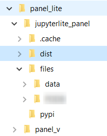
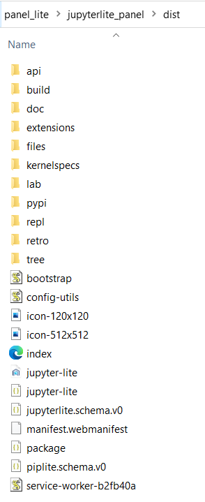
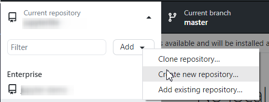
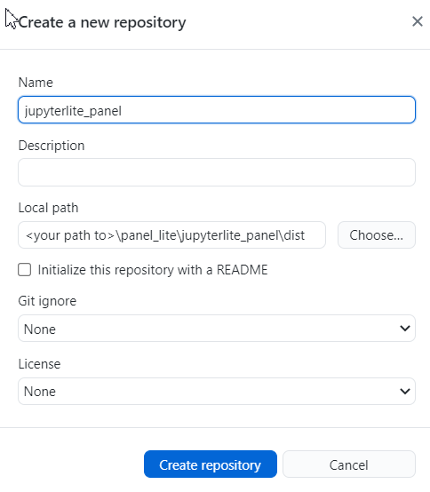
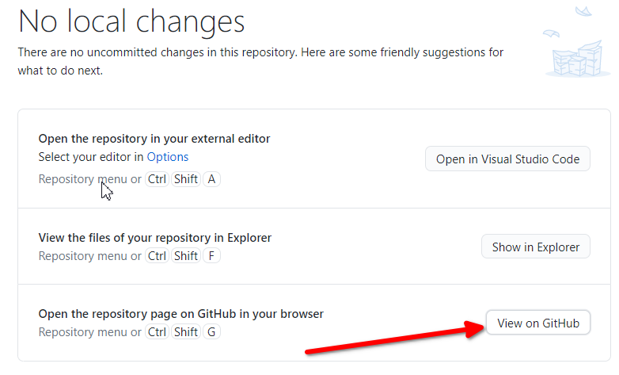
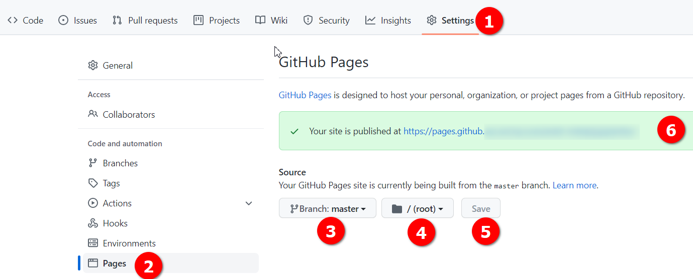
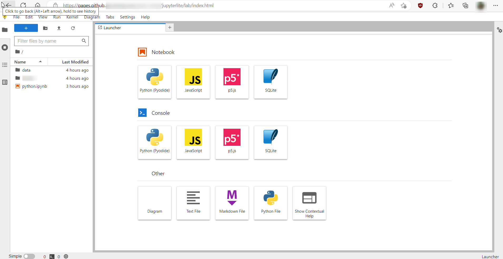

# JupyterLite on Github Enterprise with Panel enabled

Recently I found myself in a scenario where I had access to Github Enterprise but was limited to a windows machine. Now I wanted to host JupyterLite on Github Enterprise so it can be used by some other people on my team. Challenge was the "Actions" on this instance of Github enterprise were disabled and so I had to build Jupyterlite locally and push it on Github. I figured while at it, I might as well enable the "Panel" and few other dependencies. The steps that worked for me are documented here. This is ofcourse assuming that Python is already installed on the device.

The final hosted JupyterLite can be seen in action [here](https://mgw.dumatics.com/jupyterlite_panel_dist/lab/index.html).

The steps below created a Jupyterlite instance that allows use of Panel using the `%pip install panel` magic command, and if used on Chrome or its derivatives it also allows exploring local file system.

<!-- more -->

## Create and activate Jupyterlite Environment

```bash linenums="1"
mkdir panel_lite
cd .\panel_lite\
py -m venv panel_v
.\panel_v\Scripts\activate
pip install --upgrade pip
```

## Install jupyterlite and other extensions

```bash linenums="1"
pip install --pre jupyterlite
pip install jupyter-bokeh ipython ipywidgets jupyterlab-drawio jupyterlab-markup jupyterlab-myst jupyterlab-pygments jupyterlite-p5-kernel jupyterlite-xeus-sqlite libarchive-c matplotlib matplotlib-inline matplotlib-venn myst-nb myst-parser nbconvert numpy openpyxl pandas pandocfilters pkginfo pyopenssl python-dateutil python-dotenv pyviz-comms pyxlsb scipy sql SQLAlchemy sqlparse tornado widgetsnbextension xlrd XlsxWriter zipp jupyterlab-filesystem-access
```

## Prepare build directory

```bash linenums="1"
mkdir jupyterlite_panel
cd .\jupyterlite_panel\
mkdir pypi
cd .\pypi\
wget "https://cdn.holoviz.org/panel/0.14.2/dist/wheels/bokeh-2.4.3-py3-none-any.whl" -outfile "bokeh-2.4.3-py3-none-any.whl"
wget "https://cdn.holoviz.org/panel/0.14.2/dist/wheels/panel-0.14.2-py3-none-any.whl" -outfile "panel-0.14.2-py3-none-any.whl"
```

## Make a record of all that you have installed.

```bash linenums="1"
pip freeze > requirements.txt
```

## Including any existing notebooks

If you have some existing notebooks or files you would want to include on the hosted version of Jupyterlite, you must create a directory and name it `files`

## Build Jupyterlite and serve locally to test

```bash linenums="1"
jupyter lite build --output-dir ./dist
cd .\dist\
py -m http.server 8000
deactivate
```

The folder structure after build should look somewhat like below:

```bash linenums="1"
panel_lite:.
├───.cache
├───dist
│   ├───api
│   ├───build
│   ├───doc
│   ├───extensions
│   ├───files
│   ├───kernelspecs
│   ├───lab
│   ├───pypi
│   ├───repl
│   ├───retro
│   └───tree
├───files
│   ├───data
│   └───sample.ipynb
├───pypi
└───panel_v
```




## Push it to Github Enterprise

Github Desktop is the easiest way to do it. 

Open Github desktop and create new reporsitory:



On Github desktop point the Local Path field to `\panel_lite\jupyterlite_panel\dist` and do the initial commit and push to origin.



## Host Jupyterlite as Github pages

* Click on button `View on Github` on Github Desktop.



* Github Enterprise will open in browser to the created repository



* Click on Settings >  Pages 
* select Branch: master (or main) and root as source.
* Click Save and the message should be displayed in green box with the URL to access Jupyterlite.

## Finally open the URL to access JupyterLite

