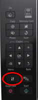

<strong>UPDATE</strong>
While this tutorial will get your printer up and running, you should also follow <a href="/part-2-configure-epson-s515w-on-linux-mint-ubuntu-10-04/">Part 2</a> to ensure that it continues to work even after you have restarted your printer.
-Ankit

Lately I have not done much experiments and hence a stable system. I did not require any changes and all was well and then recently I changed over to Linux Mint which by the way is a UBUNTU derivative, very slick and very cool. Now after this reinstall I was able to get back all my previous installs and everything the usual way but scanning using Epson S515W was not out of the box and below are the steps I followed to get it working:
<pre><code>Step 1: Configure Printer
Step 2: Test Print a page
Step 3 - Install drivers and software for scanner
Step 4 - Test Scanner
</code></pre>
<h3 id="step1configureprinter">Step 1: Configure Printer</h3>
This really works quite easily in all Ubuntu installs. Goto System &gt; Administration &gt; Printer

Now you can see my printer configured but when you will get this window, you wil only see Print_to_PDF. You should then Click on arrow next to ADD and select Printer. It will open the window below:

Again under Network Printer it may not show anything initially but if your printer is on and configured to your wireless router it will identify in a moment or two. If it does not, click on Find Network Printer.

Once your printer appears, click on it and then click on &quot;Forward&quot;.
<h3 id="step2printatestpage">Step 2: Print a test Page</h3>
Open the Printer window again from System&gt;Administration&gt;Printer and double click on printer. It should open the following window:

Click on &quot;Print Test Page&quot;. If it prints the ubuntu test page correctly your printer is configured. Mine was so I will not go more in details of alternative option. If you do want to know more let me know and I will put a post.
However if now you will try to scan you will find that scanner either is not identified or if it is it does not complete the scanning and printer gets hanged, so over to next steps then.
<h3 id="step3installdriversandsoftwareforscanner">Step 3 - Install drivers and software for scanner</h3>
Goto the avasys site that provides downloads and navigate for your model or if you have the same as mine just click on the link below and then goto Downloads and select All In One Printers. On the next page scroll down all the way and select the radio button for your printer.
<a href="http://avasys.jp/eng/">http://avasys.jp/eng/</a>
<iframe width="425" height="344" src="https://www.youtube.com/embed/fUDZE6rcYTw" frameborder="0" allowfullscreen></iframe>

Now these installs need to happen in a sequence and we don't need all deb files on the next page anyway so I will mention download and install in sequence as it should be done.
<ol>
<li>From the section &quot;Download for Epson Stylus NX510/NX515/SX510W/SX515W/TX550W data package&quot; download the data package iscan-data_1.4.0-1_all.deb.</li>
</ol>
<ul>
<li>Install this package now.</li>
<li>From the section &quot;Download for Epson Stylus NX510/NX515/SX510W/SX515W/TX550W core package&quot; download iscan_2.26.0-3.ltdl7_i386.deb.</li>
<li>Install this package now</li>
<li>From the section &quot;Download for Epson Stylus NX510/NX515/SX510W/SX515W/TX550W network plugin package&quot; download iscan-network-nt_1.1.0-2_i386.deb</li>
<li>Install this package now.</li>
<li>Now on your printer(actual machine not on laptop / computer) goto Settings (Press the button with Wrench and Screwdriver symbol as shown in the image Printer Control).</li>
</ul>
 
<ul>
<li>Using left arrow navigate to Network Settings (Computer and Printer icon)</li>
<li>Click OK button.</li>
<li>Using Down Arrow select &quot;Confirm Settings&quot; and click OK button.</li>
<li>Press Down Arrow twice and it should show the Printer IP Address. Note it Down. It will be something like 192.168.1.60.</li>
<li>Now back on your laptop open terminal and type gksudo nautilus. You will be asked your superuser password. Provide that. It will open the file explorer with admin privileges. Be extremely careful now, you do not want to delete anything in this privilege mode.</li>
<li>In the file explorer, click on &quot;File System&quot; and browse to the file path etc&gt;sane.d and open the file named epkowa.conf. (Screenshot below)</li>
<li>In the file below usb and scsi add the line net 1865 so for our example this will be  net 192.168.1.60 1865. (In gedit it was line 12 for me.)</li>
<li>Save and close the file.</li>
<li>Close all windows.</li>
</ul>

<h3 id="step4testscanner">Step 4 - Test Scanner</h3>
Now open Menu&gt;All Applications&gt;Graphics&gt;Image Scan! for Linux.

This should open the software window. Now click on preview to see that a document preview is produced. If it does you are all set. If not you must check the configuration of epkowa.conf and try again.

The preview of my 3.5 year olds drawing from scanner :

and the final scan is shown below:
