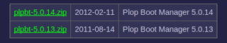
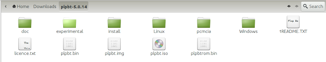
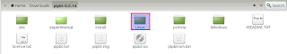
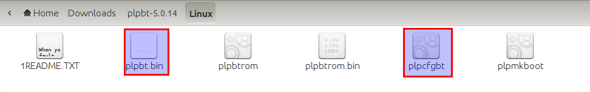
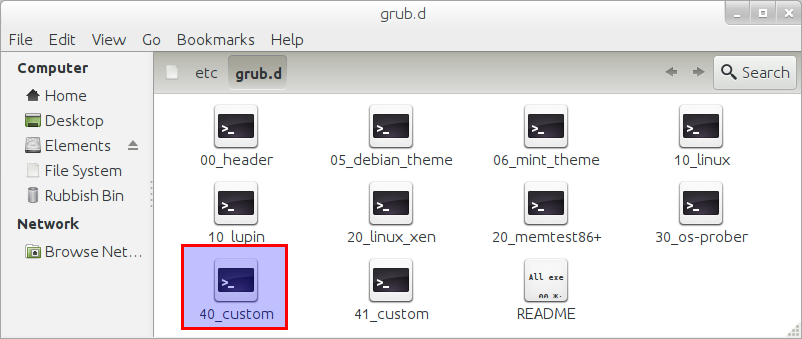

I have an old Sony VAIO which is not in it's best of health and has long been really a companion for my telly, faithfully streaming media from bbc iplayer, youtube, dailymotion and likes. Internet enabled TV arrived in my home long long back :).

Now the thing with this laptop is that it's kinda gimpy - inbuilt keyboard won't work, battery is dead and it hangs on life with constant supply of energy from the AC source on the wall and the one thing that helps me load new OS on this machine - the optical reader - is temperamental and may or may not work and is moody in selecting which CD / DVD it will read and which it won't. It does in particular like CD's authored by Linux Format guys though. Writing is a skill it has forgotten long back and if it reads something, anything I am found celebrating.

Anyway, I had ubuntu installed on this laptop for quite some time but as this laptop has one more flaw - the nvidia graphic card - and the latest update from ubuntu broke the nvidia drivers which aren't all that well supported anyway, I was being forced to reformat the machine. So I decided to try a new distro named Bodhi Linux which is very cool and uses Enlightenment as desktop which is very very good and way better than Unity and some might argue even Gnome 3.2. However, in order to do so I had to cross the hurdle of burning a CD that my laptop's Optical Drive will find intresting enough to read.

I have checked and rechecked the BIOS of this laptop and there is no way to make BIOS understand that it can boot from USB. The only options it provides are Hard Drive, Floppy Disk, Optical Reader and Network Boot. None of these were particularly useful for reasons explained above and unfortunately I was hitting the wall. So I started looking for alternative ways to get Bodhi Linux installed. Alternative is what I found in Plop Boot Manager.

Now open source enthusiasts at this point be aware, this nifty piece of software is not open source but it is so useful that this one minor flaw must be completely ignored. It gives you options to boot from USB in several ways - you can burn a CD and fool BIOS to boot from CD onto plop boot manager which in turn allows you to boot from device of your choice aka USB, it can also be put on floppy or the option that I have used - install on hard drive and configured through GRUB.

So presented below without further ado is the guide to how you can install this on your hard drive but before I do so a quick thanks to several boards and posts I referred in the process of making this work:

Steps:

Please note that these instructions will work for machines that have one of these OS installed: Bodhi Linux and Ubuntu variants. For other linux versions it should be on similar lines
{: .notice--info}

<ol>
<li>
Download the Plop Boot Manager (plpbt-5.0.14.zip file) on the machine where you want to achieve the result from <a href="http://www.plop.at/en/bootmanager/download.html">http://www.plop.at/en/bootmanager/download.html</a> 

</li>
<li>
Extract the zip file in folder where it was downloaded. In my case I have my browser setting set to download everything to &quot;Download&quot; folder. 

</li>
<li>
Now open the terminal and type following command relevant to your distro:
</li>
</ol>
<strong>For UBUNTU:</strong>
<code>gksu nautilus  /boot</code>
<strong>For Bodhi:</strong>
<code>sudo pcmanfm /boot</code>
You will be presented with a dialogue box to enter password. Once you enter the password you will be presented the contents of boot folder as shown below.
  
<ol start="4">
<li>Now 
(a) Go to the extracted plpbt-5.0.14 from step 2, click on Linux folder</li>
  
(b) Then copy the files - &quot;plpbt.bin&quot; and &quot;plpcfgbt&quot; and paste them in the boot folder opened through step 3. 
 
</ol>
<ol start="5">
<li>Once the files are copied in boot folder, double click on folder named grub and there open the file named &quot;grub.cfg&quot; in texteditor. 
</li>
</ol>
Once the file is opened, press &quot;Ctrl+f&quot; and search for string &quot;END /etc/grub.d/10_linux&quot;. Now copy the text as highlighted in screen below and paste it in a new text-editor window.
 
<ol start="6">
<li>In the new text editor after pasting the four lines from above</li>
</ol>
a) Edit the fourth line so it reads as below:
<code>linux16 /boot/plpbt.bin</code>
b) Complete the block in new editor to read as below, keeping the first three lines intact from what was copied in step 5 from grub.cfg file. In our example it will read as below:
<pre><code>    menuentry &quot;Plop Bootmanager&quot; {
    insmod ext2
    set root='(hd0,6)'
    search --no-floppy --fs-uuid --set cb7a6eb7-b355-4d0f-865e-f7312880f887
    linux16 /boot/plpbt.bin
    }
</code></pre>
Once again, this is important so remember the final structure will be achieved by following steps below.
Copy Paste this in Line 1:
<code>menuentry &quot;Plop Bootmanager&quot; {</code>
Next three lines remain same as copied from step 5:
<pre><code>    insmod ext2
    set root='(hd0,6)'
    search --no-floppy --fs-uuid --set cb7a6eb7-b355-4d0f-865e-f7312880f887
</code></pre>
Then the fourth line will be edited to look as shown below. You can copy paste this in fourth line.
<code>linux16 /boot/plpbt.bin</code>
Fifth line will be closing bracket.
<code>}</code>
<ol start="7">
<li>Now open another terminal window and type following command relevant to your distro:</li>

<strong>For UBUNTU:</strong> <code>gksu nautilus  /etc/grub.d</code>
 
<strong>For Bodhi:</strong> <code>sudo pcmanfm /etc/grub.d</code>
 
You will be presented with a dialogue box to enter password. Once you enter the password you will be presented the contents of boot folder as shown below. 

 
</ol>
<ol start="8">
<li>
Open the file 40_custom (highlighted in screenshot above) in texteditor - gedit on ubuntu or leafpad on Bodhi and paste the block from step 6(b) in this file and save it.
<pre><code> #!/bin/sh
 exec tail -n +3 $0
 # This file provides an easy way to add custom menu entries.  Simply type the
 # menu entries you want to add after this comment.  Be careful not to change
 # the 'exec tail' line above.
 menuentry &quot;Plop Bootmanager&quot; {
 insmod ext2
 set root='(hd0,6)'
 search --no-floppy --fs-uuid --set cb7a6eb7-b355-4d0f-865e-f7312880f887
 linux16 /boot/plpbt.bin
 }
</code></pre>
</li>
</ol>
<mark>Very Important - Press &quot;Enter&quot; at-least twice after pasting to ensure there are atleast two new lines below closing bracket.</mark>
<ol start="9">
<li>Close all windows and open terminal once again and type following command:</li>
</ol>
<code>sudo update-grub</code>
<ol start="10">
<li>
Now open /boot/grub/grub.conf and you should find the following entry on it:
<pre><code> ### BEGIN /etc/grub.d/40_custom ###
 # This file provides an easy way to add custom menu entries.  Simply type the
 # menu entries you want to add after this comment.  Be careful not to change
 # the 'exec tail' line above.
 menuentry &quot;Plop Bootmanager&quot; {
 insmod ext2
set root='(hd0,6)'
search --no-floppy --fs-uuid --set cb7a6eb7-b355-4d0f-865e-f7312880f887
linux16 /boot/plpbt.bin
 }
 ### END /etc/grub.d/40_custom ###
</code></pre>
</li>
<li>
Now reboot your machine with your Live USB plugged in. If you already dual boot your grub will show on restart and will have an additional option in the end - &quot;Plop Bootmanager&quot;.
</li>
</ol>
If however, you just have single OS ubuntu, press shift once the bios logo shows up and keep holding for getting the system to show Grub.
Once Grub is shown it will have the additional &quot;Plop Bootmanager&quot; menu entry on grub.
Select the &quot;Plop Bootmanager&quot; and press enter.
<ol start="12">
<li>Plop Bootmanager will show option to boot from USB. It was third option for me. Select and press enter. If your Live USB is working, you will be able to load OS from it.</li>
</ol>
This is it. You can check the video below:



Please do let me know in comments if you found this useful. If there are any other ways I will be keen to hear those too.
