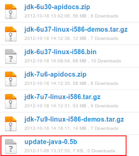
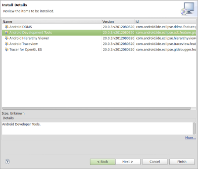
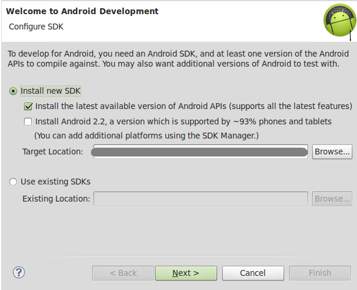

Few weeks back I updated to the latest Linux Mint offering &quot;Maya&quot; a.k.a Linux Mint 13. Now this is a LTS (Long Term Support) version and I wanted to be in a position to install everything right just so I can keep it for a longer duration and hence have been taking my time configuring stuff.
Last time when I had set up system for Android Development I remember messing up a lot and ending up installing too many things here and there and in the process did learn how to do it properly. I did not document that as a blog as it was too fragmented an experience at that time but this time round I did it properly and everything (well, okay, almost everything) was perfect.
There is lot of material on the web but again that is what led to a less than perfect install last time as it is all disjointed, making the sequence go wrong, using one way for one thing another way for second and ending us with a not so nice experience distracting you from what you want to do, start developing something on android platform or perhaps just get the adb set-up to flash your nexus phone.
So presented below is a guide that will help you prepare your Linux Mint 13 or equivalent distro for you to start android development.
You will notice that these notes do not require downloading &quot;android sdk&quot; separately and that is to save time and effort, trust me.
So the high level steps are:
<pre><code> Step 1: Download required files
 Step 2: Install Oracle Java (or what is called sun-java on Android webpages)
 Step 3: Install eclipse
 Step 4: Install ADT Plug-in for Eclipse
 Step 5: Final Configurations
 Step 6: Create Android Virtual Device
</code></pre>
<h3 id="step1downloadrequiredfiles">Step 1: Download required files</h3>
Download following files:

Links to original file locations:
<a href="http://webupd8.googlecode.com/files/update-java-0.5b">Script to Update Java</a> 
(Updated link to the latest version of script as highlighted in screenshot.)
<a href="http://download.oracle.com/otn-pub/java/jdk/7u7-b10/jdk-7u7-linux-i586.tar.gz">Java 7 SDK</a>
<a href="http://download.oracle.com/otn-pub/java/jdk/7u9-b05-demos/jdk-7u9-linux-i586-demos.tar.gz">Java 7 Samples and Demo</a>
<a href="http://download.oracle.com/otn-pub/java/jdk/7u6-b24/jdk-7u6-apidocs.zip">Java 7 API Docs</a>
<a href="http://download.oracle.com/otn-pub/java/jdk/6u37-b06-demos/jdk-6u37-linux-i586-demos.tar.gz">Java 6 Samples and Demo</a>
<a href="http://download.oracle.com/otn-pub/java/jdk/6u30-b12/jdk-6u30-apidocs.zip">Java 6 API Docs</a>
<a href="http://download.oracle.com/otn-pub/java/jdk/6u37-b06/jdk-6u37-linux-i586.bin">Java 6 SDK</a>
If you don't want to move around different webpages and websites, I have also uploaded all these files on mediafire.
<a href="http://www.mediafire.com/?4x3u3if9o7dy4">http://www.mediafire.com/?4x3u3if9o7dy4</a>
<h3 id="step2installoraclejava">Step 2: Install Oracle Java</h3>
You might ask, why do we need to do it this way?
That's because Oracle Java 6 SDK is a pre-requisite for installing Android SDK but it's not available in Ubuntu or Linux Mint repository so it can't be installed using synaptic or apt-get.
Right then, I am assuming that all the files downloaded above are placed in &quot;Downloads&quot; directory. If not, please replace &quot;Downloads&quot; in all commands with whichever directory you have downloaded these file to.
<pre class="language-bash line-numbers"><code>
#1. Open terminal and type:
cd Downloads 
#2. Make the downloaded .bin Java 6 file executable and run
chmod a+x jdk-6u37-linux-i586.bin 
./jdk-6u37-linux-i586.bin 
###This will create a directory named "jdk1.6.0_37".
#3. Untar the Java 7 SDK 
tar -xvf jdk-7u7-linux-i586.tar.gz
###This will create a directory named "jdk1.7.0_07".
#4. Unzip the Java 6 api docs 
unzip jdk-6u30-apidocs.zip -d jdk1.6.0_37/
###This command will unzip the apidocs zip file 
###and place the contents in "jdk1.6.0_37"
#5. Unzip the Java 7 api docs
unzip jdk-7u6-apidocs.zip -d jdk1.7.0_07/
###This command will unzip the apidocs zip file 
###and place the contents in "jdk1.7.0_07"
#6. Untar the Java 6 demos and samples
tar -xvf jdk-6u37-linux-i586-demos.tar.gz
###This command will untar the demos and samples file 
###and place the contents in "jdk1.6.0_37"
#7. Untar the Java 7 demos and samples
tar -xvf jdk-7u9-linux-i586-demos.tar.gz
###This will create a folder named jdk1.7.0_09. 
###Copy the contents of this folder into jdk1.7.0_07.
#8. Move the Java 6 to it's proper location
sudo mv jdk1.6.0_37 /usr/lib/jvm
###You will be asked to provide root password.
#9. Now move the Java 7 to it's proper location
sudo mv jdk1.7.0_07 /usr/lib/jvm
#10. Make the script to update java update-java-0.5b executable
#then execute it by using following commands in terminal.
chmod +x update-java-0.5b
sudo ./update-java-0.5b</code></pre>
You will be presented with following selection box: 

Once you click on OK you will be presented with following screen:

Select the radio button and click on OK.
Once Java 6 SDK is installed repeat step 10 and this time when you reach the selection window select Java 7 as shown below.

Now Oracle Java 6 and Oracle Java 7 will both be installed on your system. To check this you can use the tool &quot;galternatives&quot;. This can be installed by typing following command on the terminal window:
<code>sudo apt-get install galternatives</code> 
followed by <code>galternatives</code>.
This will open the &quot;G Alternatives&quot; window, scroll down to &quot;Java&quot; in left hand pane and click on it. You should see both versions installed and radio button for highest version selected as shown below:

<h3 id="step3installeclipse">Step 3: Install eclipse</h3>
<ol>
<li>Open Synaptic package manager and type eclipse, click on the check-box next to it and select &quot;Mark for installation&quot; then click on &quot;Apply&quot; as shown below.</li>
</ol>
 
<ol start="2">
<li>Once Eclipse is installed, we need to find out whether the necessary SWT (Standard Widget Toolkit) libraries link are set correctly or not. This is to avoid Eclipse throwing a tantrum and not starting because it is unable to find the SWT library. As you can see in the screenshot below it's a pretty quick thing:</li>
</ol>
 
A) First type the following command to check if whether SWT directory exists or not:
<code>ls ~/.swt/lib/linux/x86/</code>
If you see the same message as shown in screenshot above &quot;ls: cannot access /home//.swt/lib/linux/x86/: No such file or directory&quot;, then it means we need to create the SWT directory so continue to sub-step B.
If this command does not result in this message nor does it show a list of files (blue text in screenshot) then skip directly to sub-step C.
If it does show the list of files in blue in above screenshot, you don't need to do anything further and for you it's time to move to next step.
B) Type the following command in terminal to create the SWT directory:
<code>mkdir -p ~/.swt/lib/linux/x86/</code>
C) If the swt directory exist, but nothing is listed (no blue text), then run the following command in terminal:
<code>ln -s /usr/lib/jni/libswt-* ~/.swt/lib/linux/x86/</code>
Finally as shown in screenshot, type the command in sub-step A once again and you should see the list shown in blue on the screenshot:
Time to move on to install ADT (Android Development Tools Plugin on eclipse.
<h3 id="step4installadtpluginforeclipse">Step 4: Install ADT Plug-in for Eclipse</h3>
OK we have so far installed Java, installed eclipse and now we are all set to install Android. To do so we will follow the screenshots below:
When you start eclipse, you will be shown a splash screen, ask you to set workspace which I leave default and finally this window will open. As shown, click on the Workbench in right hand side corner. This will lead to following window.

Here Click on Help &gt; Install New Software. This will open following window.

Click on &quot;Add&quot; button in red rectangle above. Following pop-up window will appear.

In Name type &quot;ADT Plugin&quot; or whatever name you want to give. 
In Location type &quot;<a href="https://dl-ssl.google.com/android/eclipse/">https://dl-ssl.google.com/android/eclipse/</a>&quot; 
Then click OK. On following window it will first show pending but eventually it will look as below.

Here select the first option "Developer Tools" and click OK.

Click "NEXT".

Click "NEXT".

Let it run in foreground i.e. don't do anything and just wait.

Click "RESTART NOW". You will be presented with following window on restart.

Now leave the target location as is and leave everything as default and click "NEXT".

As shown above, selected the "ACCEPT ALL" radio button and click "INSTALL".
Now the android SDK is installed on the system along with other things. Close all the open windows just to clear any screen clutter. Now open the terminal and type following commands:

<code>cd android-sdks/tools</code> followed by <code>./android </code>.
It will open the following window:

<pre><code>    1. Select as shown above and optionally you can also select checkbox against Documentation and Samples. Once done click on &quot;INSTALL x Packages&quot;. 
    2. On the next window, for which I did not take a screenshot but which is same as the one before previous screenshot of terminal, select radio button &quot;ACCEPT ALL&quot; and click on &quot;INSTALL&quot;. 
    3. Now once you are back to this window select &quot;Google APIs&quot; and click on &quot;Install 1 package&quot;.
    4. On the package lis, click on &quot;ACCEPT&quot; radio button and click on &quot;INSTALL&quot;.
</code></pre>
Android Development Tools and SDK is now installed. We just need to configure few things.
<h3 id="step5finalconfigurations">Step 5: Final Configurations</h3>
<strong>adb Environmental Variables</strong>
<ol>
<li>Go to home folder</li>
<li>Press Ctrl+H 
</li>
<li>Locate the .bashrc file, if it does not exist, create one (In home folder, right click and select &quot;Create New Document &gt; Empty Document&quot;).</li>
<li>Open the file in gedit and add export <code>PATH=${PATH}:/tools:/platform-tools</code> at the end, if you created the file yourself just add this line and save.</li>
</ol>

<strong>Set the PATH environment</strong>
<ol>
<li>Go to home folder</li>
<li>Press Ctrl+H</li>
<li>Locate the .profile file</li>
<li>Open the file in gedit and add the following at the end.</li>
</ol>
<pre># set PATH so it includes user's Android SDK if it exists

if [ -d "$HOME/android-sdks" ] ; then

  PATH="$HOME/android-sdks:$HOME/android-sdks/tools:$PATH"

fi</pre>

<strong>Set-up udev</strong>
This step is only required if you want to use your android device for development purpose or if you want to flash a custom ROM.
<ol>
<li>Open the terminal and type following:</li>
</ol>
<code>gksudo nautilus /etc/udev/rules.d</code>
<ol start="2">
<li>
Create new document like we did above- Right click on empty space and select &quot;Create New Document&quot; and then &quot;Empty Document.
</li>
<li>
Name this document as &quot;51-android.rules&quot;
</li>
<li>
Open the document with Gedit and add following lines - assuming you are using &quot;Nexus S&quot; like me, if not see if your phone details are available on this link: <a href="http://wiki.cyanogenmod.com/wiki/Udev">http://wiki.cyanogenmod.com/wiki/Udev</a> and if not follow the guideline under the heading &quot;Manually create udev rules&quot; on that link.
</li>
</ol>
 
<ol start="5">
<li>Now make this 51-android.rules file executable by typing following command in the terminal window:</li>
</ol>
<code>sudo chmod a+r /etc/udev/rules.d/51-android.rules</code>
<h3 id="step6createandroidvirtualdevice">Step 6: Create Android Virtual Device</h3>
Open eclipse and follow the screenshots below:

Click on Window - AVD Manager to get to next screen except that in your screen there will be no entry.

Click on "NEW" to create a new AVD. It will open next window.

Fill details as above - You can chose name of your choice and change details as per your requirements.

To Start the AVD, click on Start.
Finally, you will be able to see the AVD as below:

This is it. Restart and your system is now all set for developing wonderful Android Applications.
