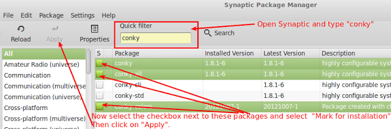
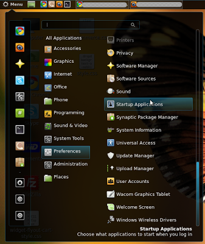
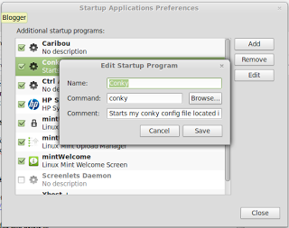

My new friend Damjan recently mentioned that he liked the Conky on my desktop and asked for details as have few others so I figured a post on the topic will be useful. 

Many who have been playing with conky seem to believe it's real easy stuff but I feel there are too many options and very little explanation which means it can be lot of messing around with different options and can take a while to get to a point where you have what you want.

 To make this conky appear exactly the way it is on my screen on your desktop follow steps 1 to 4 below and for changing time-zone settings it will be step 5:

Step 1. Install Conky from Synaptic. 
Step 2. Install the fonts used in this conky. 
Step 3. Change the conky config file. 
Step 4. Enable settings to run conky at start-up. 
Step 5: Configure time-zones on the conky config. 

<h3 id="step1installconkyfromsynaptic">Step 1. Install Conky from Synaptic:</h3>
 
Open the synaptic package manager and follow steps as shown in screenshot above. Actually I don't think conky colors is required so if it does not appear in search result don't bother. From memory, that was installed by me as part of experimenting.
<h3 id="step2installthefontsusedinthisconky">Step 2. Install the fonts used in this conky:</h3>
Download and install the fonts &quot;pf_tempesta_five_condensed.ttf&quot; and &quot;ZegoeUI-U.ttf&quot; from web or I have uploaded these to mediafire and can be download from this <a href="http://www.mediafire.com/?4ycy1sxxs5trn">link</a>.
<h3 id="step3changetheconkyconfigfile">Step 3. Change the conky config file:</h3>
<ol>
<li>Download my conky configuration in the file named &quot;.conkykrc&quot; from this <a href="http://www.mediafire.com/?nm88my3minnzao5">mediafire link</a>.</li>
<li>Open &quot;Home&quot; directory and press &quot;Ctrl+h&quot; to show hidden files.</li>
<li>Locate the &quot;.conkykrc&quot; file and delete it.</li>
<li>Now paste the &quot;conkykrc&quot; file downloaded in step 1 to home folder.</li>
</ol>
<h3 id="step4enablesettingstorunconkyatstartup">Step 4. Enable settings to run conky at start-up:</h3>
4.1. Open &quot;Startup Application&quot; from Menu &gt; Preferences. 
 
4.2. Click on &quot;Add&quot; button and fill the fields as shown above. 
 
4.3. Restart the computer and it's all done.
<h3 id="step5configuretimezonesontheconkyconfig">Step 5: Configure time-zones on the conky config:</h3>
OK, so you have conky running as it is for me but you might want different time-zones than the one I have in which case you will need to modify the .conkykrc file in &quot;Home&quot; directory.
<ol>
<li>Open &quot;Home&quot; directory and press &quot;Ctrl+h&quot; to show hidden files.</li>
<li>Locate the &quot;.conkykrc&quot; file and open it in text editor of your choice. I use gedit.</li>
<li>Now Open Terminal and Type &quot;tzselect&quot; and press enter.</li>
<li>A list of continents will be displayed, select the one of your interest by typing the number against it and press enter. (I selected &quot;Americas&quot; so I typed &quot;2&quot;)</li>
<li>Then you will be presented a list of countries. Again select the one of your interest by typing the number against it and press enter. ( I selected &quot;North America&quot; so I typed &quot;49&quot;)</li>
<li>Finally, it will display time-zones in that country. As above, select the one of your interest by typing the number against it and press enter. ( I selected &quot;Mountain Time&quot; so I typed &quot;18&quot;)</li>
<li>It will confirm selection and then mention TZ being used. For my selection it displayed &quot;Therefore TZ='America/Denver' will be used.&quot;</li>
<li>This text after &quot;TZ=&quot; is what is important for us. Copy this and go back to .conkykrc file.</li>
<li>Under &quot;TIMEZONE&quot; say you want to replace Nashville with Denver then you locate Nashville (Line 83, Col 64) and replace the text with the city of your choice, in this case &quot;Denver&quot;.</li>
<li>Now to reflect the appropriate time-zone, replace the existing time-zone &quot;America/Chicago&quot; with the one from step 10. In this example with  &quot;America/Denver'&quot;.</li>
</ol>

That's it. All Done !!!
Hope you find it useful. Feel free to ask questions on settings here and if it's something I was stuck with I might be able to help.
