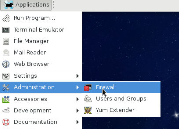
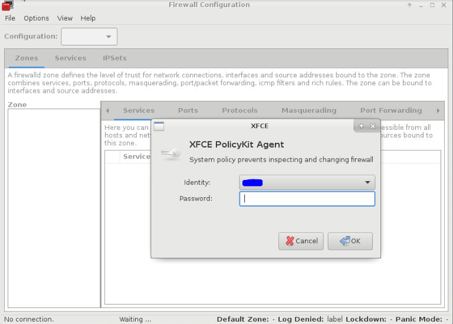
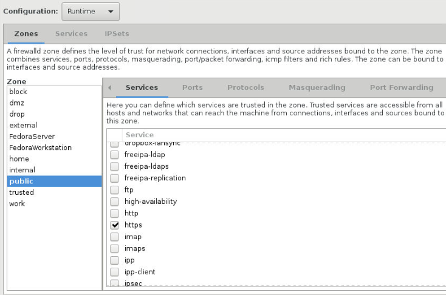
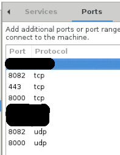
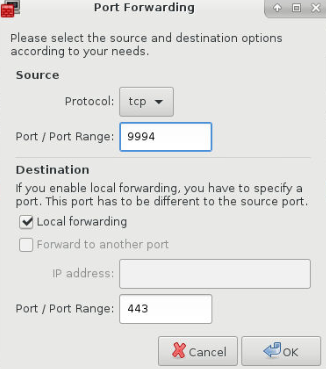

I have recently been intrigued by the idea of replacing the likes of “Dropbox” and “Google Drive” with a cloud set-up of my own. I had "Owncloud" set-up for nearly a year but was not happy with it. There were minor niggles aside form speed and thumbnails and then “Owncloud” had a recent split leading to creation of “Nextcloud”.

While “Nextcloud” is the one that is more aligned to the general principles of community driven software, it is new and is still plagued with owncloud issues as it is essentially same stuff in new packaging at the moment.

In the meantime, every now and then I was reading all the good stuff people had to say about "Seafile" and so I wanted to give it a try. Now for the past year and a half I have also been using Fedora Security Lab spin on my home server and I just wanted to get the Seafile set-up on it so I did a few “duckduckgo” searches on the net and finally had the steps to achieve the objective. Obviously it all worked and my Seafile server is live and kicking, hence the post. :)

So in nutshell my objective was to:

<blockquote>
<strong>Install seafile-server-5 behind nginx on Fedora 24 Security Lab spin all on a 32 bit 12 year old laptop.</strong>
</blockquote>

The steps I followed are listed below with detailed notes of what I did. I do not claim these to be perfect but this is what worked for me. If you know that something can be done better, please do let me know in the comments.

<h2 id="1installrequiredsoftwaretosupportseafilewithnginx">1. Install required software to support seafile with nginx:</h2>
<ol style="list-style-type: lower-alpha">
<li>python </li>
<li>python-imaging </li>
<li>MySQL-python </li>
<li>python-setuptools </li>
<li>nginx </li>
<li>mariadb </li>
<li>mariadb-server</li>
<li>policycoreutils-python</li>
<li>setroubleshoot</li>
</ol>

All this can be done with one single command:

`sudo dnf install python python-imaging MySQL-python python-setuptools nginx mariadb mariadb-server policycoreutils-python setroubleshoot`

<h2 id="2startmariadbserverandsetupbasicsecuritysettings">2. Start mariadb-server and set up basic security settings.</h2>
Now as we need to run all commands with “sudo”, it is actually easier to just go root. In other words, type "su" on the terminal and provide your password so you are logged in as root on the terminal. When you are logged in as root the $ changes to # at command prompt. All commands below are on root so if you are not logged in as root, you will need to run these with "sudo".

```bash
#Start mariadb: 
[root@localhost /] systemctl start mariadb
#Initiate the mariadb secure installation:
[root@localhost /] mysql_secure_installation
```
Above command will trigger a set of questions around port, username, password etc. You can of course change these. If you do so, you must keep note of it and change your specific details for database in subsequent steps but if you leave it default you will basically have a user: root, with a password of your choice (we will use “sqlpasswd” for this example) and a database server running at port 3306.
<h2 id="3setupdatabasesandprivilegesforseafile">3. Set up databases and privileges for "seafile&quot;</h2>
Type following:
```bash
[root@localhost /] mysql -p
```
You will be prompted to enter a password. Provide the password you have set-up for maria-db server in step above. So for our example it will be: sqlpasswd
Now on mysql prompt type following commands one after one along with semi-colon:
```sql
create database `ccnet-db` character set = 'utf8';
create database `seafile-db` character set = 'utf8';
create database `seahub-db` character set = 'utf8'
```
Now we will create a user named "seafile" for mysql with a password 'seafilepwd'. You must replace this password with one of your own. To do so use the command below and change seafilepwd with a password of your choice.
```sql
create user 'seafile'@'localhost' identified by 'seafilepwd';
```
Once seafile user is created, we need to grant permissions to this user on the three databases we created above. To do so, use the following one by one on mysql command prompt:
```sql
GRANT ALL PRIVILEGES ON `ccnet-db`.* to `seafile`@localhost;
GRANT ALL PRIVILEGES ON `seafile-db`.* to `seafile`@localhost;
GRANT ALL PRIVILEGES ON `seahub-db`.* to `seafile`@localhost;
```
Finally we will make sure that mariadb-server starts every-time the system is started. To do this simply copy the command below:

```bash
[root@localhost /] systemctl enable mariadb
```
<h2 id="4createdirectoriestodownloadandextractseafileserver">4. Create directories to download and extract seafile server:</h2>


#Create a directory called seafile:
[root@localhost /] mkdir /opt/seafile
Now change directory to the newly created path
[root@localhost /] cd /opt/seafile


Download the latest seafile-server relevant to your machine architecture (32 bit, 64 bit etc). As I am using a 32 bit laptop, I used the link meant for that.

TIP: You can get the relevant link by first opening the seafile site in firefox (https://www.seafile.com/en/download/) and scrolling down all the way to "Server" section. Then under linux section you will see link for 64 bit and 32 bit versions. Right click on one you need and click on "Copy Link" Location&amp;quot;. The copied text is what you need to paste after wget in command below.
{: .notice--tip}

```bash
[root@localhost /] wget https://bintray.com/artifact/download/seafile-org/seafile/seafile-server_5.1.3_i386.tar.gz
```
Now to extract the downloaded file, type following command.
```bash
[root@localhost /] tar -xzf seafile-server_5.1.3_i386.tar.gz
```
TIP: If downloaded version is different, the filename "seafile-server\_5.1.3\_i386.tar.gz" will be different in the link you would have got from previous step. Use the file name right at the end of the link you copied.
{: .notice--tip}

OK, now we will create a directory named “installed” and move the downloaded file in there.
```bash
[root@localhost /] mkdir installed
[root@localhost /] mv seafile-server_5.1.3_i386.tar.gz installed
```
<h3 id="checkpoint">Checkpoint</h3>
At this point, if you give the tree command, your directory structure would look as shown below
```bash
[root@localhost seafile] tree -L 2
```
```
.
|---installed
|----- seafile-server_5.1.3_i386.tar.gz
|---seafile-server-5.1.3
|----- check_init_admin.py
|----- reset-admin.sh
|----- runtime
|----- seaf-fsck.sh
|----- seaf-fuse.sh
|----- seaf-gc.sh
|----- seafile
|----- seafile.sh
|----- seahub
|----- seahub.sh
|----- setup-seafile-mysql.py
|----- setup-seafile-mysql.sh
|----- setup-seafile.sh
|----- upgrade
```
<h2 id="5configuretheseafileserver">5. Configure the seafile-server</h2>

```bash
#Change directory to seafile-server where the execution scripts are residing.
[root@localhost seafile] cd seafile-server-5.1.3
#Now run the execution script:
[root@localhost seafile-server-5.1.3] ./setup-seafile-mysql.sh
```

Running this script will initiate the seafile server set-up for mysql. You will need to provide answers to some questions. I am providing those below where you need to deviate from default or need to provide specifc information:
<ol style="list-style-type: lower-alpha">
<li><em>Name of the server.</em> Provide a servername like "my_seafile_cloud" or "cloudy_lemon" ...you get the gist.</li>
<li><em>IP or Domain of Server:</em> </li>
</ol>


TIP: Now let's take a bit of time to understand what should go here. For my usage I wanted to use dyndns so I can access this server from outside of my home network. So I had to configure my dyndns url to a port on my home router such that router understood that incoming traffic to that particular port must be transferred to this machine where the server is hosted.

Then on this machine, I have forwarded the traffic coming to a specific port again to whichever server I want to access thus having my unique URL for each service I am interested in. I will go into in a bit more detail later but for now, just ensure you are providing 1 the internal IP as well as dyndns IP along with the port you have configured on your router to reach this machine in particular where you are configuring the server.

So if internal IP of this machine is 192.168.1.24 and my dyndns url is banana.dyndns.com and I have forwarded port 9994 on my router to this machine and on machine incoming traffic to 9994 is forwarded to the port relevant to seahub then I will provide following entries as answer to this question:
192.168.1.24:9994, banana.dyndns.com


<div class="notice--tip">{{ notice-1 | markdownify }}</div>

<ol style="list-style-type: lower-alpha">
<li><em>Choose a way to initiatlise seafile databases:</em> 
Now remember we have already done this in step 2. So for this question we will need to give option 2. so just type 2 and press enter.
</li>
<li><em>Host of mysql server:</em> Unless you changed this in step 2, leave it as default (localhost)
</li>
<li><em>Port for mysql server:</em> as above leave it default (3306) unless you changed in Step 2.
</li>
<li><em>User for seafile:</em> seafile
</li>
<li><em>Password for user "seafile&quot;:</em> Use the password provided in Step 3. "seafilepwd" is what we provided for this example.
</li>
<li><em>Database name for ccnet:</em> ccnet-db
</li>
<li><em>Database name for seafile:</em> seafile-db
</li>
<li><em>Database name for seahub:</em> seahub-db</li>
</ol>

Once this wizard has completed configuring, you will get a confirmation that will tell you that seafile is now listening on port 8082 and seahub on port 8000 unless you changed these while providing answers to the wizard.

<h2 id="6addtheuserandproviderightaccess">6. Add the user and provide right access</h2>

Use following commands to go up one directory, add a user “seafile” and provide right privileges.
```bash
[root@localhost seafile-server-5.1.3] cd ..
[root@localhost seafile] adduser seafile
[root@localhost seafile] chown -R seafile .
```
<h2 id="7generatesslcertificate">7. Generate SSL Certificate:</h2>

```bash
#Change directory to /etc/ssl
[root@localhost seafile] cd /etc/ssl
#Generate private and public ssl certificates
[root@localhost ssl] openssl genrsa -out seafile_privkey.pem 2048
[root@localhost ssl] openssl req -new -x509 -key seafile_privkey.pem -out seafile_cacert.pem -days 1095
```
<h2 id="8createthenginxconfigfileforseafile">8. Create the nginx config file for seafile</h2>

Use following command to create seafile.conf file:

```bash
[root@localhost ssl] nano /etc/nginx/conf.d/seafile.conf
```
Copy Paste the following but do make relevant changes where required for servername etc:

```nginx
########################################################
server {
    listen      80;
    server_name *banana.dyndns.com*; ---&gt; Must change this as per your set-up. Notice no port 9994 here.
    rewrite ^ https://$http_host$request_uri? permanent;   # force redirect http to https. 
}
server {
    listen 443;
    ssl on;
    ssl_certificate /etc/ssl/seafile_cacert.pem;
    ssl_certificate_key /etc/ssl/seafile_privkey.pem;
    server_name *banana.dyndns.com*; ---&gt;Must change this as per your set-up. Notice no port 9994 here. 
    proxy_set_header X-Forwarded-For $remote_addr;
    add_header Strict-Transport-Security "max-age=31536000; includeSubdomains&amp;quot;;
    server_tokens off;
    location / {
        fastcgi_pass   127.0.0.1:8000;
        fastcgi_param  SCRIPT_FILENAME    $document_root$fastcgi_script_name;
        fastcgi_param  PATH_INFO          $fastcgi_script_name;
        fastcgi_param  SERVER_PROTOCOL    $server_protocol;
        fastcgi_param  QUERY_STRING       $query_string;
        fastcgi_param  REQUEST_METHOD     $request_method;
        fastcgi_param  CONTENT_TYPE       $content_type;
        fastcgi_param  CONTENT_LENGTH     $content_length;
        fastcgi_param  SERVER_ADDR        $server_addr;
        fastcgi_param  SERVER_PORT        $server_port;
        fastcgi_param  SERVER_NAME        $server_name;
        fastcgi_param  HTTPS              on;
        fastcgi_param  HTTP_SCHEME        https;
        access_log     /var/log/nginx/seahub.access.log;
        error_log      /var/log/nginx/seahub.error.log;
    }
    location /seafhttp {
        rewrite ^/seafhttp(.*)$ $1 break;
        proxy_pass http://127.0.0.1:8082;
        client_max_body_size 0;
        proxy_connect_timeout 36000s;
        proxy_read_timeout 36000s;
        proxy_send_timeout 36000s;
    }
    location /media {
        root /opt/seafile/seafile-server-latest/seahub;
    }

########################################################
```
<h2 id="9applyconfigchangestoseafile">9. Apply config changes to seafile</h2>

```bash
#Change to conf directory at /opt/seafile.
[root@localhost ssl] cd /opt/seafile/conf
#Now open the ccnet.conf file:
[root@localhost conf] nano ccnet.conf
```
Amend the file as per below:

```nginx
########################################################

[General]
USER_NAME = my_seafile_cloud 
#**Must change this as per your setup.**
ID =
NAME = my_seafile_cloud ####&lt;--------- Must change this as per your setup.
SERVICE_URL = https://192.168.1.24:9994,https://banana.dyndns.com:9994 
#**Must change this as per your setup.**
#**Also note that here we have provided the 9994 port **
#**- the one we used as port forward on router **
#**to send traffic to this machine.**

[Client]
PORT = 13419

[Database]
ENGINE = mysql
HOST = 127.0.0.1
PORT = 3306
USER = seafile
PASSWD = sqlpasswd 
#**This would be same as what was provided in Step 2.**
DB = ccnet-db
CONNECTION_CHARSET = utf8

########################################################
```
Open the seahub_settings.py file
```bash
[root@localhost conf] nano seahub_settings.py
```
Add the line <code>FILE_SERVER_ROOT= 'https://banana.dyndns.com:9994/seafhttp'</code> replacing <em>banana.dyndns.com:9994</em> with url to reach your machine.

```nginx
########################################################

DATABASES = 
{
	'default': 
	{
	'ENGINE': 'django.db.backends.mysql',
	'NAME': 'seahub-db',
	'USER': 'seafile',
	'PASSWORD': 'sqlpasswd', #This will be same as password created in Step 2.
	'HOST': '127.0.0.1',
	'PORT': '3306'
	}
}

FILE_SERVER_ROOT= 'https://banana.dyndns.com:9994/seafhttp' 
#**Must change this as per your setup.**
#**Also note that here we have provided the 9994 port **
#**- the one we used as port forward on router **
#**to send traffic to this machine.**
```
<h2 id="10nowcreatetheseafileandseahubservicesandenablethemsotheyrunatsystemstartup">10. Now create the seafile and seahub services and enable them so they run at system startup:</h2>
Create a seafile.service file:

```bash
[root@localhost conf] nano /etc/systemd/system/seafile.service
```

Paste the below into the file:

```nginx
########################################################

[Unit]
Description=Seafile
After=network.target mariadb.service

[Service]
Type=oneshot
ExecStart=/opt/seafile/seafile-server-latest/seafile.sh start
ExecStop=/opt/seafile/seafile-server-latest/seafile.sh stop
RemainAfterExit=yes
User=seafile
Group=seafile

[Install]
WantedBy=multi-user.target
#########################################################
```
```bash
#Now reload the systemd and enable seafile to start at system start-up.
[root@localhost conf] systemctl daemon-reload
[root@localhost conf] systemctl enable seafile
#Create a seahub.service file:
[root@localhost conf] nano /etc/systemd/system/seahub.service
```

Paste the following in the file and save.

```nginx
##########################################################
[Unit]
Description=Seafile hub
After=network.target seafile.service

[Service]
ExecStart=/opt/seafile/seafile-server-latest/seahub.sh start-fastcgi
ExecStop=/opt/seafile/seafile-server-latest/seahub.sh stop
User=seafile
Group=seafile
Type=oneshot
RemainAfterExit=yes

[Install]
WantedBy=multi-user.target
##########################################################
```
Now enable seahub to start at system start-up and start seafile and seahub services.

```bash
[root@localhost conf] systemctl enable seahub
[root@localhost conf] systemctl start seafile
[root@localhost conf] systemctl start seahub
```
<h3 id="startnginxserviceandenabletorunatsystemstart">Start nginx service and enable to run at system start</h3>

```bash
[root@localhost conf] systemctl enable nginx.service
[root@localhost conf] systemctl start nginx.service
```
<h2 id="12fedoraspecificsteps">12. Fedora specific steps:</h2>

Now at this point there were few final things specific to Fedora that needed attention. I was ending up getting error 500 and what not and after a bit of searching on duckduckgo, I tried steps listed in this section that fixed the issue.

I am not entirely sure what this does but what I understood is selinux was not allowing some access between nginx and seafile which this resolved. How? Well, you tell me :D.

I had to install policycoreutils-python and setroubleshoot packages for these commands to work, so I have included them in Step 1 anyway.

```bash
[root@localhost conf] cat /var/log/audit/audit.log | grep nginx | grep denied | audit2allow -M mynginx
[root@localhost conf] semodule -i mynginx.pp
[root@localhost conf] setsebool httpd_can_network_connect 1
```
<h2 id="13resetadminuserandpasswordforseafile">13. Re-set admin user and password for seafile:</h2>

```bash
#Change directory to seafile
[root@localhost conf] cd /opt/seafile/seafile-server-5.1.3/
#Now run the reset-admin
[root@localhost seafile-server-5.1.3] ./reset-admin.sh
```

<h2 id="14firewallconfigurationandportforwarding">14. Firewall configuration and port forwarding:</h2>

Notes below are relevant to system running Fedora Security Lab spin with XFCE but general principle will be same.
Application-&gt;Administration-&gt;Firewall will open firewall gui.<br>

<br>

You will be asked for password and upon entering you will be presented with Zones and Services.
<br>

In Services enable https by clicking the checkbox against “https”.
<br><br>

Now click on "Ports" and click on "Add".
<br><br>
Then add port 8082 in "Port / Port Range" and select "TCP" as "Protocol".<br>
Then add port 8082 in "Port / Port Range" and select "UDP" as "Protocol".<br>
Then add port 8000 in "Port / Port Range" and select "TCP" as "Protocol".<br>
Then add port 8000 in "Port / Port Range" and select "UDP" as "Protocol".<br>
Then add port 443 in "Port / Port Range" and select "TCP" as "Protocol".<br>
<br><br>

Now click on Port Forward tab and click on "Add". Then fill field as shown below:

```nginx
Protocol: tcp  
Port / Port Range: 9994 
# This is the port you have used on your router for port forwarding to this machine.
Under Destination section, tick the checkbox for "Local Forwarding"
Port / Port Forwarding field: 443 
# If you have used above configuration, SSL is enabled at 443. 
# If you have changed it, mention the relevant port.
```
TIP: Once you have made these changes don't forget to save this from run time to permanent or these changes will be lost when you restart the machine. [Options-> Runtime to Permanent]
{: .notice--tip}

<h2 id="15finallyrestartnginx">15. Finally, restart nginx:</h2>

Use the following command to restart nginx services.
```bash
[root@localhost seafile-server-5.1.3]# systemctl restart nginx.service
```
This is it. All Done !!!
If you now type your URL: (https://<em>banana.dyndns.com</em>:9994 from this example) on a browser, you will be presented with login page where you should use the admin login details you have created in Step 13 above.
