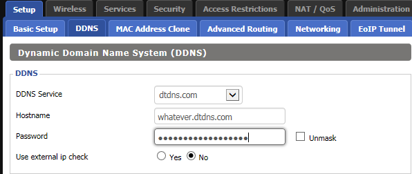
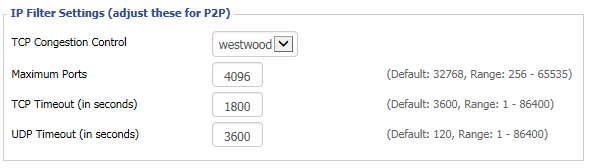

I have been with PlusNet for over two years now and am a happy camper as far as fiber optic broadband is concerned but as I am no longer on a broadband contract with PlusNet and had no intention of going on one, so the only way I could get a change to my ageing router was by purchasing a new one.
Hence I started reading about my options and soon enough realised that an old router can be given new lease of life using DD-WRT. Equally soon-ish I also realised that the router from PlusNet - TG582n - is quite rubbish and does not play nice with any of the open source firmwares.
So I figured that if I have to just play around a bit, I might as well start with something cheaper and cheaper is what I found in the TP-Link router TL-WR841n at just £16.00. You can't get any cheaper than that in my opinion. OK, so now that we have established that I am cheap and my new router is cheap, let's move on to interesting stuff.

I had read that TP-Link router and specifically TL-WR841n plays nicely with DD-WRT but it was only after I had my new toy did I realise that these things also come in hardware version and while interwebs is filled with instructions on installing DD-WRT for upto v9, when it comes to v11 in Europe, it can be a bit tricky to proceed. There are some instructions in forums<sup class="footnote-ref"><a href="#fn1" id="fnref1">[1]</a></sup> but nothing that walks one end to end hence this post.

## Flash router with DD-WRT firmware
There are two ways to ensure that the DD-WRT firmware gets flashed on the router:

<ol>
<li><strong>Apply Unlocked stock firmware</strong>  - This is the one I used and to use this I downloaded the modified firmware from NeDark that he has provided in a post on the OpenWRT forum <a href="https://forum.openwrt.org/viewtopic.php?id=67382">here</a></li>
</ol>
<ul>
<li><strong>Using TFTP server</strong> - This is considered to be a safe approach because you do not have to use any modded version of stock firmware to apply it. However, if like me you are anyway going to flash it with DD-WRT, I feel it's a bit of pain that can be avoided as it involves setting up TFTP server and making your router to connect to this server can take some time and effort. It is explained <a href="http://www.dd-wrt.com/phpBB2/viewtopic.php?t=304830&amp;sid=84c147f63f0876b055b3eb7add2a8d4e">here</a>.</li>
</ul>

Right, so assuming you want to go with the first and easier approach, first you need to download the modded firmware from NeDark. He has uploaded it on his <a href="https://dl.dropboxusercontent.com/u/5038754/wr841n%28EU%29_v11_150616.bin">dropbox link</a> and I have also uploaded a copy of this firmware <a href="http://www.mediafire.com/file/4ap8bde3m6trcs2/wr841n%28EU%29_v11_150616.bin">here</a>.

I recommend that you download all the three files from my folder on Mediafire<sup class="footnote-ref"><a href="#fn2" id="fnref2">[2]</a></sup> using the link below but if you would much rather download directly from DD-WRT, then the links for rest of the two files that I used are also in references <sup class="footnote-ref"><a href="#fn3" id="fnref3">[3]</a></sup> and <sup class="footnote-ref"><a href="#fn4" id="fnref4">[4]</a></sup> below.

Assuming that now you have all the three files safely downloaded to you computer we just follow the simple steps below:

<ol>
<li>Connect the power supply to the TP-Link router and switch it on.</li>
<li>Connect the ethernet cable in one of the yellow LAN slots of the router.</li>
<li>Switch-off the wifi on your computer and connect the other end of the ethernet cable to the ethernet port of your computer.</li>
<li>Once the ethernet connection on your laptop is established, open a browser and type <code>192.168.0.1</code> and press enter.</li>
<li>You will be presented with TP-LINK admin interface.</li>
<li>Login using the credentials username: <code>admin</code>; password: <code>admin</code>.</li>
<li>On left hand navigation locate and click on <code>System Tools</code> and then on expanded menu click on <code>Firmware Upgrade</code></li>
<li>Now click on <code>Browse</code> button and select the file from NeDARK - <code>wr841n(EU)_v11_150616.bin</code> from your downloaded folder.</li>
<li>Click on <code>Upgrade</code> button. It will take roughly 30 to 40 seconds and router will reboot.</li>
<li>Refresh the browser screen and you will once again be presented with TP-LINK admin interface.</li>
<li>Once again login using the credentials username: <code>admin</code>; password: <code>admin</code>.</li>
<li>On left hand navigation locate and click on <code>System Tools</code> and then on expanded menu click on <code>Firmware Upgrade</code></li>
<li>Now click on <code>Browse</code> button and select the file <code>factory-to-ddwrt.bin</code>.</li>
<li>Click on <code>Upgrade</code> button. It will take roughly 30 to 40 seconds and router will reboot.</li>
<li>Disconnect the ethernet cable from Laptop and reboot the laptop - This isn't always required but just to be safe.</li>
<li>Reconnect the ethernet cable to the laptop. Make sure that wifi is switched off on the laptop.</li>
<li>Once the ethernet connection on your laptop is established, open a browser and type <code>192.168.1.1</code> and press enter.  &lt;-- <em><strong>Notice the different IP than what was used in step 4</strong></em>.</li>
<li>If all has gone well until now you will be greeted with DD-WRT login interface and will actually be asked to change the password.</li>
<li>After providing the password, navigate to tab Administration and then sub-tab named Firmware upgrade.</li>
<li>Click on <code>Browse</code> and this time select <code>tl-wr841nd-webflash.bin</code> and Click upgrade. This will take 40 seconds or so and your router has now been liberated.</li>
</ol>

This is it for flashing TP-LINK TL-WR841N v11 router with DD-WRT. <s>I will be writing more about how to configure DD-WRT to work with Plusnet fiber optic broadband and to play nice with NEST so stay tuned if this interests you.</s>
I made fiber optic broadband work with no fuss but with NEST there were some issues basically down to auto setting changing to channel 13.

<h2 id="makingnestplaynicewithddwrt">Making NEST play nice with DD-WRT</h2>
The issue was that NEST would suddenly drop internet connection and then not identify the SSID for my router. The SSID just won't appear in the list of available wireless networks.

<ul>
<li>NEST apparently does not like channel 13, possibly even Channel 11 and 12. Changing the channel to any of the single digit (1 - 9) works well.</li>
<li>In addition giving a static IP for NEST MAC seems to have resolved any network drops whatsoever.</li>
<li>Under Wireless Setting, I also changed the Beacon Interval to 211.</li>
<li>Under Administration tab -&gt; Management -&gt; IP Filter Settings, I changed the TCP timeout to 1800 and UDP timeout to 3600.</li>
</ul>

<h2 id="configurerouterforplusnetfiberopticbroadband">Configure router for PlusNet Fiber Optic Broadband</h2>
For configuring PlusNet fiber optic broadband, the settings I used are as below:
<strong>Setup -&gt; Basic Setup</strong><br>
<br>
<br>
<strong>Setup -&gt; DDNS</strong><br>
<br>
<strong>Wireless -&gt; Basic Settings</strong><br>
<br>
<strong>Wireless -&gt; Wireless Security</strong><br>
<br>
<strong>Administration -&gt; Management</strong><br>
<br>
<strong>Administration -&gt; Commands</strong><br>

Add the following in the startup commands
```bash
# Fix lan port communication 841 v7, v9, v11 
swconfig dev eth0 set enable_vlan 1 
swconfig dev eth0 set apply
```

as shown below:<br>


Above basic setting ensures that PlusNet fiber optic broadband works perfectly fine.
<strong>REFERENCES:</strong>

<hr class="footnotes-sep">
<section class="footnotes">
<ol class="footnotes-list">
<li id="fn1" class="footnote-item"><a href="https://www.quora.com/Is-the-TP-Link-TL-WR841n-v11-router-supported-by-DD-WRT">https://www.quora.com/Is-the-TP-Link-TL-WR841n-v11-router-supported-by-DD-WRT</a> <a href="#fnref1" class="footnote-backref">↩︎</a>
</li>
<li id="fn2" class="footnote-item"><a href="https://www.mediafire.com/folder/q56dcdecfh3v1/Router_Firmware">https://www.mediafire.com/folder/q56dcdecfh3v1/Router_Firmware</a> <a href="#fnref2" class="footnote-backref">↩︎</a>
</li>
<li id="fn3" class="footnote-item"><a href="http://download1.dd-wrt.com/dd-wrtv2/downloads/betas/2016/12-15-2016-r30949/tplink_tl-wr841ndv11/factory-to-ddwrt.bin">http://download1.dd-wrt.com/dd-wrtv2/downloads/betas/2016/12-15-2016-r30949/tplink_tl-wr841ndv11/factory-to-ddwrt.bin</a> <a href="#fnref3" class="footnote-backref">↩︎</a>
</li>
<li id="fn4" class="footnote-item"><a href="http://download1.dd-wrt.com/dd-wrtv2/downloads/betas/2016/12-15-2016-r30949/tplink_tl-wr841ndv11/tl-wr841nd-webflash.bin">http://download1.dd-wrt.com/dd-wrtv2/downloads/betas/2016/12-15-2016-r30949/tplink_tl-wr841ndv11/tl-wr841nd-webflash.bin</a> <a href="#fnref4" class="footnote-backref">↩︎</a>
</li>
</ol>

</section>
