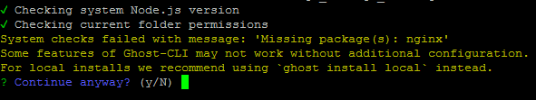
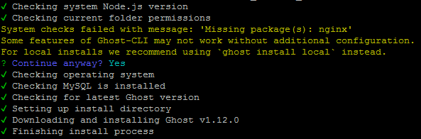

Right then, the Ghost V1.0 was out a while back and they made Ghost 0.11.x an LTS so I was not in any rush to upgrade too. I have not had much time to sort this out for a while and two days back when I finally came around to check how to upgrade, my first moment of concern was that officially supported stack is for NGINX.

I have moved my blog to the Apache Stack on DigitalOcean and while on my sandbox environment I still have NGINX, that is not a place I want to host my blog from. Anyhoo, I realised soon enough that while not officially supported it s easy to bypass the restrictions so I went ahead.
The upgrade itself couldn't have been simpler considering the major version bump. The answer to the question &quot;Was it worth it?&quot; is something we will have to wait and see although I am liking what I see except for the initial hiccups.

{: .notice--success}
EDITED AFTER THE POST: Boy oh boy - just after I finished this post I saw the latest version of Ghost V1.12 is out and it was such a painless process compared to past. Just a simple command 'ghost update' and job done. That itself makes this whole pain kind of worth it.


OK so the steps I took are as below:
<ol>
<li><a href="#backup">Backup</a></li>
<li><a href="#downloadandinstall">Download and Install</a></li>
<li><a href="#setupwizard">Setup Wizard</a></li>
<li><a href="#configureapache">Configure Apache</a></li>
<li><a href="#restore">Restore</a></li>
<li><a href="#tweak">Tweak</a></li>
</ol>

<h2 id="backup">Backup</h2>
We will take the back-up from front end for all the posts and we will also backup on the server the entire directory where old instance of the blog is residing.
To take backup of all the content and download it in a json file, open your ghost site on a browser, navidate to &quot;Settings&quot; and then click on &quot;Export&quot;.
Next for the backup of folder on the server itself. To do this issue the following commands on the terminal.

```bash
#Updateand upgrade the OS repo
sudo apt-get update
sudo apt-get upgrade
#Stop the ghost server
pm2 stop Ghost &quot;assuming Ghost is the pm2 id for the site&quot;
# Change directory to web-server root
cd /var/www/html/&quot;path to your ghost directory say 'ghost' &quot;
# Create a new directory for backup
sudo mkdir old_ghost_bkp
sudo mv ghost old_ghost_bkp
# Recreate the ghost directory
sudo mkdir ghost
cd ghost
# Give right privileges to the new directory
sudo chown -R &lt;your username&gt;:www-data .
```

<h2 id="downloadandinstall">Download and Install</h2>
As we are already in the right directory lets get on with installing the latest version of Ghost using npm.

```bash
sudo npm install -g ghost-cli
#Make sure you are in the directory where new ghost is to be installed.
#If you have followed all commands so far, you will already be in 
#required the directory
ghost install
```

{: .notice--warning}
It is at this point that you will have to deviate from official guide if you have Apache instead of NGINX. You will be prompted by the installer that it could not find NGINX and do you still want to continue. Default is &quot;No&quot; so make sure you enter &quot;Y&quot; and then press enter.

<br>
For me rest of the install went smoothly.<br>


<h2 id="setupwizard">Setup Wizard</h2>
Immediately after the install is complete, you will be presented with following questions:

{: .notice--info}
Please note that if you have configured SSL using LetsEncrypt as explained in previous posts on this blog then even if you are using https, the answer to blog url must be the with http and not https.

For example: I gave http://mgw.dumatics.com and not https://mgw.dumatics.com
</code></pre>


Enter your blog url: http://your.blog.url
Enter your MySQL Hostname: localhost
Enter your MySQL Username: root
Enter your MySQL Password: &quot;your mysql root password&quot;
Enter your Ghost database Name: "a relevant name" 
# for security reasons you may want to keep it different from your blog name";
Do you wish to set up Nginx: no
Do you wish to set uo Ghost MySQL User: yes
Do you wish to set up Systemd: yes
Do you want to start Ghost: yes


{: .notice--warning}
Please do note that the response on line 6 above to &quot;Setup Nginx&quot; must be &quot;no&quot;

After the questions are complete you will get a notification <code>You can access you blog at http://your.blog.url</code>.
At this point, it is best to see which port is configured by ghost CLI for this installation. you can do so by checking the configuration file like so:

```bash
nano config.production.json
```
You can change the port if you like but if it is different than the port you originally had for old version of ghost you can either change it here or you need to change Apache conf file in next step.
If you do decide to change the port here, then there should be no need to carry out the next step - Configure Apache.

<h2 id="configureapache">Configure Apache</h2>
Assuming that the port in Ghost config file was <code>1234</code>, there will be some changes that you will need to make in Apache conf files like so:

```bash
cd /etc/apache2/sites-available/
sudo nano ghost.conf
```

Now change the port on <code>ProxyPass</code> and <code>ProxyPassReverse</code> to be same as what is in the <code>config.production.json</code> file and save it by pressing <code>Ctrl+x</code> and <code>y</code>.- so for this example it will be changed to <code>1234</code> and change will look as below:

```html
ProxyRequests off
ProxyPass / http://localhost:1234/
ProxyPassReverse / http:/localhost:1234/
```

Now open the ssl config file for the site using commands below and make the same changes as above.
```bash
sudo nano ghost-le-ssl.conf
```

{: .notice--primary}
TIP: If done using LetsEncrypt, it will be named something like `ghost-le-ssl.conf`.

Once the changes are saved, disable and enable the configurations using following commands:
```bash
sudo a2dissite ghost.conf
sudo a2dissite ghost-le-ssl.conf
sudo a2ensite ghost.conf
sudo a2ensite ghost-le-ssl
#Restart the server
sudo service apache2 restart
```

Now if you enter you blog url in a browser, you should be presented with vanilla Ghost site. If not, something in server set-up has not worked and you will need to troubleshoot it and fix - luckily for me all worked like a charm.
<h2 id="restore">Restore</h2>
Right, so you are now on the browser looking at the Vanilla Ghost install. First thing you need to do now is create the user with same credentials you had on your old version of ghost. To do this you will first need to enter the admin url for ghost and follow the steps to create your user.
Once you are into the admin interface, navigate to &quot;Settings&quot; -&gt; &quot;Labs&quot; and click on &quot;Choose File&quot; button, select the json backup that was exported from your old version of the blog and then click on &quot;Import&quot; button.
Now to restore the images from your old blog on the server issue following commands:
```bash
cd /var/www/html/ghost/content
sudo rm images
sudo cp /var/www/html/old_ghost_bkp/ghost/content/images /var/www/html/ghost/content/
### Make the new image directory is writable or image uploads will fail
sudo chown -R ghost:ghost images/
### Restart Ghost
cd ..
ghost restart
```

{: .notice--warning}
1. The ghost CLI commands like stop, start and restart will require you to be in the directory where ghost is installed.
2. While start and stop commands of ghost specifically ask for sudo credentials, restart command just keeps rotating and hence it is better to issue a command with sudo before you issue `ghost restart`. 

This is it. Your old blog is now fully restored.

<h2 id="tweak">Tweak</h2>
This section is a bit of a pain because there are quite a few things that break with this version. So if you have heavily used html, you will painstakingly need to go through posts and add a new line between markdown and html content for it to be parsed properly or else it will display quite wiered outputs on your blog.
If you have used code blocks with syntax highlighting, another change is with older version you would have given three backticks followed by language-sql but now you just need to give three backticks followed by sql.
If you have used line numbering using prism.js, it just wont work and you will need to apply changes to your theme the way I did. Without going too much in detail on that, you can get the copy of <a href="https://github.com/pubmania/scrawl/blob/master/assets/js/prism.js">prism.js</a>, <a href="https://github.com/pubmania/scrawl/blob/master/assets/js/prism-custom-line-numbers.js">prism-custom-line-number.js</a>, <a href="https://github.com/pubmania/scrawl/blob/master/assets/css/prism.css">prism.css</a>, <a href="https://github.com/pubmania/scrawl/blob/master/assets/css/prism-line-numbers.css">prism-line-number.css</a> using the github links for my theme and place them in assets directory of your theme. Then make sure you include them in relevant files where your theme calls the javascripts.
Once done, issue the command <code>ghost restart</code> and things should look pretty again.
Happy Migrating !!!

